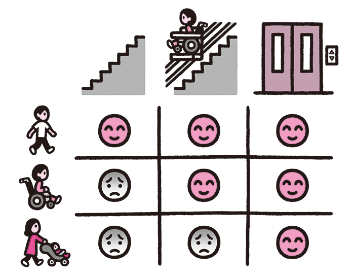

# なぜ Webはアクセシブルなのか

Webの本質はアクセシビリティである、と言われます。以下はWorld Wide Webの創始者であるW3Cのディレクター、Tim Berners-Lee氏の言葉です（参考1）。

>The power of the Web is in its universality.Access by everyone regardless of disability is an essential aspect.

>Webの力はその普遍性にあります。障害の有無にかかわらず誰もがアクセスできるというのが Webの本質的な側面なのです。

なぜアクセシビリティがWebの本質とされるのでしょうか。本書ではWeb制作のプロセスに沿って、それぞれのプロセスでアクセシビリティについて考えるべきこと、取り組むべきことを述べていきます。その前に、Webにおけるアクセシビリティとは何かをおさらいしておきましょう。

## アクセシビリティとは
"accessible"は "access" + "able"、すなわち「アクセス可能」という意味です。ここでの「アクセス」の対象は場所だけではなく、物や情報も含みます。どこかに行く、何かを手に取る、といった行動を問題なく実現できれば「アクセスできる」と言えますし、実現できなければ「アクセスできない」ということになります。

アクセスする対象が同じものでも、アクセスできるかどうかは人によって異なります。多くの人が問題なくアクセスできる場合でも、ある人にとってはアクセスしにくかったり、全くアクセスできなかったり、といったことが起こり得ます。

電車に乗って移動する場合を考えてみましょう。このとき、目的地にアクセスするためには、駅に行く、切符を買う、改札を通る、ホームに移動する、電車に乗る、といった行動が必要になります。状況によっては、これらの行動が難しい場合もあります。

* 車椅子を利用している場合、階段やエスカレーターを使ってホームに移動することが困難かもしれません。
* 目が見えない場合、切符を購入するのが難しいかもしれません。そもそも、どこで切符を売っているのかを知ること自体が難しい場合もあります。

このようなケースでも、工夫があれば問題なくアクセスできるようになる場合があります。

* 階段に車椅子用の昇降機を設置する
* 点字や音声によるナビゲーションを用意する、案内できる人を用意する

駅がこのような工夫を積み重ねることによって、多くの人が利用しやすい状態、すなわちアクセシブルな状態になります。しかし、このように特別な工夫をするのにはコストがかかります。ユーザー一人ひとりの状況に合わせてカスタマイズした手段を提供できれば理想ですが、難しい場合もあるでしょう。

## アクセシビリティとユニバーサルデザイン
一人ひとりの状況に合わせるのには、コストがかかる場合があります。そこで、ひとつの同じものをさまざまな人が使えるようにすればよいのではないか、という発想が出てきます。これが「ユニバーサルデザイン」の考え方です。"Universal"は普遍、汎用といった意味の言葉です。

先ほどの車椅子の例でいえば、車椅子用昇降機を設置することでアクセスは可能になります。しかし、昇降機を利用できるのは車いすのユーザーだけで、他の多くのユーザーには恩恵をもたらさないものになります。では、エレベーターを設置すればどうでしょうか。エレベーターは、車椅子の人も、そうでない人も利用することができます。さまざまな状況の人が同じものを利用できるようになっているのです。

<!--ここから図のキャプション-->
階段のみだと、車椅子ではアクセスが困難。車椅子用の昇降機を設置すると車椅子でもアクセス可能になるが、車椅子以外の人には恩恵がない。アクセシビリティは向上したが、ユニバーサルなデザインとは言いにくい。エレベーターを設置すると、徒歩の人も車椅子の人も同じものを利用できる上、ベビーカーのユーザーもアクセス可能になるなど、より幅広い恩恵がある。こちらのほうがよりユニバーサルデザインに近い。
<!--ここまで図のキャプション-->

しかし、ひとつのものを多くの人に使えるようにした場合、個々の人に最適なものにはならないことがあります。たとえば、多くのマウスは右利きの人が使うことを想定してデザインされていますが、左利きの人でも使える左右対称形のマウスもあります（表1）。ユニバーサルデザインの観点からは望ましいように思えますが、右利きの人には、右利き専用のマウスの方が手にフィットし、使いやすいことが多いでしょう。

表1：マウスの種類と使いやすさ

| マウスの種類     | 右利きの人 | 左利きの人 |
|:-----------------|:-----------|:-----------|
| 右利き用のマウス | 使いやすい | 使いにくい |
| 左右対称のマウス | 使える     | 使える     |
| 左利き用のマウス | 使いにくい | 使いやすい |

このようなことが起きるのは、人によってベストなものの形が異なるからです。その差異が小さければ、その溝を埋めるひとつの製品を用意することもできます。しかし、その差が大きい場合、それを埋める製品を作ることは難しく、誰にとっても使いやすくない、中途半端なものになることもあります。

## Webとユーザーエージェント
Webは、他のメディアと比べて圧倒的にアクセシブルです。インターネットに接続できる環境があれば、いつでも好きなサイトにアクセスすることができます。さまざまな特性の人が自由に利用でき、地理的、時間的な制約もほとんどありません。車椅子の人も気軽にショッピングができますし、全盲の人でも気軽に新聞を読むことができます。Webを使えば、誰もが社会に参加できるチャンスを持つのです。

Webには、ユニバーサルデザインを実現しやすい理由があります。私たちは、特に難しいことを考えなくてもサイトを閲覧できますが、裏側では以下のようなことが行われています。

* サイトのURLのドメイン名を見て、DNSを参照しIPアドレスを取得する
* 取得したIPアドレスにあるWebサーバーにTCP接続を行う
* Webサーバーに対してHTTPリクエストを送る
* WebサーバーからのHTTPレスポンスを受け取る
* コンテンツタイプを判定する
* text/htmlなどであれば、HTMLを解釈する
* HTMLを解釈した結果にスタイルを適用してレンダリングを行う
* 結果を表示する

ユーザーはこのような過程を意識する必要はありません。なぜなら、このような面倒な手順は全て、プログラムが代わりにやってくれるからです。

このように、裏側で通信してコンテンツにアクセスするプログラムを「ユーザーエージェント」と呼びます。代理人（エージェント）がユーザーに成り代わってWebサーバーにアクセスし、さまざまな処理を行ってくれるのです。ユーザーはサイトを直接見ているように感じているかもしれませんが、実際にはユーザーエージェントが介在し、ユーザーはその処理の結果を見ているのです。

物理的な道具では、提供されたものをそのまま使うしかないため、道具そのものがユニバーサルなデザインになっていなければなりませんでした。しかしWebでは、コンテンツ単独ではなく、ユーザーエージェントと合わせることでユニバーサルデザインを実現することができます。

ユーザーは自分に合ったユーザーエージェントを選ぶことで、より自分に合った結果を得られるのです。さらに、ブラウザやOSの設定を変更することもできます。たとえば、Windowsには「拡大鏡」や「ハイコントラストモード」という機能があり、これらを有効にすると、目が悪くても画面の内容を把握しやすくなります。

## さまざまなユーザーエージェント
ユーザーエージェントには、以下のようにさまざまなものがあります。

### ビジュアルブラウザ
サイトを視覚的にレンダリングして表示するプログラムです。テキストだけでなく画像も表示できますし、最近のものには映像を表示したり、スクリプトによって複雑な処理を行ったりする機能もあります。一般的にブラウザと言えばこれを指します（図2）。

図2：ビジュアルブラウザの例（Firefox）

### テキストブラウザ
ブラウザの中には、画像などの表現ができず、テキストの表示を中心とするものもあります。UNIX系のシェルなどでは画像が表示できず、このようなブラウザが役立ちます。Lynxやw3mなどが該当します（図3）。

図3：テキストブラウザの例（w3m）

### ダウンローダー
ファイルなどのリソースをダウンロードするためのツールです。コンテンツを受け取った後は表示するのではなく、ファイルとして保存します。（図4）。

図4：ダウンローダーの例（SiteSucker）

### ロボット
人間が操作せず、サイトに自動的にアクセスして情報を取得するユーザーエージェントもあります。このようなものを「ロボット」と呼びます。その場で操作しなくてよいため、定期的に自動アクセスするのに向いています。フィードリーダーやチェックツールなどが代表的な例です（図5）。

図5：フィードリーダーの例（feedly）

### クローラー
ロボットとほぼ同義ですが、自動的にリンクをたどって次々にページの情報を取得していくものを「クローラー」と呼んで区別することがあります。検索エンジンのものがよく知られていますが、他にもさまざまな目的で利用されます。

## 支援技術
ユーザーエージェントは単体で使うだけでありません。支援技術（Assistive Technology）と組み合わせると、さらにアクセシビリティを高めることができます。支援技術には以下のようなものがあります。

### 拡大ツール
拡大ツールは、画面や文字を大きく拡大して表示するためのソフトウェアです。OSやブラウザは画面や文字を拡大する機能を持ちますが、ロービジョン（弱視）のユーザーは、さらに拡大するために専用のソフトウェアを導入することもあります。OSに拡大のためのツールが付属していることもあります（図6）。

図6：Windowsに付属している「拡大鏡」を使用して画面を拡大した例

スマートフォンやタブレットなどでは、ピンチ操作によっていつでも画面を拡大することができます。ロービジョンのユーザーに限らず、多くのユーザーが日常的に拡大の操作を行っています。

スクリーンリーダー
スクリーンリーダーは、画面の内容を合成音声で読み上げるソフトウェアです。主に視覚障害のあるユーザーが利用し、ブラウザに限らず、OSやアプリケーションの画面全般を音声で読み上げます。日本国内ではPC-Talker、JAWS、NVDAなどがよく使われています。OSにスクリーンリーダーの機能が組み込まれていることもあり、iOSやOS Xでは「VoiceOver」を有効にすると画面の内容を読み上げることができます（図7）。Windowsにも「ナレーター」という簡易なスクリーンリーダーが搭載されています。

図7： VoiceOverの設定画面

Webにアクセスする際は、単に表示結果を読み上げるだけでなく、操作を補助する機能が提供されます。たとえば、次の見出しに飛ぶ、リストを読み飛ばす、次の入力欄に移動する、といった操作ができるようになります。多くのスクリーンリーダーは一般的なブラウザと組み合わせる形で使用し、ブラウザでこれらの操作ができるようにしますが、中には、専用の音声ブラウザを持つ製品もあります。

### 専用ハードウェア
ソフトウェアによる支援だけではアクセスできないような場合、ハードウェアを使って補う場合があります。一人ひとりに合わせて専用に作られる場合もあり、さまざまなものが存在します（図8、9、10）。

図8：代替マウス
ボタンやスティックでポインタを動かすことができる。マウス操作ができないユーザーでも利用できる。
図9：点字ディスプレイ
ピンが上下することで凹凸を出し、テキストを点字として出力する。視覚にも音声にも頼れない盲聾のユーザーでも利用できる。

図10：視線入力装置の例
視線を動かし、対象に注目するだけで操作を行えるようにしている。

ここで挙げた支援技術は、ほんの一例です。Webを利用する際、ユーザーはこのようなさまざまな工夫によって、自分に合った、アクセスしやすい環境を得ることができます。これは物理的な道具やメディアにはない特性です。だからこそ、Webは本質的にアクセシブルであると言えるのです。

## アクセシビリティとマシンリーダビリティ
Webが本質的にアクセシブルであるのは、ユーザーエージェントによって処理されるからです。ユーザーはユーザーエージェントを変更したり、支援技術を導入することで、自分に合った環境を得られます。

しかし、ユーザーエージェントがコンテンツを適切に解釈して処理できなければ、この利点は失われてしまいます。たとえば、スクリーンリーダーを使って音声での読み上げや点字での出力を行うような場合、テキストの情報が必要になります。コンテンツが画像や動画、音声だけで提供されている場合、プログラムでその内容を処理することは今のところ難しく、対応できたとしても限定的なものになります。

あるものをコンピュータで読み取ることができるとき、「マシンリーダブルである」と言います。コンピュータで読み取りやすいコンテンツは、「マシンリーダビリティが高い」と言えます。マシンリーダビリティが特に重要になるのは、スクリーンリーダーやサーチエンジンのクローラーです。このような環境では、マシンリーダブルでないコンテンツにほとんどアクセスできない場合があります。Webにおけるアクセシブルなコンテンツとは、マシンリーダブルなコンテンツであることとほぼ同義です。

サイトの多くがHTMLとCSSで作られるのは、それがマシンリーダブルだからでもあります。HTMLは、テキストにマークアップを施すことで要素の構造や意味が明確になるようにしたものです。このマークアップによってマシンリーダビリティが向上し、さまざまな処理ができるようになります。素直に作られたHTMLのコンテンツの多くは、自然とアクセシブルなものになります。

参考1 Accessibility - W3C
http://www.w3.org/standards/webdesign/accessibility
