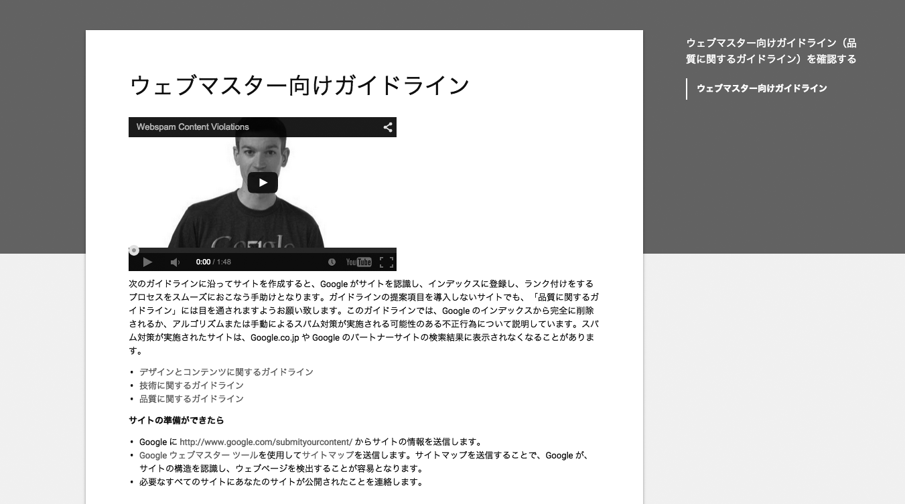

# なぜアクセシビリティと向き合うのか
私たちはなぜアクセシビリティの向上に取り組むのでしょうか。「アクセシビリティ」という言葉からは、障害者への対応というイメージを持たれることが多いようです。確かに、アクセシビリティの向上が障害者に恩恵をもたらすのは間違いありませんが、それだけではありません。

## アクセスできる人を増やすため
アクセシビリティが向上すれば、アクセスできる人の母数が増えます。人がサイトにアクセスできないのは、障害がある場合だけではありません。人は常に健康なわけではなく、一時的に何かがしづらくなることはよくあります。「手を怪我した」「メガネを忘れた」「周りが騒がしい」「パソコンの調子が悪い」といった状況は、全てアクセスへの障害となり得ます。

また、子どもや日本語に慣れていない人の場合、難しい言葉が使われているサイトにはアクセスしにくくなるでしょう。アクセシビリティへの配慮を行うことは、障害者や高齢者だけではなく、あらゆる人に恩恵をもたらす可能性があります。

## さまざまなデバイスに対応するため
時代の移り変わりと共に、運営者が想定していなかった新しいデバイスが登場することもあります。実際、スマートフォンやタブレットの普及によって、Webは大きく変わり、制作の現場では小さな画面、タッチ操作といった要素を常に意識するようになりました。デバイスの進化は早い上、未来にどのようなデバイスが出るのか完全に予想することは困難です。現在ではウェアラブルデバイスにも注目が集まっており、画面が極めて小さかったり、画面を持たないデバイスが登場しても不思議ではありません。

あまり知られていないデバイスもあります。たとえば、ゲーム機のWiiでは、「Wiiリモコン」を使ってWebにアクセスします。多くのテレビにもWebにアクセスする機能があり、テレビのリモコンで操作します。モノのインターネット（Internet of Things、IoT）という言葉が流行していますが、この現象は今に始まったことではなく、既にさまざまなデバイスがWebにアクセスできるようになっています。

また、昔からあるデバイスが見落とされることもあります。典型例は印刷です。Webページが印刷されることは意外に多く、しかも、モノクロで印刷されることが珍しくありません。

特定のデバイスしか想定せずにサイトを作っていると、このような多様なデバイスに対応できません。アクセシビリティへの配慮を行うと、さまざまなデバイスに対応でき、まだ見ぬ未来のデバイスへの対応も容易になります。

** デバイスの特性でアクセスできないケース **
* 情報にアクセスできない
  * 通信速度が遅くて画像が表示されない、動画が再生されない
  * モノクロで印刷したら、色分けされたグラフの意味がわからなくなった
  * 周囲が騒がしくて音声がはっきり聞こえない
  * 音声の解説があるようだが、音が出せないためわからない
* 操作できない
  * 画面の小さい端末で、小さなボタンがうまく押せない
  * タッチパネルで、「マウスポインタを重ねる」という操作ができない
* 環境が対応していない
  * iPhoneやiPadでアクセスしたら、Flashコンテンツが表示されない
  * 「プラグインが必要」と表示されたが、会社ではインストールが禁止されている

## SEOのため
Googleなどのサーチエンジンは、検索対象となるサイトのコンテンツを読み取り、データとして蓄積します。このとき、クローラーというユーザーエージェントがサイトにアクセスし、情報を取得します。

アクセシビリティがサーチエンジンに与える恩恵は、大きく分けて2つあります。

ひとつは、サーチエンジンのクローラーがコンテンツにアクセスできるようになることです。コンテンツのアクセシビリティに問題があると、コンテンツに全くアクセスできないことがあります。たとえば、画像だけで構成されたページがあったとき、その画像に適切な代替テキストが指定されていなければ、サーチエンジンのクローラーはその画像を「読む」ことが困難になります。サーチエンジンのクローラーは、全盲のユーザーと同じような環境に置かれているのです。

もうひとつは、コンテンツの意味が伝わるようになることです。サーチエンジンはコンテンツを解析して、キーワードの重みづけを行います。このとき、ページタイトルや見出し、リンク、強調箇所などがサーチエンジンに伝わらないと、適切な重みづけができなくなり、うまく検索できなくなる可能性があります。

サーチエンジンのクローラーがサイトにアクセスしやすくすること、これはすなわち、サーチエンジン最適化（SEO）に他なりません。実際、SEOの基本的な部分は、アクセシビリティ向上の施策と重なります。Googleのウェブマスター向けガイドライン（参考1、図1）には、以下のような内容が書かれています。

図1：Googleウェブマスター向けガイドライン

>* わかりやすい階層とテキストリンクを持つサイト構造にします。各ページには、少なくとも1つの静的なテキストリンクからアクセスできるようにします。
>* サイトの主要なページへのリンクを記載したサイトマップを用意します。サイトマップ内にリンクが非常に多数ある場合は、サイトマップを複数のページに分けることをおすすめします。
>* 1ページのリンクを妥当な数に抑えます。
>* 重要な名前、コンテンツ、リンクを表示するときは、画像の代わりにテキストを使用します。Googleのクローラでは、画像に含まれるテキストは認識されません。テキストコンテンツの代わりに画像を使用する必要がある場合は、alt属性を使用して簡単な説明テキストを組み込みます。
>* `<title>`タグの要素とalt属性の説明をわかりやすく正確なものにします。
>* 無効なリンクがないかどうか、HTMLが正しいかどうかを確認します。

これらは、いずれもアクセシビリティ向上のための施策そのものです。アクセシビリティ向上は、そのままSEOにもつながるのです。

ただし、この対応だけでSEOが万全になるわけではありません。SEOにおいては、ユーザーが入力する検索キーワードにマッチしたコンテンツが用意できるか、ユーザーに支持されるコンテンツを作れるか、といった要素も重要です。有用なコンテンツを用意すること、そのコンテンツをアクセシブルにすること、この2つのどちらが欠けても、ユーザーを呼び込むことはできないのです。

## ユーザビリティの向上、改善のため
ある人にとっては「使いにくいが、なんとか使える」という状況が、別の人にとっては「全く使えない」という状況になっていることがあります。アクセシビリティの向上で「全く使えない」という状況を解消すると、他のユーザーにとっての「使いにくい」状況も改善されることになります。

アクセシビリティ向上の施策は、ほとんどの場合、ユーザビリティも向上させます。両者には重なる部分が多く、ある施策がアクセシビリティのためのものなのか、ユーザビリティのためのものなのかは区別できないこともあります。ただし、アクセシビリティの向上だけを行なえば十分ユーザビリティを確保できるわけではありませんので、その点は注意が必要です。

## ユーザー体験の向上、改善のため
ユーザーがサイトを訪問すれば、体験が生まれます。このユーザー体験（User Experience、UX）は、ユーザーのサイトに対する評価、さらには運営者やサービス全体についての評価を左右します。

好ましいユーザー体験は、アクセスできて初めて生まれます。注意しなければならないのは、アクセスできなかったというのもひとつの体験だということです。情報が得られなかった、操作できなかった、理解できなかったというのは、ユーザー体験としては最悪の部類です。アクセシビリティが向上すれば、最悪の体験を回避し、それを成功体験に変えられる可能性があります。「Web情報アーキテクチャ」の著者のひとりであるPeter Morvilleは、「体験」を7つの要素に分解しました。

* accessible =アクセスできる
* usable =使える
* useful =役に立つ
* findable =見つけられる
* credible =信頼できる
* desirable =望ましい
* valuable =価値がある

この7要素の相関を表したのが、「UXのハニカム構造」という図です（参考2、図2）。

図2：UXのハニカム構造

中心にvaluable（価値がある）が配置され、周囲に残りの6要素が等しく配置されています。6つの要素全てが「体験」を構成する要素であり、この組み合わせによって、中央の「価値がある」状態が生まれます。周囲の要素のどれかが欠ければ、価値を損なうことになります。

この図では6要素が等価に配置されていますが、これをピラミッド状に配置する図もあります。以下の図は、書籍「スキル向上のためのHTML5テクニカルレビュー」に掲載されている図をベースに、「IAシンキング」の著者である坂本貴史さんが再構成したものです（参考3、図3）。

図3：UXの4つのレベル

ピラミッド構造の下部にある要素は、上部の要素の前提となる要素です。「役に立たない」「信頼できない」状態では、「価値がある」「好ましい」という状態を達成することは困難です。「使えない」「見つけられない」状態では、「役に立つ」「信頼できる」という状態を達成することは困難です。そして、それら全ての前提となるのが、「アクセスできる」ということです。アクセシビリティはユーザー体験の土台であり、良好なユーザー体験を作るためには欠かせないものなのです。

## 規格への対応のため
規格への対応が求められているから、という理由で取り組みが行われることもあります。2008年に W3Cの勧告となったWeb Content Accessibility Guidelines（WCAG）2.0は、Webコンテンツのアクセシビリティについて規定したガイドラインです。日本では、2010年に日本工業規格JIS X 8341.3:2010として、このガイドラインがほぼそのまま規格化されています。また、2012年には、国際標準化機構（ISO）によってISO/IEC 40500:2012として規格化されました。

国や地方公共団体は、工業標準化法により、日本工業規格を尊重しなければならないとされています。また、総務省の「みんなの公共サイト運用モデル改定版（2010年度）」（参考4、図4）という手順書では、公的機関がJIS X 8341-3に準拠することを推奨しています。

図4：みんなの公共サイト運用モデル改定版

民間企業などのサイトの場合、日本国内には対応を義務づける法令はありませんでした。しかし、2016年4月に施行される予定の障害者差別解消法では、民間の事業者に対しても、対応を求める努力義務規定があります。

諸外国においても、国や公共団体に対してアクセシビリティガイドラインの尊重義務を課しているケースは数多くあります。特に有名なのは、アメリカのリハビリテーション法508条でしょう。これは、政府機関が調達する情報機器やサイトがアクセシブルでなければならないとするもので、サイトについてもガイドラインに従わなければならないとしています。

また、2000年のシドニーオリンピックでは、全盲のユーザーが公式サイトにアクセスできなかったため、オーストラリアの障害者差別禁止法（Disability Discrimination Act）に違反しているとして裁判となりました。結果、オーストラリア政府はオリンピック委員会にWebサイトの修正を命じました（図5）。

図5：2000年シドニーオリンピック公式サイト

もちろん、強制力がなくても、自主的に取り組んでいる民間企業はたくさんあります（図6）。サイトの戦略や目的を明確にするためにも、アクセシビリティを確保する意味を理解することが望ましいでしょう。このような規格への取り組みの考え方については、2章「戦略の策定」でとりあげます。

図6： JIS X 8341-3:2010の試験結果を公開した民間企業の例（参考5）

## 取り組みをアピールするため
アクセシビリティに配慮していない企業より、アクセシビリティに配慮している企業に良い印象を持つ人は多いでしょう。また、サイトのアクセシビリティを第三者に評価され、ランキングという形で公表されることもあります。アクセシビリティに配慮したサイト作りは、ユーザーや第三者の印象を向上することにもつながるのです。

そのため、「アクセシビリティに取り組んでいる」というアピールそのものを目的とした取り組みが行われる場合もあります。しかし、このようなアピールは、アクセシビリティの本質から外れる危険性があります。アピールを目的とした取り組みは、実際にアクセスできるかどうかより、取り組みをしているように見えるかどうかを重視したものになりがちだからです。この問題については、「2-3手段が目的になってしまう」でとりあげます。

取り組みをアピールするための適切な方法は、アクセシビリティ方針や試験結果を公開することです。実際にアクセシビリティを確保した上で、きちんと情報を公開することがアピールにつながります。

参考1 [Googleウェブマスター向けガイドライン](https://support.google.com/webmasters/answer/35769#1)

参考2 [User Experience Design](http://semanticstudios.com/user_experience_design/)

参考3 [Evaluation method of UX "The User Experience Honeycomb"](http://www.bookslope.jp/blog/2012/07/evaluationuxhoneycomb.html)

参考4 [みんなの公共サイト運用モデル改定版（2010年度）](http://www.soumu.go.jp/main_sosiki/joho_tsusin/w_access/index_02.html)

参考5 [アクセシビリティへの対応方針：日立](http://www.hitachi.co.jp/utility/accessibility/)
