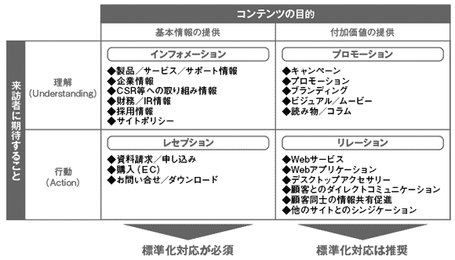

# アクセシビリティ方針を作らない

アクセシビリティ方針は、サイト全体のアクセシビリティへのスタンスを明確にするものです。プロジェクト中でサイトの品質にかかわるさまざまな判断を行うためには、あらかじめ方針を明確にしておくことが重要です。

## よく見られる問題

### アクセシビリティについての合意形成ができない

アクセシビリティ方針がないため、プロジェクトメンバー間の合意ができていないままプロジェクトが進んでしまっている。プロジェクト終盤で対応が必要だと判明しても、対応することができない。

## ここが問題! 方針がないと判断や調整、合意形成ができない

サイト構築プロジェクトの中では、アクセシビリティに関する判断や調整、合意が必要になる局面があります。方針が決まっていなければ、適切な判断ができなかったり、合意したはずの内容が覆るというリスクがあります。

### 配慮が全く行われない

アクセシビリティ方針がない場合、アクセシビリティへの配慮や対応が全く行われない可能性があります。発注者と受注者の双方がアクセシビリティについて全く考えていなければ、当然、何も行われません。実装者がアクセシビリティに配慮しようとしても、企画・設計やビジュアルデザインのプロセスでの配慮がなければ、実装の段階でアクセシビリティを確保することはほとんど不可能です。各プロセスで必要な配慮が行われないままプロジェクトが進んでしまうと、公開直前で追加のアクセシビリティ対応が必要になったり、公開後になって問題が表面化することもあります。

### 適切な判断ができない、人によって判断が異なる

プロジェクト中には、アクセシビリティに関する判断が必要な局面が何度も出てきます。方針が明確になっていないと、適切な判断ができなかったり、人によって判断が異なるということが起こります。

### 合意形成ができない、覆る

方針を明確にしておかないと、プロジェクト内での合意形成に支障が出ることがあります。

実は期待されていたアクセシビリティ対応のレベルがあり、それが実現されていないとなれば、本来必要だった品質を満たしていないことになります。逆に、アクセシビリティを高めることがビジュアルデザインを劣ったものにすると誤解して、アクセシビリティ対応は不要だと考える人もいます。そのような誤解がないかどうか確認するためにも、方針を提示して合意することが必要です。

方針をあいまいなままにしておくと、合意したはずの内容が後から覆ることもあります。プロジェクト終盤になって「実は対応が必要だった」という話が出てきても、もはや対応ができなくなっていることが多いでしょう。

## 解決アプローチの例

### まずは最低限の方針を策定する

プロジェクトの方針を決める際にアクセシビリティ方針も策定し、メンバーと共有する。難しく考えすぎず、最低限、目標とするレベルだけでも決めておくとよい。

## 解決アプローチ 難しく考えすぎず、最低限の方針を決めて共有する

「アクセシビリティ方針」というと大げさなものに思えるかもしれませんが、最低限決めなければならないのは目標とするレベルだけです。まずは目標を明確化して共有し、細かいことは随時決めていきましょう。

### まずは最低限の方針を策定する

プロジェクトの開始時に、まず最低限のアクセシビリティ方針を策定するようにします。「方針を策定する」というと大変なことに思えるかもしれませんが、ウェブアクセシビリティ方針策定ガイドライン（参考1）で「明記すべき」とされている項目は2つしかありません。

ひとつは対象範囲で、どこからどこまでがひとつのサイトなのか、除外されるものがあるのか、といったことを定義します。多くの場合、サイト全体を対象とすればよく、深く考える必要はないでしょう。

もうひとつは目標とするレベルです。WCAG 2.0やJIS X 8341-3の達成基準にはA、AA、AAAの3つのレベルがあります。

- レベルA（シングルA）: 最低限の基準です。これを満たせていないコンテンツは、環境によっては全くアクセスできなくなる場合があります。どんなサイトも、この基準を満たすべきです。25項目の基準を達成する必要があります。
- レベルAA（ダブルA）: 望ましい基準です。これを満たせていないコンテンツは、環境によってアクセスが困難になる場合があります。レベルAの基準に加えて、13項目の基準を達成する必要があります。
- レベルAAA（トリプルA）: 発展的な基準です。これを満たすと、環境によってよりアクセスしやすくなる場合があります。レベルAAの基準に加えて23項目の達成基準が存在しますが、中には達成困難なものもあり、全てを満たすことは難しいでしょう。

AAAを達成しなければならないケースはほとんどありませんので、AかAAのどちらにするのか決めれば良いでしょう。Aでも最低限のマシンリーダビリティは担保できますので、全くアクセスできないという事態は避けることができます。AAを選択すると、それに加えて「アクセスしやすい」というところまで求められることになります。

公共性が高いサイトの場合、レベルAAを目標とするべきです。総務省の「みんなの公共サイト運用モデル」（参考2）においても、公共サイトがレベルAAを目標にすることを推奨しています。

民間企業のサイトであっても、高い品質を求める場合にはAAを選択することがあります。また、Aを基本としつつ、AAやAAAの項目を追加することもできます。よくあるのは、レベルAAのカラーコントラストの項目を追加するパターンです。レベルAにはカラーコントラストの基準がなく、文字が見やすい、見づらいという判断が主観的なものになりがちです。レベルAAの項目では基準が数値で示されているため、この項目を追加することで、客観的な判断ができるようになります。

いずれの場合も、無理のない方針を立てるようにしましょう。必要以上に目標が高すぎると、誰も守れなくなって方針が形骸化することがあります。次節の「2-2適切でないアクセシビリティ方針」も参照してください。

なお、「アクセシビリティには一切配慮する必要がない」という方針もありえます。対応は行われないかもしれませんが、方針があいまいで意見の食い違いが起きるよりはよいでしょう。クライアントやプロジェクト内での合意のために、対応しないという方針を明示するのもひとつの方法です。

### 方針を公開するかどうか決める
アクセシビリティ方針を公開するかどうかもひとつのポイントとなります。

公共系のサイトの場合、「みんなの公共サイト運用モデル」でウェブアクセシビリティ方針の公開が求められています（参考3）。

民間企業の場合、このようなガイドラインからの要請はありませんが、アクセシビリティへの取り組みを社内外にアピールするため、自主的に方針を公開することがあります。実際に公開されている方針の例を「2-3 手段が目的になってしまう」で紹介していますので、参考にしてください。

なお、 JIS X 8341-3に沿ったウェブアクセシビリティ方針を公開する場合、対応度の表記が必要となります（参考4）。「準拠」「一部準拠」「配慮し試験」などの表記をしたい場合、試験の実施が必須となります。試験を実施する場合はコストがかかりますので、あらかじめ見積もっておく必要があるでしょう。

### アクセシビリティ方針の立て方を決めておく

同一の運営者が複数のサイトを持っているような場合、サイトごとにアクセシビリティ方針を決める必要があります。方針を決めるのは難しくありませんが、多数のプロジェクトが並行で走る場合、その都度判断するのは大変です。どのような場合にどのような方針を採用するべきか、あらかじめ決めておくと良いでしょう。「失敗しないWeb制作」（参考5）には、canon.jpの判断基準の例が紹介されており、参考になります（図1）。

図1：canon.jpにおいて、アクセシビリティ方針を立てる際の判断基準をドキュメント化している例

### アクセシビリティ方針を文書化する

方針を策定しても、プロジェクト関係者にしっかり共有されていなければ意味がありません。共有するために必要なのは、文書化です。立派なドキュメントにする必要はありませんが、クライアントに提出したり、外部に公開したりする際には、それなりに細かい部分まで書く必要があるでしょう。項目の詳細については次節「2-2適切でないアクセシビリティ方針」で見ていきます。

参考1 [ウェブアクセシビリティ方針策定ガイドライン（ウェブアクセシビリティ基盤委員会）](http://waic.jp/docs/accessibility-plan-guidelines/201308/)

参考2 [みんなの公共サイト運用モデル](http://www.soumu.go.jp/main_sosiki/joho_tsusin/w_access/index_02.html)

参考3 [みんなの公共サイト運用モデル（2010年度改定版）付属資料１ウェブアクセシビリティ方針策定・公開の手順書](http://www.soumu.go.jp/main_sosiki/joho_tsusin/w_access/pdf/index_02_03.pdf)

参考4 [ウェブコンテンツの JIS X 8341-3:2010 対応度表記ガイドライン](http://waic.jp/docs/jis2010-compliance-guidelines/)

参考5 [ワークスコーポレーション刊「失敗しないWeb制作」](https://www.wgn.co.jp/store/dat/3215/)
