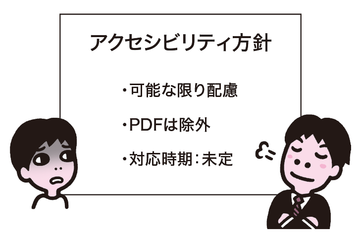
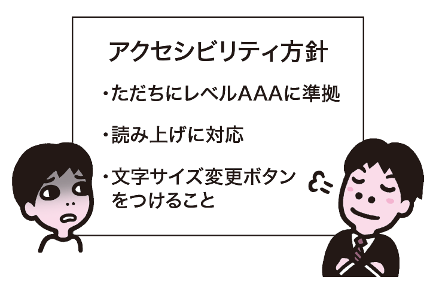
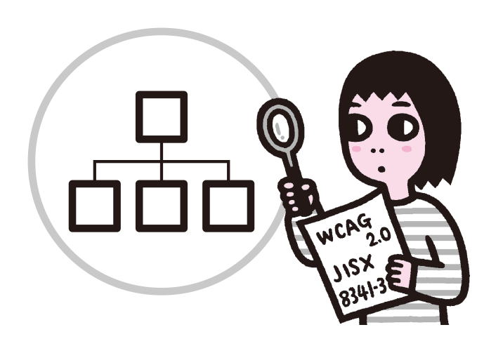
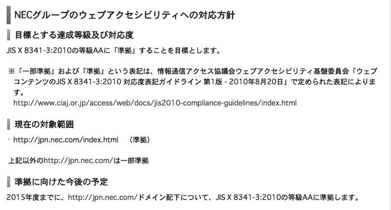

# 適切でないアクセシビリティ方針

アクセシビリティ方針を作成しても、見当はずれの方針や、守ることができないような方針を立ててしまうと、成果物に反映されません。できることとできないことを見極め、明確で現実的な方針を立てましょう。

## よく見られる問題

### あいまいな方針を立ててしまう

方針があいまいで目標がはっきりしない例。方針がない場合と同じ
問題が発生する。

### 誤解に基づいて方針を立ててしまう

誤解に基づいて、現状に即していなかったり、実効性のない方針を立てている例。方針を誰も守れずに形骸化したり、アクセシビリティが向上しなかったりする。

## ここが問題! 方針があっても、適切なものでなければ機能しない

アクセシビリティ方針を作成しても、適切なものでなければ機能しません。見当はずれの方針では、成果物も見当はずれなものになってしまいます。また、あいまいだったり、守ることが難しい方針を立ててしまうと、方針を誰も守らなくなってしまいます。

### 方針があいまい

方針があいまいで、目標がはっきりしない場合があります。たとえば、以下のようなアクセシビリティ方針は、目標がはっきりしていません。

- アクセシビリティに配慮する
- WCAG 2.0に配慮する / JIS X 8341-3に配慮する
- JIS X 8341-3の要件を可能な限り達成する

WCAGやJIS規格を参照する場合、目標を明確にしないと、何をどこまでやればよいのか判断できません。特にRFP（提案依頼書）において、このようなあいまいな記述になっているケースが多く見られます。RFPの段階ではあいまいな状態でも問題ありませんが、このままでは方針としては使えません。

### 対象があいまい

方針そのものが明確でも、適用する対象があいまいになっていることがあります。このような場合、現場の解釈でどんどん適用範囲を狭められてしまうことがあります。たとえば、以下のようなケースです。

- CMSで生成しているコンテンツは対応させることが難しいため、対象外とする
- 動画を埋め込んでいる部分は、YouTubeの機能を使っているため対象外とする
- PDFは対応が難しいため、対象外とする

これらのコンテンツもサイトの一部であり、アクセスできる必要があるはずです。このようなアクセシビリティ方針の解釈を放置していると、対象外とされるコンテンツがどんどん増えていってしまいます。

### スケジュールがあいまい

アクセシビリティ方針があっても、実施のスケジュールが決まっておらず、いつまでに実現すればよいのかが不明瞭な場合があります。こうなると、やはり方針は実効性を失ってしまいます。

### 方針が現状に即していない

方針が現状に即していなければ、方針に従うことができなくなります。特に、大規模なリニューアルプロジェクトの場合、全てのコンテンツをすぐにアクセシブルにすることは難しい場合があります。「ただちに等級AAの全項目に準拠」というような方針を立てても、達成することができません。また、構築時のことだけ考えて運用が難しい方針を立てると、運用時に対応できず、方針が形骸化していってしまいます。CMSを使っている場合、CMSの制約で方針が実現できなくなることもあります。

### 特定環境への配慮だけを求める

「読み上げ環境に配慮すること」「スクリーンリーダーでの読み上げができること」のように、特定環境への配慮だけを求めるようなアクセシビリティ方針が作られることがあります。このような方針では、特定の環境に特化した対応が行われてしまいます。さまざまな環境でアクセスできるようにはならず、対象とした環境以外ではかえってアクセスしづらくなる可能性もあります。

### 具体的な特定機能の実装だけを求める

「文字サイズを変更する機能を設けること」のように、具体的な特定機能の実装だけが求められていることがあります。このようなものはアクセシビリティ方針ではありませんし、その機能がアクセシビリティを向上させるとも限りません。特定の機能の導入だけで終わってしまい、他の配慮が全く行われなくなる可能性があります。

## 解決アプローチの例

### 現状のリサーチを行う

アクセシビリティ方針を策定する前に、まず現状のリサーチを行う。これにより、プロジェクトに見合った方針を策定できるようになる。

### 目標、対象、スケジュールを明確に定める

NECグループのアクセシビリティ方針、目標、対象、スケジュールを明確にしている（参考1）。

## 解決アプローチ ガイドラインを参考に、明確で現実的な方針を定める

まずはリサーチを行って、サイトの現状と、必要になるアクセシビリティのレベルを把握します。その上で、各種のアクセシビリティガイドラインを参照して、目標とするレベルや範囲、スケジュールを決めます。

### 現状のリサーチを行う

無理のない目標を立てるためには、現状を把握することが重要です。特にリニューアルの際は、現状のサイトをチェックして、どのようなアクセシビリティ上の課題があるのか確認しましょう。ここでは厳密な試験を行う必要はありませんので、おおまかなチェックで構いません。問題が起きやすい点はWCAG 2.0などのガイドラインにまとめられていますし、簡単なチェック方法をまとめたEasy Checks（参考 2）などの文書もあり、これらを参考にすれば比較的容易に調査することができます。

また、対応が難しそうな箇所がないか洗い出しておきましょう。動画や音声のコンテンツ、外部サービスを利用している部分、HTML以外のコンテンツ（主にPDFやFlash）などは要チェックです。

運営者の体制や事業のポリシーなどを確認し、どの程度のがんばりが可能なのか把握しましょう。CMSを採用している場合、CMSの制約についても確認しておきます。このような点に照らして、目標とする基準が達成できそうかどうか確認し、適切なレベルを設定するようにします。

### ガイドラインを参照して、目標を明確にする

WCAG 2.0やJIS X 8341-3を参照して、目標とするレベルを明確に定めます。目標の決め方については、前節「2-1 アクセシビリティ方針を作らない」の解決アプローチを参照してください。

### 対象を明確にする

目標が明確になったら、アクセシビリティ方針の適用となる対象を明確にします。通常は、単にサイト全体を対象としますが、以下のように、サイトの一部を適用除外としたくなるケースがあります。

#### 一般ユーザーによる書き込みや投稿がある場合

一般ユーザーが書き込んだり投稿したりするコンテンツがある場合、サイト運営者によるコントロールが利きません。ユーザーにアクセシビリティに配慮した投稿を求めることは難しく、将来的に改善することも難しいでしょう。このようなコンテンツは、アクセシビリティ方針の対象外とするしかありません。

#### 外部サービスを利用している場合

外部サービスを利用している場合、サイト運営者のコントロールが利きにくい場合があります。しかし、サービス事業者に改善を求めることはできるはずですし、別のアクセシブルなサービスに乗り換えることも可能です。そのため、外部サービスというだけで対象外とすべきではありません。よりアクセシブルなサービスを選定する努力をすること、必要な改善を求めることなどを方針化しましょう。

#### 技術的に対応が難しい場合

技術的に対応が難しい場合もあります。たとえば、アクセシビリティに配慮されていないCMSを導入してしまい、生成されるコンテンツをどうしてもアクセシブルにできない、というようなケースです。これはそのCMSを選定した運営者の責任であり、どうすることもできません。CMSの入れ替えには時間とコストが大幅にかかるでしょうが、時間をかけてでも対応する必要があるでしょう。

### スケジュールを明確にする

アクセシビリティ方針を実現するスケジュールを明確にします。サイトを新規に構築する場合は、公開と同時に実現するのがベストでしょう。リニューアルの場合、古いコンテンツが大量にあったり、動画や音声、スキャンされたPDFのようなコンテンツがあると、対応に時間がかかることもあります。一気に対応できない場合、いつまでに対応するのか、スケジュールを決めることが重要です。半年、一年といった大まかな目処でもよいので、スケジュールを立てましょう。

参考1 [アクセシビリティについて：デザインポリシー | NEC](http://jpn.nec.com/design/accessibility/)

参考2 [Easy Checks - A First Review of Web Accessibility](http://www.w3.org/WAI/eval/preliminary.html)
