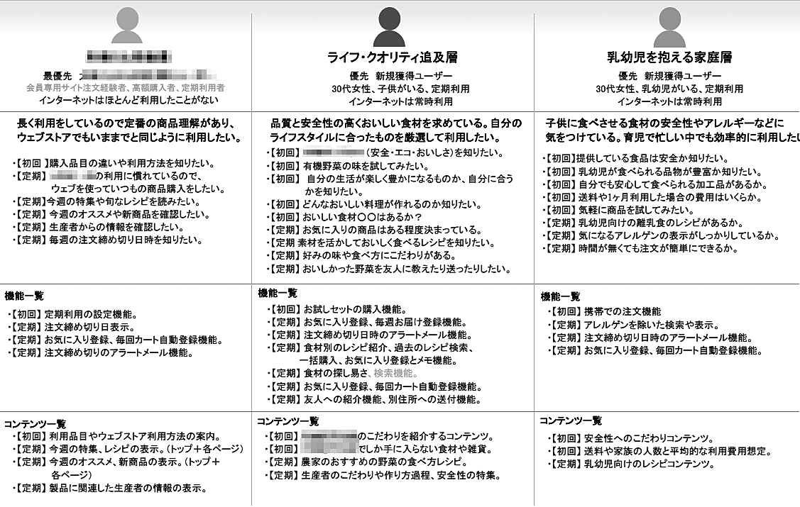
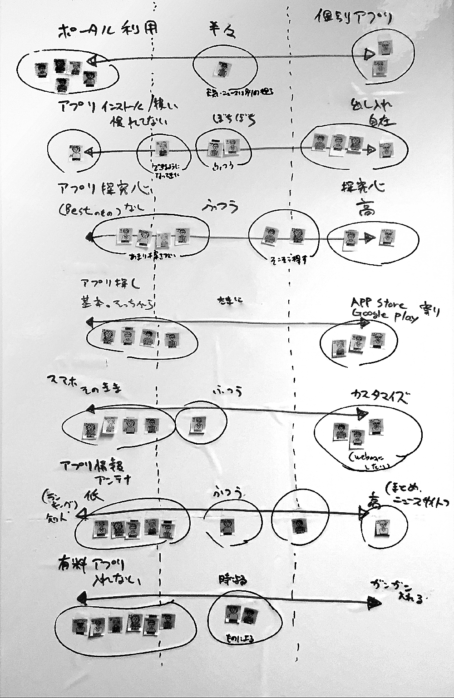
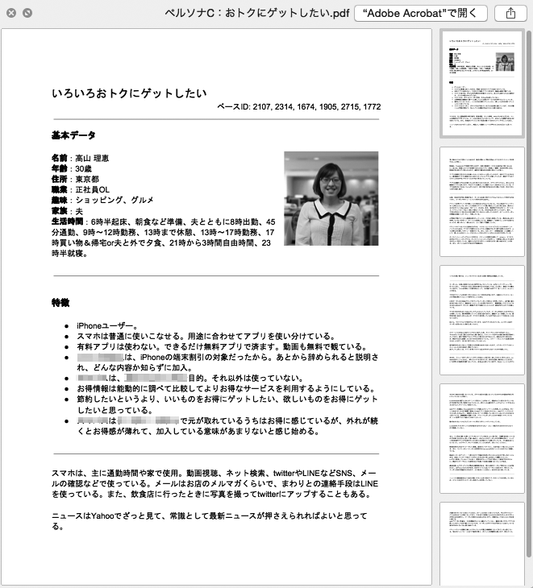

# 概要と流れ
戦略のフェイズでは、ビジネス要件やプロジェクトの方針、そしてアクセシビリティ方針を明確にしました。「要件定義」のフェイズでは、それらの方針を踏まえた上で、具体的にどのような機能やコンテンツが必要になるのか検討し、サイトが満たすべき要件を定義します。

コンテンツを企画する際には、アクセシビリティ方針を踏まえて、求められる基準を満たせるようにする必要があります。アクセシビリティが確保できない場合、別の形で表現したり、代替コンテンツを用意することを検討しましょう。また、実装要件を定義し、検証を行うブラウザやOS、デバイスなどの環境や、印刷時、スクリプト無効時等の要件について決めておきます。これらを事前に検討しておくことで、公開後に泥縄式の対応が求められるような事態を避けることができるでしょう。

## STEP1 サイトの現状調査
まず、サイトの調査を行い、サイトがユーザーにどう受け止められ、どう使われているのか、現状を把握します。特にリニューアルの際は、既存サイトの課題を把握しておくことが重要です。プロジェクトによって必要な調査は異なりますが、一般的には以下のような調査を行います。

* ユーザー調査
* コンテンツ分析
* 流入状況調査
* SNS利用状況調査
* システム調査
* 社内フロー分析

以下に挙げるように、具体的な調査の方法はいくつかあります。

### アンケート
多数のユーザーに対してアンケートを実施して、問題点を抽出します。競合他社のサイトと見比べた際の印象、使いやすさなどを回答してもらい、集計・分析します。定量的なデータが手に入りますので、ブランドの方向性を決めるような場合には良い手法です。ユーザーがアクセシビリティの問題を感じたことがあるか、サイトのアクセシビリティ方針を気にしているか、といった調査も可能ですが、実際のユーザーの挙動そのものを見ているわけではないため、問題の本質まではわからないことが多いでしょう。

### ユーザーインタビュー
ユーザーインタビューは、ユーザーに実際にサイトを使ってもらい、その様子を観察したり、ヒアリングを行ったりしてユーザーを理解する手法です。何のためにサイトを使い、何を利点と感じ、何に不満を感じるのか、といったユーザーの心理や行動を把握し、ユーザー像を明確にします。これにより、そのユーザーに合った、ユーザビリティの高いコンテンツとは何かが見えてきます。アクセシビリティの問題にはユーザビリティと重なる部分もあるため、そのような部分をカバーする手法としても有効です。

ただし、ユーザーインタビューでは特定のユーザーを観察するため、さまざまな環境における問題を抽出することはできません。障害当事者にインタビューすることも可能ですが、障害の程度や性質は人によって全く異なり、スキルや知識のレベルによってもアクセス方法が全く異なることがあるため、アクセシビリティの問題を網羅的に発見することは難しいでしょう。

### ヒューリスティック評価
ヒューリスティック評価は、確認項目のリストに沿ってチェックを行い、問題点を抽出する手法です。専門的な視点によるチェックが行われるため、多数派のユーザーが気にしないような問題点や、表面化しづらい問題に気づくこともあり、アクセシビリティの調査とは相性の良い手法です。比較的短期間で結論を出すことができるのもメリットと言えます。

専門的な視点と言っても、調査のために必要な要素はWCAG 2.0やその関連文書に書かれていますので、そこまで高度な知識がなくても実施することができます。「2-2適切でないアクセシビリティ方針」の「現状のリサーチを行う」の項も参照してください。

## STEP2 ユーザー像の定義
戦略フェイズで、ビジネス要件としてのターゲットユーザーの定義を行っているはずです。これを踏まえ、このサイトを訪れるのはどのような人か、どのような人に来てほしいのかを確認し、そのユーザー像を明確にして、共有できるようにします。ユーザー像を明確する方法にはさまざまなものがあります（図1）。

図1：ユーザー像を明確にするさまざまな方法の例

サイトの要件を考える上で、ユーザーの行動を想定することは重要です。ユーザーがどういう目的でどういう行動をとり、どこから来てどこへ行くのか、というシナリオを考える必要があります。

ユーザーの行動を考える際には、サイトの外にも目を向ける必要があります。そもそも、ユーザーがWebを使うとは限りませんし、Webを使うときも、ひとつのサイトで全てを完結させるとは限りません。ユーザーはこのサイトに来る前に検索エンジンを使っていることが多いでしょうし、同業他社のサイトも
見て比較しているかもしれません。

また、近年ではスマートフォンやタブレット、PCなど、さまざまなデバイスが出てきています。PCで調べたことの続きをスマートフォンで見るというように、複数のデバイスをまたぐ体験が当たり前になっています。紙媒体やテレビなど、Web以外のメディアにまたがるケースもあるでしょう。さまざまな状況、さまざまなデバイスを考慮することは、アクセシビリティへの取り組みの必要性につながります。

### ペルソナ法の落とし穴
ユーザーをイメージしやすくするために、具体的なプロフィールや人物像を設定した仮想のユーザーを想定する手法があります。この仮想ユーザーを「ペルソナ」と呼びます（図2）。

ユーザーについて考える際、ペルソナは強力なツールとなります。ユーザー像を明確にせずに「この言葉はユーザーに伝わるだろうか?」と考えるよりも、ペルソナを想定して「この言葉はデジカメを初めて買うA子さんに伝わるだろうか?」と考えるほうがわかりやすく、より明確な答えを出すことができます。

しかし、アクセシビリティの観点から見ると、ペルソナ法には落とし穴があります。ペルソナは特定のユーザーを想定し、その特定のユーザーにとって使いやすいものを考える手法です。これは、さまざまな環境を想定するというアクセシビリティの原則とは反対の方向を向いています。たとえば、健康でPCの操作が得意な人のペルソナをつくり、そのペルソナだけを意識した場合、アクセシビリティへの配慮はほとんど不要だという結論になってしまうでしょう。

それでは、障害者のペルソナを作ればよいのでしょうか。障害の種類はさまざまです。視覚障害に絞っても、全盲だけでなくロービジョン（弱視）の人もいますし、ロービジョンの人も見え方は一人ひとり異なります。ある人には見えやすいと感じるものが、他の人には全く見えないということが起こります。見え方の程度が同じでも、使っている支援技術が異なっていたり、使い方が異なることもあります。このようなさまざまな状況の全てについてペルソナを作ることは現実的ではありません。ペルソナ法は、多種多様な状況を想定することには向いていないのです。

とはいえ、アクセシビリティの中にも、ペルソナが有効なものはあります。ナビゲーション、ラベル、文章をユーザーにわかりやすくする際には、ペルソナを想定すると良いでしょう。ペルソナを活用しつつも、同時にさまざまなユーザーについて思慮をめぐらせることが重要になります。

図2：ペルソナの例

## STEP3 コンテンツの企画と定義
実際にサイトにどのようなコンテンツを持たせるのかを検討します。

### 要素の洗い出し
まず、サイトに必要となる要素を洗い出します。要・不要を考えながら取捨選択し、要素ごとの関係性を考えながら、おおまかにコンセプトマップとしてまとめます（図3）。

図3：コンセプトマップの例

### コンテンツ仕様の検討
ここから、それぞれのコンテンツの詳細を検討していきます。コンテンツにどんな要素が含まれるのか、ページ構成はどうなるのか、各ページにどのようなものが入るのか、といった要素を検討し、ドキュメント化します。ここでアクセシビリティについて考慮することはきわめて重要です。コンテンツの性質によっては、そもそもアクセシビリティを確保できなかったり、問題を起こしやいものがあるからです。

#### グラフィックや音声など、特定の感覚に依存するもの
グラフィックや音声などは、それぞれ視覚、聴覚に依存したコンテンツになります。場合によっては代替となるテキストを用意することも可能ですが、アーティスティックな表現などはテキストでは伝えきれないことがあります。また、テキストを用意することにコストがかかる場合もあります。

#### お絵かきやゲームなど、特定の操作に依存するもの
ユーザーの操作に応じて変化するインタラクティブなコンテンツが、特定の操作に依存してしまうことがあります。たとえば、マウスでお絵かきができるというコンテンツを、ポインティングデバイスがない環境で操作することは難しいでしょう。ゲームのコンテンツも、特定の操作デバイスや操作タイミングに依存することがあります。

ただし、アクセシビリティに配慮するということと、アクセシブルでないコンテンツを一切認めない、ということはイコールではありません。ゲームやお絵かきなどのコンテンツは、どうしてもアクセシブルにできないことがありますが、だからといって、全く使ってはならないということではありません。

## STEP4 実装要件の定義

### ブラウザ・OS・デバイス要件
このサイトが、どのようなブラウザやデバイスで閲覧できる必要があるかを決定します。ただし、ここで決めるのはあくまでも最低限の要件で、実際は、他のブラウザでも問題なくアクセスできることがほとんどです。ここでは以下の2点を明確にします。

* どのような環境でテストを実施するのか
* それぞれの環境において、どこまでの動作を保証するのか

アクセシビリティの観点では、ありとあらゆる環境でのアクセスを保証することがベストです。しかし現実問題として、世界に存在する全ての環境でテストを実施することはできません。また、古いブラウザでは新しい技術に対応していない場合がありますし、デバイスの特性などの理由で、一部のコンテンツにどうしてもアクセスできないというケースが出てきます。そのような場合に、アクセスできるように対応しなければならないのか、あるいは、代替コンテンツを用意するといった対応でよいのか、などの点を判断する必要があります。事前に要件を決めておかないと、そのような判断が難しくなります。

なお、「アクセスできない、対応していない」ということをきちんと把握することも重要です。これを把握することで、必要に応じて代替コンテンツを用意するなどの対応をすることが可能になるからです。

ベンダーのサポートが終了したOSやブラウザの扱いを明確にすることも重要です。サポートが終了したソフトウェアは、ベンダーでさえ動作を保証できず、ユーザーが安全に使用することはできません。無理に動作を保証しようとせず、対応しないことを明確にしておくのが良いでしょう。

### スクリプト無効時・プラグイン無効時
JavaScriptやFlashなどの機能は、環境によって動作しなかったり、設定で無効にすることができます。このような機能が無効の場合の対応について、事前に方針を決めておく必要があります。方針には以下のようなものがあります。

#### スクリプトやプラグインを利用しない
サイト内でスクリプトやプラグインの機能を一切使用しない、というのもひとつの方針です。特に、Flashはスマートフォンで動作しないことがあり、似たような機能をJavaScriptで実現できることも多いため、使用しないという選択をすることがあります。

#### 依存しない形で利用する
技術を利用しても、情報の取得に影響がない形でのみ利用し、依存しないようにするという方針もあります。たとえば、マウスオーバー時のエフェクトにJavaScriptを利用する場合、スクリプト無効時はエフェクトが再現されませんが、情報へのアクセスは問題なく可能です。スクリプト無効時にリッチなUIの代わりにシンプルなフォームを表示する、凝ったメニューの代わりにシンプルなリンクを提供するなど、代替手段を提供する方法もあります。

#### 依存する形で利用する
主要なコンテンツが、ある技術を使わなければ実現できないものの場合、その技術に依存することもやむを得ません。この場合、無効環境ではそのコンテンツを利用することができません。そのような場合でも、真っ白な画面を出すのではなく、どのようなコンテンツがあるのかを説明しておくと良いでしょう。そうすれば、ユーザーは必要に応じて別の環境でアクセスし直すこともできます。

### 印刷時
Webページを紙に印刷したときの要件を確認しておきましょう。ナビゲーションやボタンが紙に印刷されても使えませんので、印刷時にはナビゲーションを表示しないようにすることがあります。逆に、ナビゲーションが表示されないとイメージが大きく異なってくる、ナビゲーションの中にも有益な情報が含まれている、といった理由で、あえて印刷させたいこともあります。また、場合によっては、適切な印刷結果を得るためには印刷用スタイルの調整が必要になることもあります。印刷時にナビゲーションを消すのかどうか、印刷用のスタイル調整を行うのか、といったことを事前に決めておく必要があるでしょう。

### 運用要件の検討
サイトの運用も重要な要件です。以前は更新のたびに制作会社に発注する企業も多かったのですが、近年ではCMSを導入するケースも増えてきました。CMSにはさまざまな機能があり、うまく活用すればアクセシビリティの向上に役立ちます。ただし、CMSを導入すればなんでも解決するわけではありません。CMSはコンテンツを管理する道具に過ぎず、もともとアクセシブルでないコンテンツをCMSに入れても、アクセスできるようにはなりません。

逆に、CMSの制約によってアクセシビリティが損なわれる場合もあります。特に注意が必要なのは、サイト要件よりも先にCMSの導入だけが決まっているパターンです。このような形のプロジェクトでは、サイトの形や現実の運用フローに合わせたCMS選定が行われていない可能性が高く、機能先行でコンテンツが置き去りになってしまうおそれがあります。このような問題点については、「3-6 CMSの導入で失敗する」も参照してください。
