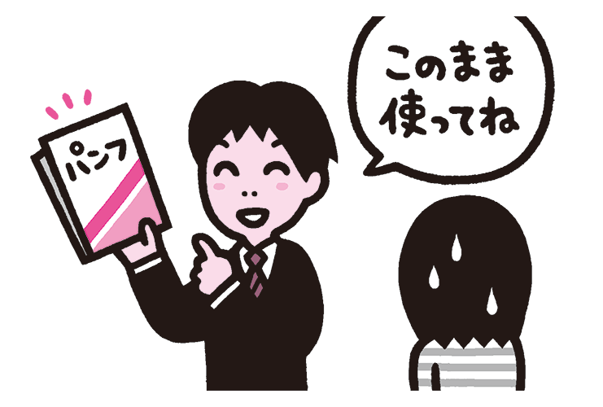
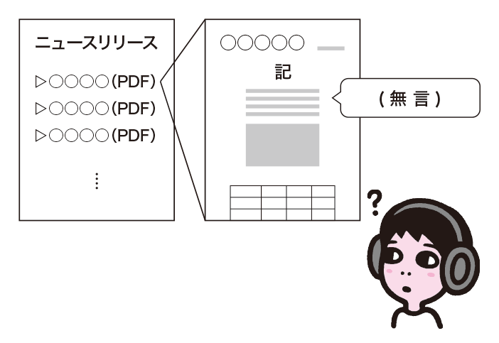
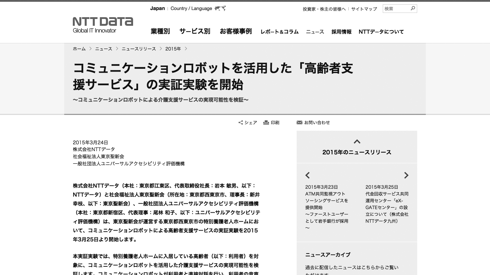
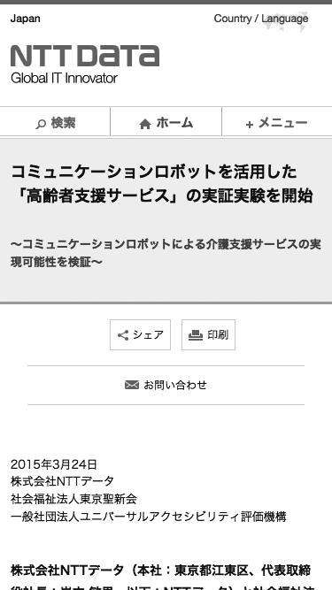

# 紙媒体のコンテンツがそのまま使われる
紙媒体を想定して作られたコンテンツを、Webにそのまま流用しようとするケースがあります。しかし、単純に流用できるケースはそれほど多くありません。

## よく見られる問題

### 紙媒体のコンテンツをそのままWebに流用する

紙媒体のコンテンツをそのままWebに流用しようとしている例。紙媒体はマシンリーダビリティやマルチデバイスを考慮しておらず、アクセシブルでないことが多い。

### アクセシブルでないPDFを流用してしまう

ニュースリリース一覧にPDFが並ぶ例。PDFのアクセシビリティに問題があると、スクリーンリーダーなどで全くアクセスできなくなる。

## ここが問題！ Webは紙媒体と特性が異なる
紙媒体を想定して作られたコンテンツは、Webの特性を考慮していません。そのままWebに流用しようとしても、うまくいかなかったり、アクセシビリティの問題を起こすことがあります。

### 紙媒体のコンテンツをそのままWebに流用する
プレスリリースなどの文書をWebに掲載することはよくあります。このとき、元となる原稿が紙のことしか考慮していないと、適切な見出しがなかったり、代替テキストに配慮されていなかったり、きわめて複雑な表が使われていたり、といったさまざまな問題が出てくる場合があります。現場の実装担当者が、裁量で見出しや代替テキストを補っている場合もあるでしょう。しかし、個々人の裁量に任せる形では、担当者によって対応の仕方が変わってしまったり、対応が行われなかったりする可能性があります。

### アクセシブルでないPDFを流用してしまう
プレスリリース用に作られたPDFファイルを、PDFファイルのまま掲載して済ませてしまうパターンもあります。元のPDFがアクセシブルなものであれば問題ない場合もありますが、実際は問題を抱えていることが多く、そのまま流用するとアクセスできなくなるケースがあります。

## 解決アプローチの例

### 原稿をWeb用に再構成する

Web用に再構成した原稿の例。紙媒体とレイアウトを変え、Web用に再構成しているため、画面幅が狭くなっても使いやすい。

## 解決アプローチ 流用できるか検討し、必要に応じて再構成する
紙媒体に向けて作られたコンテンツを、そのままWebに流用できると考えるべきではありません。そのまま使える場合もあるでしょうが、ほとんどの場合、Web向けに作り直す必要があります。

### Web用に再構成する
まずは内容をチェックし、Webに向いていない要素がないかどうかチェックします。特に、以下のような点については、表現を変えたり、Web用に再構成したりすることを検討しましょう。

* 複雑な表が使われている場合、シンプルな表に組みなおす、もしくは表をやめる
* 画像や写真に頼った表現がある場合、代替テキストを考慮し、必要に応じてテキストを補う
* 下線や取り消し線など、視覚に頼ったテキストの表現がある場合、テキストだけで理解できるように内容を見直す

対応方法の詳細は、「7章コンテンツ設計」および「8章ビジュアルデザイン」で扱っていますので、参考にしてください。
