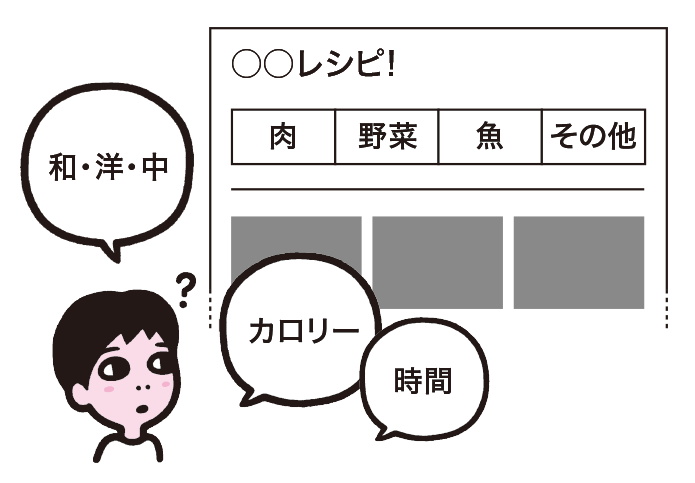

# 分類や並び順がわかりづらい
情報の分類や並び順が運営者視点になっていると、ユーザーのニーズを満たさないことがあります。カスタマージャーニーマップやコンテンツ目録などを活用して、ユーザーが見てわかりやすいように分類・整理しましょう。

## よく見られる問題

### 分類がユーザーのニーズに沿っていない

事業部別に分類されたメインナビゲーションの例。社内の組織構造を知らないユーザーには理解できず、どこに目的の情報があるのかわからない。

提供側が想定した重要度の順で並んだ新着情報リストの例。ユーザーは一番新しい情報を知りたいのに、それがどれなのかがわからない。

### 分類が一種類に限定されている

レシピサイトのナビゲーションが材料で分類されている例。材料以外の探し方をしたいユーザーにとって、このナビゲーションはニーズを満たせない。

新着順に並び順が固定された商品検索結果の例。新着を知りたいユーザーには良いが、他の切り口で探したいユーザーは目的の情報にたどり着けない可能性がある。

### サイト内でコンテンツや機能が分散している

サイト内に製品カタログページと特集ページがあり、情報がそれぞれに分散している例。ユーザーは情報を探し回らねばならない。

サイト内検索、Q&A検索、製品検索など、同じように見える機能が複数ある例。それぞれ検索範囲が違うため、混乱の原因になる。

## ここが問題! 運営者視点の分類はニーズを満たさない

情報の分類がユーザーニーズに沿っていないと、そこに含まれる内容が類推できず、目的のものを見つけられません。また、サイトの規模によっては、似て非なる情報の分散が起こり、これも混乱の原因になります。

### 分類がユーザーのニーズに沿っていない

運営者の視点で分類を行うと、ユーザーの考え方に沿った分類にならないことがあります。たとえば、社内の担当事業部ごとに製品を分類すれば、内部では運用しやすくなるかもしれません。しかし、ユーザーはどの製品がどの事業部のものか知らないため、製品を探し出せなくなってしまいます。

また、運営が重要と考える情報をユーザーも重要と考えるかどうかはわかりません。日付順に並ぶ新着情報のリストの中で、運営側が重要だと思った情報だけを先頭に持ってきたりすると、ユーザーには並び順のルールがわからなくなり、混乱してしまいます。

### 分類が一種類に限定されている

多くのコンテンツは複数の切り口で分類することができます。たとえば、料理のレシピには材料や手順、調理時間、カロリー、和洋中などのジャンル、旬の季節、などの切り口があります。また、コンテンツの並び順にも複数の切り口があります。たとえば、カメラの製品一覧であれば、発売日、価格、大きさ、重さ、人気度、レビュー数、評価平均値、50音（アルファベット）などが挙げられます。

このようなコンテンツに対し、ユーザーはさまざまな切り口で情報を探そうとします。目的に合った切り口のナビゲーションがないと、ユーザーはコンテンツを探し回ることになり、目的のコンテンツにたどり着けないことがあります。「4-6 情報への到達手段が少なすぎる」も参照してください。

### サイト内でコンテンツや機能が分散している

あるひとつの情報が、サイト内で複数のページに分散していることがあります。たとえば、ひとつの商品の情報が、商品詳細ページ、特集ページ、商品スペシャルコンテンツといった別々のページに掲載されることがあります。このとき、あるページで得られる情報が別のページにはなかったり、表現が微妙に異なったりしていると、ユーザーはどこを見れば必要な情報が手に入るのかわからず、混乱してしまいます。

機能の整理が不十分な場合も同様の問題が起きます。たとえば、サイト内検索、 Q&A検索、製品検索などの機能を個別に導入している場合がありますが、それらの機能がきちんと文脈に沿っていなかったり、UIが差別化されていないと、ユーザーには同じものに見えます。同じ検索をしているのに結果が異なったり、思ったものが出てこなかったりするように見え、混乱の原因になってしまいます。

## 解決アプローチの例

### ユーザーの行動からタスクを想定して分類を行う

カスタマージャーニーマップの例（参考1）。ペルソナをもとにユーザーの行動、およびそこから生じるタスクを想定する。

### 異なる分類軸を選べるようにする

メインナビゲーションとは別の軸のナビゲーションを設けたり、リストの並び順を切り替える機能を設けた例。情報探索に選択肢が生まれ、目的を達成しやすくなる。

### コンテンツ目録を定義して分散を防ぐ

コンテンツ目録の例。どのコンテンツがどこに掲載されるのかを管理することで、不要な分散を防ぐ。

## 解決アプローチ ユーザー中心の分類を基礎にし、複数の軸で分類する

ユーザーの行動に沿って情報の分類を行います。カスタマージャーニーマップ、カードソーティングなどの手法で分類し、複数の分類軸を用意します。また、情報が複数の箇所に分散しないように、コンテンツ目録を作成して管理します。

### ユーザーの行動からタスクを想定して分類を行う

ユーザーが理解できる分類を行うためには、提供側の事情や思い込みによる分類を避け、ユーザー視点での分類を行う必要があります。ユーザーがどのような状況で、何を行おうとしてサイトを訪問するのかを検討し、ユーザーの行動を軸にして分類します。

### ペルソナからカスタマージャーニーマップを作成する

ユーザーの行動を想定するには、3章「要件定義」の「概要と流れ」でも紹介したペルソナ法が有効です。インタビューやアンケート、アクセスログなどからペルソナを作成していれば、ペルソナは行動パターンの情報も含んだものになっているはずです。このまま検討を行うことも可能ですが、ペルソナの行動を時系列で可視化した「カスタマージャーニーマップ」を作成しておくと、のちの作業で参照しやすくなります。このとき、現状のペルソナの行動を示したもの（AsIs版）と、サイト運営者がこうなってほしいと期待する理想的な行動を示したもの（ToBe版）をまとめておくようにします。

### ユーザーの認知や行動の傾向を調査する

分類しようとしている情報に対して、ユーザーがどういう分類を思い描くか、どういう言葉で探しているかを把握します。これによって、ユーザーが推測しやすいグルーピングを考えることができます。以下のような点を調査すると良いでしょう。
- 競合のサイト、雑誌や書籍などの媒体、実店舗などが、どのように情報を分類しているか。また、並び順はどのようにしているか、検索機能などを備えているか
- ユーザーがどのような検索キーワードで探しているか。そのキーワードで検索した場合に出てくる他社のサイトのページの構成はどうなっているか
- 既存サイトがある場合、サイト内検索でどのような検索キーワードが使われているか。検索されたがヒットしなかったキーワードにどのようなものがあるか。ヒットした場合、結果のページには何が載っているか

### カードソーティングによる分類の検討

カスタマージャーニーマップの作成とユーザー行動の調査ができたら、実際に情報の分類を検討していきます。

まず、 3章「要件定義」の「概要と流れ：STEP3 コンテンツの企画と定義」で紹介したコンテンツの洗い出し結果をもとに、各コンテンツのタイトルを付せんなどの「カード」に書き出します。そして、これらを並べ替え、「ソート」してグルーピングしていきます。この手法を「カードソーティング」と呼びます。

この際、最初からカテゴリ名を決めておくのではなく、カードだけを見て、似たようなもの、共通点のあるものをまとめていきます。カスタマージャーニーマップを参考にしながら、ユーザーの目から見た類似点、共通点を考えてまとめていきましょう。グルーピングを複数人で行ったり、誰かがまとめたものを次の人がレビューしていくような形にすると、偏りが防げます（図1）。可能であれば実際のユーザーにグルーピングに参加してもらうと、より確度が高まるでしょう。

このように、既存の枠にとらわれずに情報を自由にまとめていく手法を「オープンカードソート」と呼びます。オープンカードソートを行うことで、運営者視点のカテゴリ分けをいったん廃して、ユーザー視点でのグルーピングを考えることができます。これに対し、既存のカテゴリに情報を当てはめていく手法を「クローズドカードソート」と呼びます。サイトの構造を変更できない条件でコンテンツを追加したり、既存コンテンツの分類を見直したりする場合は、クローズドカードソートが有効なこともあります。

もっとも有効と思われる分類軸が検討できたら、それらをサイトマップやナビゲーションへの機能要求の土台とし、引き続きサイト全体の構造の検討に移ります。

図1：カードソーティングを行っている現場の例

### 複数の分類軸を用意する

メインとなるナビゲーションや並び順とは別の軸の分類も設けておくと、情報探索に選択肢が生まれ、ユーザーは目的を達成しやすくなります。

#### カードソーティングでの試行の繰り返し

カードソーティングによる分類は、別の分類軸を設けるのにも有効です。ある軸でグルーピングができたら、別の軸でのグルーピングを検討し、それを繰り返すことで、さまざまな分類軸が見えてきます。

ユーザーの行動において、サイトとの接点はひとつだけとは限りません。同じサイトに、異なる流入経路や異なる目的で訪問するのはよくあることです。複数の経路や目的それぞれに対して適切な分類を考えていくと、分類のパターンが複数出てきます。並び順についても、経路や目的ごとに適切なものが異なってくるでしょう。大小や強弱がつけられる全ての属性について、分類と並び順をひと通り検討してみるようにします。

#### サイトへの組み込み

有効と考えられる分類軸が特定できたら、サイトに組み込みます。ナビゲーションであれば、コンテンツエリアの冒頭やサブカラムなど、迷った時に目を運びやすい位置に展開するのが良いでしょう。併せてフッタで展開するのもよい手です。コンテンツを読んだ後で別のルートを提示できるからです。

また、並び順の切り替え機能であれば、リストの冒頭にボタンやセレクトボックスとして設置するのが一般的でしょう。このとき、セレクトボックスが操作された瞬間に並び順が変わるようにしていると、キーボードで操作できなくなることがあります。選択した後、決定ボタンを押したときに並べ替えるようにしましょう。

#### 盛り込みすぎに注意

複数の分類軸を提供することは有効ですが、検討した全ての分類軸が採用できるわけではありません。用語集のコンテンツを50音順に分類することには意味がありますが、ニュースリリースをタイトルの50音順で分類しても意味がありません。意味のない分類をナビゲーションとして追加すると、ナビゲーションが複雑になり、逆効果になります。どの軸を採用するかは慎重に検討する必要があるでしょう。

また、ナビゲーションが増えるということは、それだけコンテンツの領域が減るということです。特にスマートフォンなどの画面が狭いデバイスや、スクリーンリーダーなどのコンテンツを直線的に受け取る環境では、多すぎるナビゲーション類はかえって邪魔になります。有効かつ邪魔にならないというバランスを見つけるには、机上で想像を続けるより、ある程度の形が見えてきた段階で早期にプロトタイプを作成して、ユーザビリティテストを行うのが良いでしょう。

### コンテンツ目録を作成して分散を防ぐ

ひとつの情報が複数のページに点在したり、似て非なるページが乱立する状況を防ぐためには、コンテンツ目録による管理が有効です。

#### コンテンツ目録とは

コンテンツ目録とは、3章「要件定義」の「概要と流れ：STEP3 コンテンツの企画と定義」で説明した「コンテンツの企画と定義」の結果をリストの形にまとめたもので、「コンテンツインベントリ」と呼ばれることもあります。サイトマップがページレベルの分類で、「ページ→その中身の概要」という観点でまとめられているのに対し、コンテンツ目録は、「コンテンツ→掲載ページ」という観点で、詳細なマッピングを行なったものです。

#### ページレベルではなく、コンテンツレベルで管理する

サイトをリニューアルする際は、基本的には既存サイトのページ構成を踏襲せず、ページの統廃合を行います。そのため、ページレベルでの管理ではなく、コンテンツのチャンク（かたまり）のレベルで分類、取捨選択を行ったり、似たような情報を近接させる、関連情報を相互に結びつけるといった再編作業が必要になります。

この状態管理をページごとの仕様書だけで行うと、既存サイトとリニューアル版で何がどう変わったか把握できなくなってしまいます。コンテンツ目録を作成しておけば、ある情報がどのページにどんな形で記載されているかわかるため、情報が点在したり、似たようなページ、似たような機能が乱立してしまう事態を防げます。

#### やむを得ず分散させる場合は、相互リンクで補完する

コンテンツや機能は、基本的には似て非なるものが存在しないように統廃合すべきです。ただしリニューアルの範囲や、過去の慣習、サイトの機能の制限などによって、すぐには整理しきれない場合もあるでしょう。そのような事情でやむを得ずコンテンツや機能が分散してしまう場合は、それぞれの守備範囲を解説しつつ、近い内容を持つページや機能同士を相互リンクし、補完関係を作るようにしましょう。このようにすれば、少なくともそれぞれの違いは理解でき、混乱を減らすことができます。

参考1 [カスタマージャーニーマップで顧客の心を見つめてサイトを改善、5つの作成ステップと7つの実例](http://web-tan.forum.impressrd.jp/e/2014/03/24/16722)
