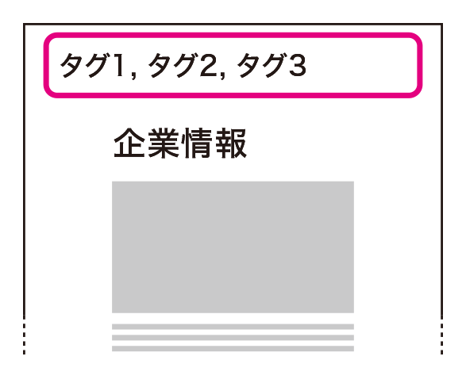

# 現在地がわからない

ユーザーがサイト内で方向転換しようとするときは、現在地の情報を参考にします。わかりやすさと冗長さのバランスをとりながら、ナビゲーションとパンくずリストの組み合わせで現在地を表現しましょう。

## よく見られる問題

### 現在地を把握する手段がない

ナビゲーションの現在地表示やパンくずリストがない例。自分がどこにいるのかわからず、どこに行けるのかも推測できない。

### 現在地の表示と間違えそうな表現がある

ナビゲーション内の特定の項目を強調している例。強調箇所が現在地表示のように見えてしまう。

## ここが問題! 迷ったとき、現在地がわからないと混乱する

ユーザーが迷ってしまったときは、自分が間違えてどこかに迷い込んだと考え、現在地を知ろうとします。現在地がわからないと手がかりがなくなり、目的の場所に行けなくなることがあります。

### 現在地を把握する手段がない

現在地を知りたいとき、ユーザーはよくある現在地表示を探します。そのひとつは、ナビゲーションの現在地表示です。ナビゲーション内で選択済みに見える表現があると、ユーザーはそこが現在地であると考えます。もうひとつは、サイトのホームから現在地までの階層を示す「パンくずリスト」と呼ばれるナビゲーションです。これらがないと、ユーザーは現在地を見失ってしまいます。

### 現在地の表示と間違えそうな表現がある

一般的な現在地表示のパターンを別の意味で使うと、ユーザーは誤解してしまいます。ナビゲーション項目を不用意に強調したり、スタイルを変えたりすると、現在地表示のように見えます。また、テキストリンクを並べたものがタイトルなしで置かれていると、パンくずリストのように見えます（図1）。

図1：パンくずリストと間違えそうなリンクの例

パンくずリストのように見えるナビゲーションの例。実際はコンテンツが所属するタグの一覧であり、階層構造は示していない。

## 解決アプローチの例

### ナビゲーションに現在地表示をつける

ナビゲーションに現在地表示をつけた例。ナビゲーションが複数ある場合、それぞれの現在地を見ることで現在の詳細な位置が分かる。

### パンくずリストを設置する

パンくずリストを設置した例。直接的に現在地を確認でき、必要があれば上層のページに移動して確認することもできる。

## 解決アプローチ 一般的なわかりやすい現在地表示をつける

ユーザーが迷ったとき、現在地の情報をすぐに見つけられるようにする必要があります。サイト全体のナビゲーションに現在地表示をつけ、バランスを見ながらパンくずリストを設置しましょう。

### ナビゲーションに現在地表示をつける

ユーザーが現在地を理解できるように、ナビゲーションには現在地表示をつけます。現在地表示は、はっきりと違いがわかるものにした上で、スタイルも独自のものとし、別の目的に使わないようにします。また、色のみに依存しないよう注意しましょう。「8-1見た目に頼っている」も参照してください。

また、ナビゲーション内の現在地の項目からは、リンクを外すべきです。自分自身にリンクするリンクがあると、押してもページが変化せず、混乱を招きます。

### パンくずリストを設置する

3階層以上あるサイトの場合、パンくずリストの設置を検討しましょう。パンくずリストは、ページ上部に設置することが一般的です。ただし、ページ上部のナビゲーションで現在地が十分に示せている場合、補助的な扱いとして、ページの下部に置くこともあります。

パンくずリストだと明確に認識できるように、独自のデザインは避け、一般的なパンくずリストのデザインにそろえます。パンくずリストの先頭は「ホーム」から始め、区切り文字には「>」を使いましょう。区切りに画像を使用する場合は、「右向き」を指す表現にします。

## コラム 複雑すぎるパンくずリスト

コンテンツが同時に複数のカテゴリに属する場合、親階層となるページが複数存在することになります。このとき、親ページの数と同数のパンくずリストを並列で配置してしまうと、膨大な数のリンクの中からリンクを探し出さなければならなくなり、読み飛ばすことも難しくなります（図1）。複数のパンくずリストが考えられる場合でも、主要なものひとつだけに絞って提示しましょう。

親のカテゴリを漏れなく示すことが必要な場合は、パンくずリストとは別に、親カテゴリへのリンクを設置し、コンテンツ内に設置すると良いでしょう。見た目がパンくずリストと近くても、文脈が異なるため、ユーザーの利用シーンは異なるものになります。コンテンツを読んだ後で出現するため、大量のリンクが提示されてもユーザーが混乱することは少ないでしょう（図2）。親カテゴリに戻る手段については、次節「4-5再調整したり、やり直す手がかりがない」も参照してください。

図1：ナビゲーション領域に多数のパンくずリストを設置した例

ナビゲーション領域に多数のパンくずリストが置かれている例。パンくずリストが非常に広い領域を占め、読み飛ばすことが難しくなっている。

図2：パンくずリストの要素をコンテンツ内に配置した例

パンくずリストの要素をコンテンツ内に配置した例。前後には見出しも立っているため、読み飛ばすことも難しくない。
