# 再調整したり、やり直す手がかりがない

ナビゲーションが整備されていても、サイトの中でユーザーが迷ったり、混乱することはあります。ユーザーが行き詰まることを避けるために、少し手前に戻って再調整したり、最初に戻ってやり直す手段を提供しましょう。

## よく見られる問題

### トップページへのリンクが見つけられない

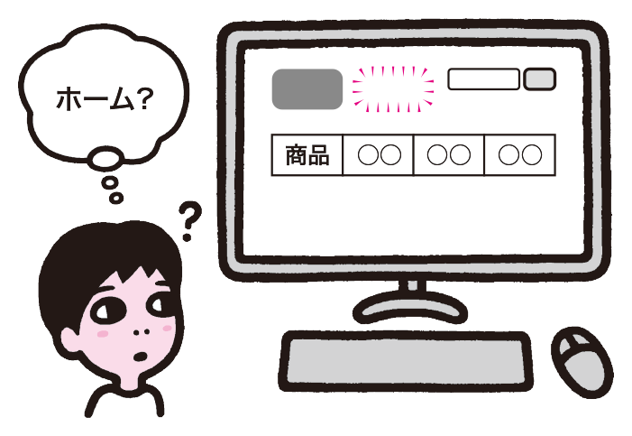

ページにトップページへのリンクがない例。迷ったり全体を見渡したいと思った時に、トップページに戻ることができない。

### 最初のページに戻れない

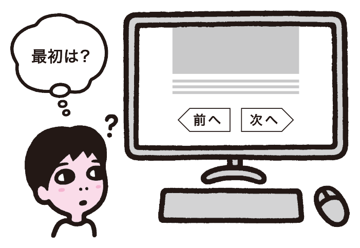

コンテンツが複数ページにまたがるが、先頭に戻るリンクがない例。途中のページにランディングしてきた場合、コンテンツを最初から読むことが難しくなる。

### 親階層やカテゴリトップへのリンクが見つけられない

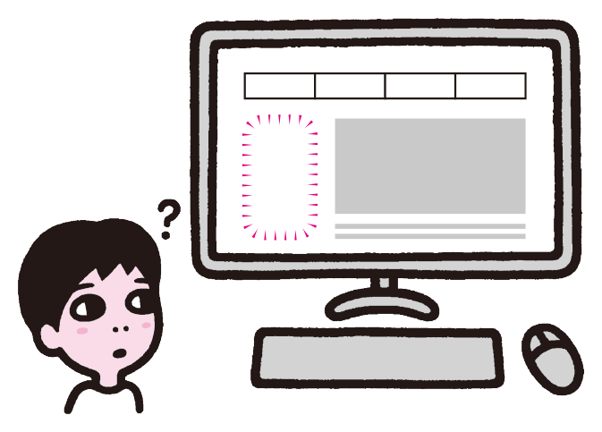

親階層やカテゴリトップへのリンクがない例。ひとつ上に戻りたい場合も一度トップページに戻るしかなく、サイトの階層が深い場合は大幅な遠回りになる。

### 読み終わったあとに移動できない

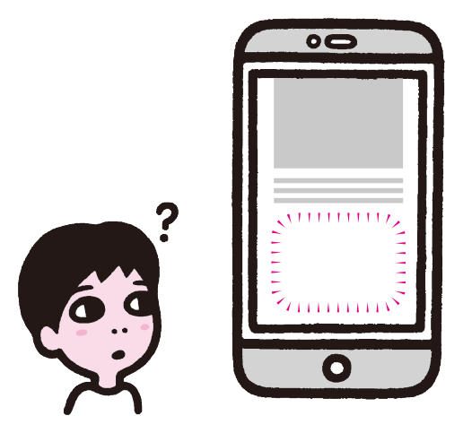

コンテンツを最下部まで読んだ後、そこからの移動先がない例。違うものを見たかったり、読んだ結果のアクションを起こそうとしても、行き先がわからない。

### 行き止まりになって先に進めない

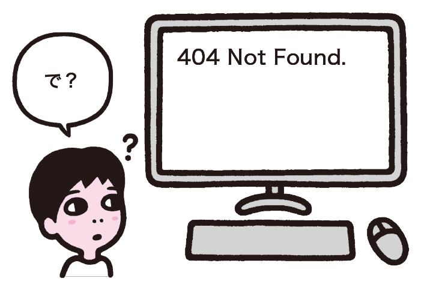

404 Not Foundページで、次のアクションにつながるリンクがない例。ユーザーはどうしてよいかわからず立ち往生してしまう。

### 検索結果に対し、やり直しの手段が提示されない

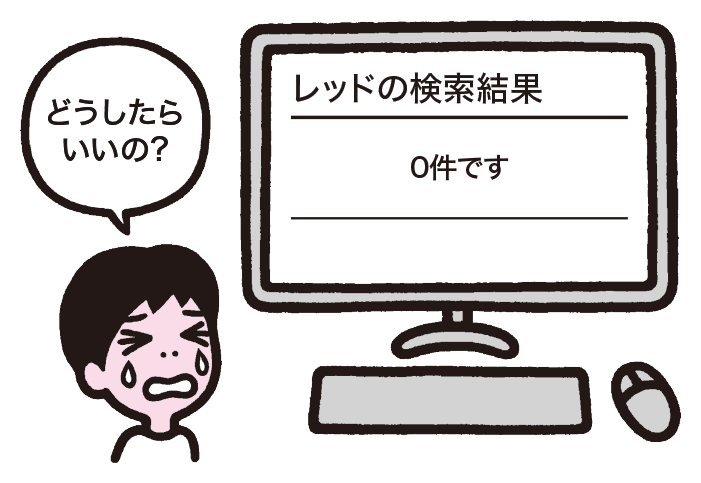

検索結果ページで、検索をやりなおす手段が提供されていない例。希望の結果が得られなかった場合、ユーザーはどうすればよいのかわからない。

## ここが問題! やり直しができないとユーザーが行き詰まる

ユーザーは直前の操作を取り消したり、最初に戻ってやり直そうとすることがあります。やり直すことができないと、ユーザーは操作を訂正することができず、一度失敗しただけで目的が達成できなくなってしまいます。

### トップページへのリンクが見つけられない

トップページはサイトの起点であり、ほとんどの場合、トップページから全ての情報にたどり着くことができます。ユーザーがサイトの中で完全に迷ってしまった場合、トップページに戻ってやり直そうとします。しかし、トップページに行く動線がページ上で明確に示されていないと、トップページに戻ってやり直すことができません。こうなってしまうと、ユーザーは目的の情報にたどり着くことができません。

### 最初のページに戻れない

ひとつのコンテンツが、複数のページで構成されていることがあります。検索エンジンや外部サイトから来たユーザーは、記事の先頭ページではなく、途中のページにランディングする場合があります。このとき、先頭のページや目次ページに移動するリンクがないと、ユーザーは記事を最初から読むことができません。トップページに戻ってやり直すとなると、大幅な遠回りになってしまいます。

### 親階層やカテゴリトップへのリンクが見つけられない

ユーザーがあるカテゴリを選択したとき、目的の情報がその中に含まれていないことがあります。また、検索エンジンや外部サイトから来たユーザーが、たどり着いたコンテンツと異なるカテゴリを選択しようとすることがあります。このときユーザーは、ひとつ上の階層にカテゴリ一覧ページがあると予想して、そこに移動し、カテゴリを選び直そうとするでしょう。ひとつ上の階層に移動する手段がなければ、トップページまでに戻ってやり直すことになってしまい、遠回りになります。

### 読み終わったあとに移動できない

詳細ページのコンテンツを読み進めていくと、その内容を知ったことで目的が変化し、より詳しく調べたくなったり、関連する話題も知りたくなることがあります。また、問い合わせや申し込みといった行動をとりたくなる場合もあります。このとき、コンテンツ終端付近にそのようなページへのリンクがないと、ユーザーはナビゲーションエリアに意識を向け直さねばならず、次のアクションを行いにくくなります。

### 行き止まりになって先に進めない

「ページが見つかりません」とだけ表示される404 Not Foundページに出会うことがあります。コンテンツが探しだせなかった状態に対してのサポートがないため、ユーザーはどうすればいいかわからず、離脱するしかなくなります。同様に、申込フォームで「送信完了」とだけ出る場合もあります。きちんと申し込みできたのか、その後の手順がどうなるか、連絡がないときへの対処などといった情報への動線がないため、ユーザーは立ち往生してしまいます。

### 検索結果に対し、やり直しの手段が提示されない

ユーザーがキーワードで検索を行ったとき、期待した結果が得られないのはよくあることです。このとき、ユーザーはすぐに別のキーワードを試そうとするでしょう。検索をやり直す手段が提供されていないと、ユーザーは検索を続行できなくなってしまいます。

また、サイト内検索の検索結果ページに外部から直接流入してくるケースもあります。この場合、ユーザーは検索フォームを経由してきていないため、検索フォームに戻って検索する方法がわからないことがあります。検索に限らず、入力フォームではやり直しが頻繁に発生します。フォームについては 6章「システム設計」も参照してください。

## 解決アプローチの例

### 共通ヘッダーにトップページへのリンクを設置する

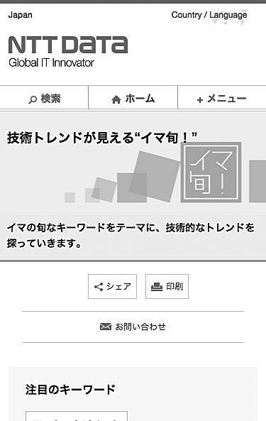

定位置にトップページへのリンクを設置した例。ユーザーが迷っても、いざとなれば常にトップページからやり直すことが可能になる。

### 一連のページ全てに最初のページヘのリンクを置く

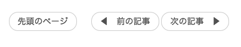

複数ページにまたがるコンテンツの先頭へのリンクを置いた例。途中のページにランディングした場合でも、最初から読むことができる。

### 上位階層に移動するためのナビゲーションを定位置に置く

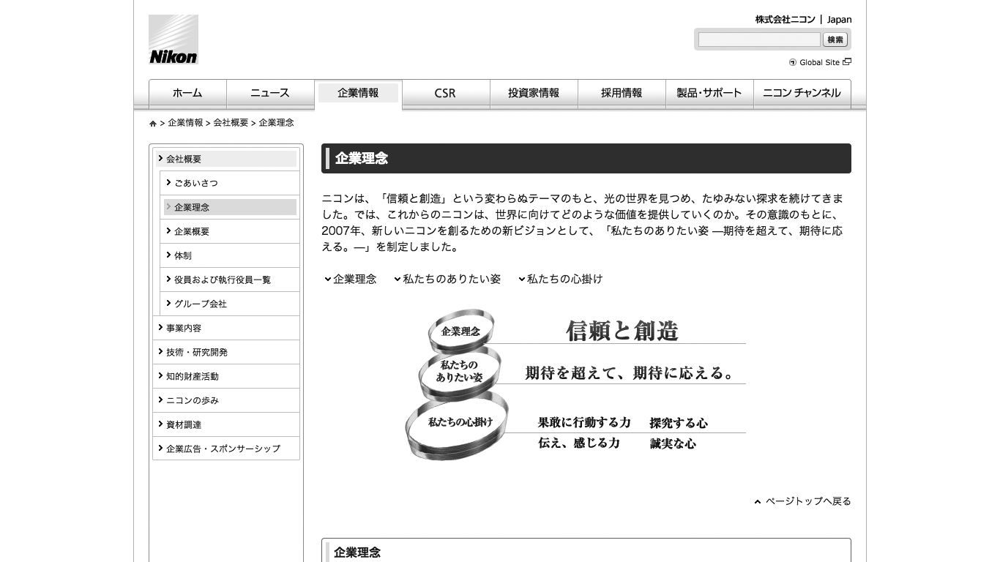

同種のコンテンツをまとめるカテゴリトップページヘのリンクを置いた例。このコンテンツに近い別のコンテンツを探す際に役立つ。

### 関連記事やコンバージョンに関わるナビゲーションを置く

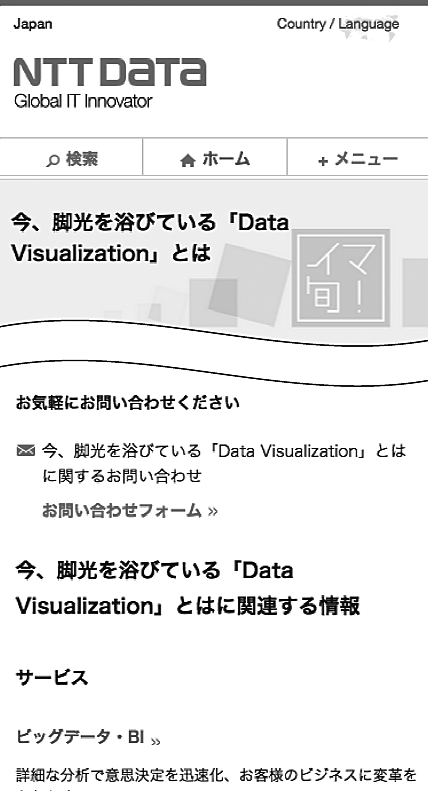

ページ下部に関連するコンテンツやカテゴリへのリンクを置いた例。コンテンツを読み終えたユーザーは、すぐに別のコンテンツ探しに行くことができる。

### 行き止まりが起きないようにナビゲーションを置く

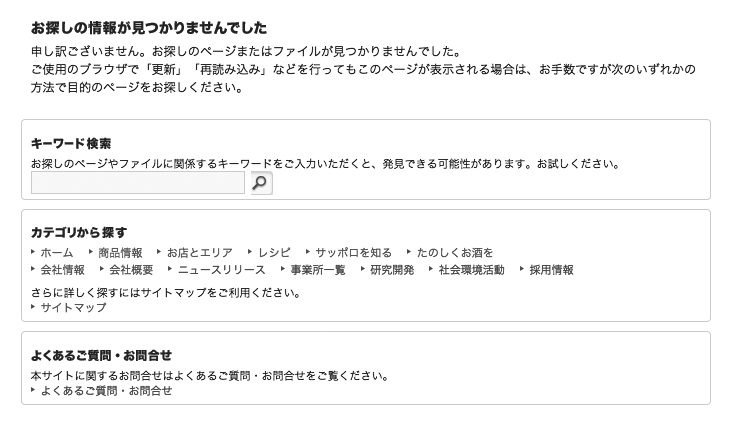

404 Not Foundのページにさまざまなナビゲーションを置いた例。行き詰まりにはならず、ユーザーは別の方法で探索を続けることができる。

### 検索結果ページ自体で条件を変更してやり直せるようにする

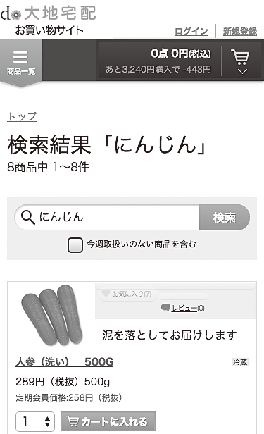

検索結果ページで検索ワードを訂正できるようになっている例。訂正が容易なほか、外部の検索エンジンからこのページにランディングした場合にも有用。

## 解決アプローチ 再調整とやり直しの手段を作り、行き詰まりをなくす

トップページに戻る、上位階層に戻る、先頭に戻る、再検索する、といったやり直しの手段を提供します。リンクやフォームは一般的な場所やコンテンツの近くなど、迷っているユーザーに気づきやすい場所に配置します。

### 共通ヘッダにトップページへのリンクを設置する

確実にやり直しできる状況を作るため、共通ヘッダにトップページへのリンクを設置します。ユーザーが混乱しているときでも使えるように、はっきりわかる形にするのが望ましいでしょう。単に企業ロゴにリンクを張るだけでなく、明示的に「ホーム」「トップ」というラベルがついたナビゲーション要素を設置したり、文脈的に気づけるようにグローバルナビゲーションの一部に組み込んだりという形を検討すべきです。企業ロゴのみにリンクを張る場合でも、代替テキストを「企業名：ホーム」として、視覚的な位置関係によらずリンクの行き先がわかるようにしましょう。

### 一連のページ全てに最初のページヘのリンクを置く

コンテンツが複数のページで構成される場合は、一連のページ全てに、最初のページ、もしくは目次となるページへのリンクを置きます。ページ送りのナビゲーションがある場合は、ページ送りと合わせて先頭ページや目次へのリンクを配置すると良いでしょう。一貫したルールを持たせ、設置場所がページごとに異ならないようにします。

### 上位階層に移動するためのナビゲーションを定位置に置く

下層のページには、上位階層に移動するためのリンクを置き、親ページにアクセスしやすくします。上位階層に移動するためのリンクは定位置に置いて、見つけやすくしましょう。パンくずリストが設置されていれば、それだけで親ページに戻ることができます。ただし、パンくずリストは読み飛ばされ、気づかれないこともあります。パンくずリストとコンテンツが離れている場合、必要に応じて、コンテンツの近くに親階層へのリンクを追加しても良いでしょう。

### 関連記事やコンバージョンに関わるナビゲーションを置く

詳細ページのコンテンツエリア終端付近には、関係する話題を引き続き追えるよう、関連コンテンツへのリンクリストを置きます。また、問い合わせや申し込みのきっかけになるコンテンツには、それらのフォームへのリンクを忘れずに設置します。本文と関係ないリンクを置くと宣伝や広告のように見えてしまうため、コンテンツの文脈に沿ったリンクを選ぶようにします。実際にどのようなリンクがユーザーに望まれているかは、A/Bテストなどで確認していくと良いでしょう。

### 行き止まりが起きないようにナビゲーションを置く

ユーザーの目的がきちんと果たせるよう、適切なコンテンツに誘導し、行き止まりを作らないように設計します。404 Not Foundページであれば、トップページや代表的なカテゴリへのリンク、アクセス数ランキング、サイト内検索フォームなど、再探索に役立つリンクや機能を掲載できるでしょう。申し込みフォームの送信完了ページであれば、受付番号、受付内容、今後の流れ、連絡がない場合の対処といった情報を掲載したり、それらに関する「よくあるご質問」ページへ誘導したりといった補足が考えられます。

### 検索結果ページ自体で条件を変更してやり直せるようにする

商品検索などの検索結果ページには検索フォームを置き、すぐに再検索可能なように設計しておきます。ユーザーが入力したキーワードをあらかじめ入れておくと、タイプミスの修正などが簡単にできるようになります。外部から流入してきたケースでも、すぐに好きなキーワードで検索し直すことができます。
