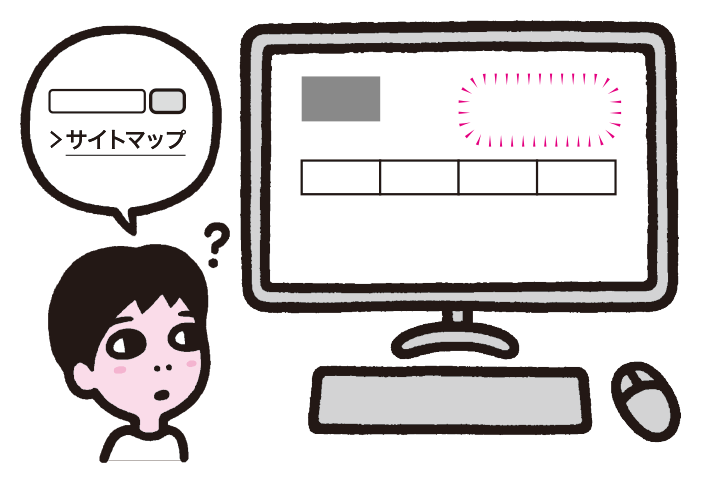
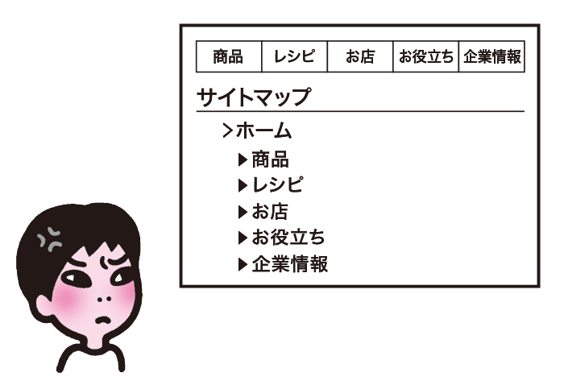

# 情報への到達手段が少なすぎる

あるユーザーには役に立つナビゲーションも、他のユーザーには使えなかったり、ニーズを満たせないことがあります。複数のルートでコンテンツに到達できるようにして、到達手段を確保する必要があります。

## よく見られる問題

### サイトマップやサイト内検索が見当たらない

サイトマップやサイト内検索が見当たらない例。ナビゲーションを使いこなせないユーザーの最後の砦がなくなってしまう。

### サイトマップやサイト内検索が役に立たない

サイトマップにナビゲーションと同じ内容しか載っていない例。サイトマップやサイト内検索が存在していても、役に立つ内容になっていなければ意味がない。

## ここが問題! 選択肢がないと情報を探しにくい

ユーザーのニーズやリテラシーはさまざまです。サイトが用意しているメインのナビゲーションを使いづらいと感じる場合もあります。サイトマップやサイト内検索などがないと、目的とする情報に到達できなくなることがあります。

### サイトマップやサイト内検索が見当たらない

サイトのメインとなるナビゲーションは、典型的なユーザーのニーズに合わせて設計します。しかし、ナビゲーションの項目やラベルはサイトごとに異なるため、ユーザーは新しいサイトを訪問するたびに、使い方を学習しなければなりません。他のサイトでナビゲーションが使いづらかった経験から、そもそもメインのナビゲーションを使おうとしないユーザーもいます。情報への到達手段がメインのナビゲーションだけしかない場合、このユーザーは情報に到達できなくなってしまいます。

このようなユーザーへの助け舟となるのが、サイトマップとサイト内検索です。これらの仕組みは、サイトごとの表現の差異が小さいため、ユーザーが安心して利用できます。これらが利用できないと、ユーザーはサイト側の作法に合わせなければならず、負担が大きくなります。

### サイトマップやサイト内検索が役に立たない

サイトマップとサイト内検索が存在しても、その内容が適切でない場合、余計に混乱を深める結果になってしまいます。

#### 役に立たないサイトマップ

サイトマップの掲載内容が多すぎると、大量のリンクの中から目的の物を探し出さなければなりません。大規模なサイトでは、サイトマップに全てのページを載せるとリンクが膨大な量になってしまい、非常に使いにくくなります。逆に、下層のコンテンツへのリンクを省略しすぎて、最上位付近の階層しか掲載していない場合、ナビゲーションと情報量が変わらなくなり、サイトマップの意味がなくなります。

また、ナビゲーションでの分類軸や並び順とサイトマップの並び順が異なっていたり、最新の内容がサイトマップに反映されておらず、誤った内容になってしまっているケースも見受けられます。このようなことがあると、サイトマップを使おうとしたユーザーがかえって混乱することになります。

#### 役に立たないサイト内検索

サイト内検索では、入力キーワードに対して期待した答えが返ってこない場合があります。ユーザーは、キーワードをタイプミスすることがありますし、同義語や異なる表記の単語で検索することもあります。ユーザーのニーズを満たすコンテンツがあっても、ユーザーが検索した単語がコンテンツに含まれていなければ、検索結果に出てきません。検索結果に出てきても、上位に表示されなかったり、ページタイトルや説明文が不適切な場合、ユーザーに気づいてもらえないことがあります。

## 解決アプローチの例

### サイトマップを設ける

ヘッダ内にサイトマップのリンクを設置した例。迷ったユーザーはいつでもサイトマップにアクセスできる。

### サイト内検索を設ける

ヘッダ内にサイト内検索を設け、サジェスト機能を提供した例。入力の負担が減り、入力ミスも防止できる。

## 解決アプローチ コンテンツを探す手段を複数用意する

複数のナビゲーションの手段を用意することで、ユーザーはさまざまな方法や切り口でコンテンツを探せるようになります。サイトマップやサイト内検索を設けて到達手段に冗長性を持たせると、必要な情報に到達できる可能性が高まります。

### サイトマップを設ける

サイトマップの目的は、サイトの階層構造をわかりやすく伝えることです。特異なデザインや複雑なインタラクションは避け、見出しやリストを使って、コンテンツへのリンクをツリー状に配置します。サイトマップに掲載する階層の数は、おおむね3〜4階層分を目安にすると良いでしょう。

サイトマップへのリンクもわかりやすい場所に設置しましょう。ユーザーが困ったときに目が行く、ヘッダ内に設置することが一般的ですが、コンテンツを読み終えたユーザーが次の行き先を検討できるように、フッタに展開して設置することもあります。いずれの場合も、定位置に置いておくことが重要です。

サイトマップのメンテナンス漏れにも注意が必要です。コンテンツの追加・削除を行った場合、忘れずにサイトマップに反映する必要があります。運用マニュアルに加える、CMSを利用して自動更新されるようにするなどの方法で、サイトマップの更新漏れを防止しましょう。

### サイト内検索を設ける

可能であれば、サイト内検索を設けます。ただし、単に設置しただけでは使われなかったり、適切な結果を返せないことがあります。ユーザーにとって役に立つ機能を提供しましょう。

サイト内検索は、検索ボックスが見える形でヘッダの右上に置くのがベストです。多くのサイトでこの位置に置かれているため、検索したいユーザーはまずこの位置を探します。また、サイト内検索のボックスには、キーワードを入力するための十分な大きさが必要です。スペースが確保できない場合、普段は小さなボックスを表示しておき、フォーカス時にボックスを広げるという方法もあります。

サイト内検索が実際に活用できるように、ユーザーの行動を確認しましょう。実際にどんな単語が検索されているか調査し、対応するコンテンツがあるか確認します。適切なコンテンツがある場合、コンテンツ内にキーワードを含めて、検索にヒットするようにしましょう。類義語や表記ゆれを検索エンジンの側で吸収できない場合、「Web（ウェブ）」のようにかっこ書きで併記して両方書く方法もあります。

ユーザーのタイプミスや表記ゆれは、サジェスト機能で補うこともできます。入力ミスを防ぐだけでなく、入力の負担を減らすメリットもあります。ただし、サジェスト機能はスクリプトで動作するため、実装方法によっては問題が生じることもあります。キーボードで操作できるか、スクリーンリーダーで利用できるかといった点を確認しておきましょう。

頻繁に検索される単語に対し、対応するコンテンツが存在しない場合、ニーズがあるのにコンテンツがない状況になっています。この場合は、ニーズを満たすコンテンツを追加できないか検討しましょう。
