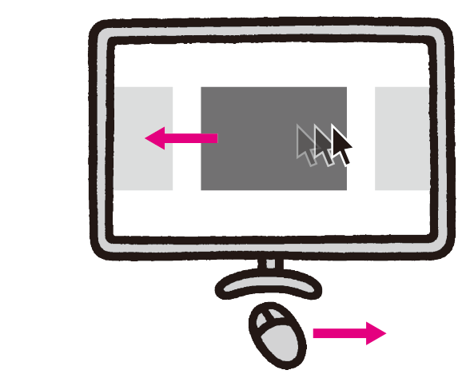

# デバイスに依存したUI
マウスやタッチ操作といった特定のデバイスを前提としていると、そのデバイスがない環境では操作ができません。マウスが使えない環境なども考慮し、特定のデバイスに依存しないようにUIを設計します。

## よく見られる問題

### マウスクリックでしか操作できない

マウスクリックでのみ操作できるボタンの例。キーボードではこのボタンを操作することができない。

### マウスオーバーでしか操作できない

グローバルナビゲーションにマウスオーバーするとメニューが出現する例。キーボードやタッチデバイスではこのメニューを出すことができない。

### スワイプでしか操作できない

タッチデバイスを前提とした、スワイプで左右に送るUIの例。マウスで使えるようにしても、対象をドラッグしてめくる操作はユーザーには想像できないことがある。

### ポインタの位置でしか操作できない

画面内のマウスポインタの位置に応じ、要素が移動したり切り替わったりする例。キーボードやタッチデバイスでは操作できない。

## ここが問題！ 特定のデバイスを使えない環境がある
ユーザーの多くは、マウスを使って操作し、その結果を画面で見ます。しかし、全てのユーザーがマウスと画面を使うわけではありません。特定デバイスを前提としたUIは、そのデバイスが使えない環境でアクセスできなくなります。

### マウスクリックでしか操作できない
マウスのクリックでしか操作できない要素がある場合、マウスが使えない環境では操作ができなくなってしまいます。HTMLで標準的に用意されているボタンなどは、マウスだけでなく、キーボードでも問題なく操作できるようになっています。独自にボタン状のインターフェイスを実装するような場合には注意が必要です。

### マウスオーバーでしか操作できない
ある要素にマウスポインタを重ねる動作を「マウスオーバー」と呼びます。アイコンにマウスオーバーするとヘルプメッセージが表示される、グローバルナビゲーションにマウスオーバーするとサブメニューが出現する、とった表現はよく見られます。しかし、キーボードではマウスオーバーの操作はできませんし、タッチデバイスにもマウスオーバーの概念はありません。タッチ時にOS側である程度エミュレートされますが、想定した動作になるとは限りません。

マウスオーバーによる動作が単なる演出であり、コンテンツやナビゲーションを含まないものであれば問題ありません。マウスオーバーでサブメニューが出現する場合でも、それがおまけにすぎず、他のルートでも簡単にコンテンツにたどり着ければ、大きな問題はないでしょう。しかし、サブメニューからしか行けないコンテンツがあったり、サブメニュー内にしか書かれていない情報があるような場合、ユーザーは全くアクセスできなくなってしまいます。

### スワイプでしか操作できない
スマートフォンアプリでは、左右のスワイプでページをめくるようにして切り替える操作が一般的です。その操作をWebにも導入して、スワイプで操作できるようにすることがあります。しかし、スワイプという動作はタッチデバイス特有のものです。

また、iOSのSafariなどでは、画面の左右スワイプが「戻る」「進む」の機能に割り当てられているため、コンテンツ側でスワイプ操作を導入すると誤動作することがあります。左右にドラッグするジェスチャーをブラウザの「戻る」「進む」に割り当てているユーザーも、同様に混乱することがあります。

### ポインタの位置でしか操作できない
マウスポインタの位置に応じて要素が動く表現が存在します。マウスポインタを画面の右のほうに動かすと要素が左にスクロールし、中央に持ってくると止まる、といった具合です。これは完全にマウスポインタの存在を前提にしており、キーボードやタッチデバイスでは操作できません。

## 解決アプローチの例

### UIを変えずに、他のデバイスでも操作可能にする

マウスでもキーボードでも操作できるボタンの例。キーボードでは、このボタンにフォーカスを当ててEnterキーを押すことで操作できる。

### UIをデバイスに依存しないものに変更する

スワイプ操作のUIをやめ、ページ切り替えボタンを設けた例。ボタンはタッチでもマウスでもキーボードでも操作できる。

## 解決アプローチ デバイスに依存しないように実装する
特定デバイスに依存したUIは避け、他のデバイスでも扱えるように実装します。それができない場合、UIを変更することを考えましょう。デバイス依存を避けられない場合は、代替コンテンツを用意するという方法もあります。

### UIを変えずに、他のデバイスでも操作可能にする
デバイスに依存するように見えるUIも、見た目や機能をそのままに、他のデバイスでも操作可能にできる場合があります。基本的に、キーボードで操作できるようになっていれば、他のほとんどのデバイスでも操作可能です。キーボードで操作できるか確認し、操作できなければ工夫が必要になります。

#### クリックで操作する要素をキーボードでも操作可能にする
キーボードでも、目的の要素にフォーカスを移してからEnterキーを押すという操作でクリック操作を代替できます。通常のボタンやリンクは、標準でキーボード操作にも対応しており、この方法で問題なく操作できます。スクリプトなどで独自のコントロールを実装する場合には注意が必要です。「9-7スクリーンリーダー対応が不適切」も参照してください。

#### マウスオーバーで操作する要素をキーボードでも操作可能にする
マウスオーバー操作については、キーボードでフォーカスを移したときに動作させることも可能ですが、単純に実装すると別の問題が起きることがあります。たとえば、フォーカス時に自動的にサブメニューが開いた場合、開いたサブメニュー内部にフォーカスが移るため、サブメニューのスキップができず、Tabキーを押していくと全ての項目をたどることになってしまいます。後述のように、サブメニューがクリックで開くように変更するのが良いでしょう。

なお、サブメニューがショートカットのための補助的なものであり、使用しなくても全てのコンテンツにアクセスできる場合、キーボード操作に対応させないという選択肢もあります。ただしこの場合、キーボード操作で全てのコンテンツに容易にアクセスできることを確認する必要があります。

### UIをデバイスに依存しないものに変更する
UIの見た目や機能を維持したままでは、他のデバイスで操作可能にできないケースがあります。そのような場合には、UIそのものをデバイスに依存しないものに変更できないか検討します。

#### サブメニューをクリックで開くように変更する
マウスオーバーでサブメニューが開く表現をやめ、クリックやキーボードのEnterで開くようにします。この際、クリックするとサブメニューが開くという挙動がユーザーに予想できるようにする必要があります。ラベルを工夫したり、矢印などのアイコンをつけて判別可能にすると良いでしょう（図1）。

図1：クリックやタッチでサブメニューが開く例

クリックやタッチでサブメニューが開くようにした例。開いたメニュー内に閉じるボタンがある。

また、メニューを閉じる操作もクリックで行うことができるようにします。閉じ方がわからないユーザーのために、サブメニュー内に明示的に「閉じる」ボタンを配置するのが良いでしょう。

#### スワイプUIを切り替えボタンに変更する
左右スワイプで要素を切り替えるUIには、明示的な切り替えボタンをつけ、操作方法を明確にします。ボタンはタッチでもマウスでもキーボードでも操作できます。このとき、スワイプの機能を残すことも考えられますが、ブラウザの「戻る」「進む」との誤操作の問題が起きないように注意しましょう。誤操作が避けられないようであれば、スワイプでの操作は残さない方が良いでしょう。

#### ポインタの位置に依存する演出をやめる
ポインタの位置に依存する演出については、それが必要でなければやめてしまいましょう。ただし、中にはどうしてもポインタの位置に依存しなければならない表現もあります。たとえば、筆で何かを描くようなアプリケーションの場合、ポインタがなければその表現を行うことができません（図2）。このコンテンツが何らかの情報を伝えるものであれば、代替コンテンツを用意する必要があるでしょう。

図2：TheShodo（2015年3月まで公開）

筆で文字を描く書道の動きを再現したアプリケーションの例。その性質上、ポインタが使えないと利用することができない。
