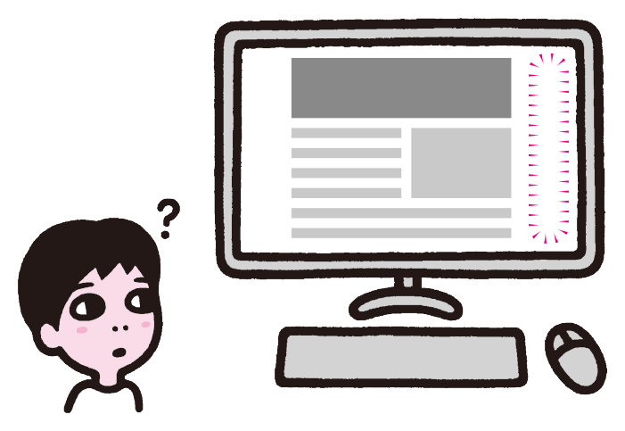
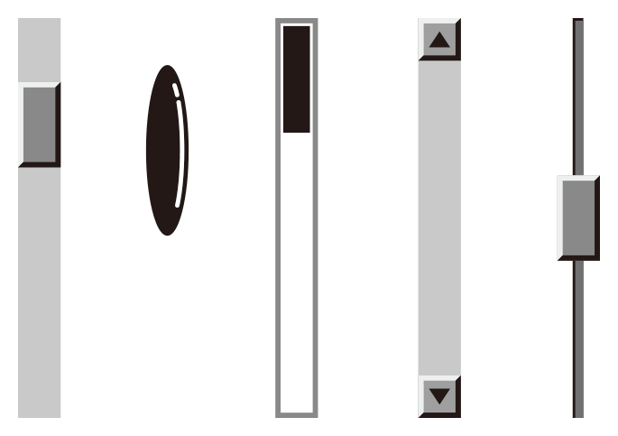
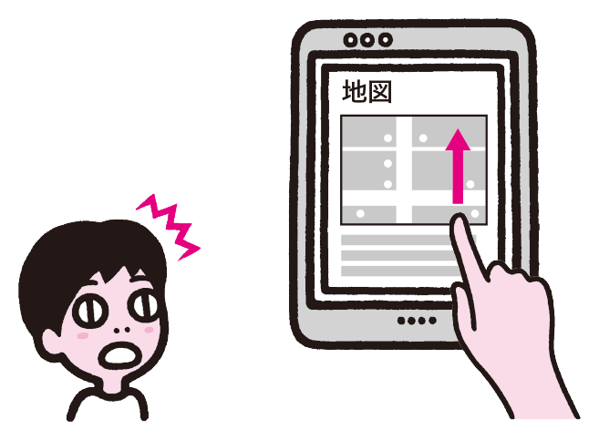
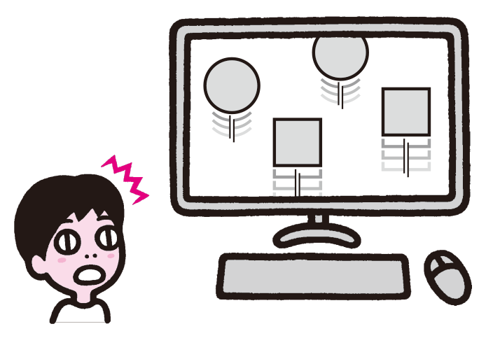
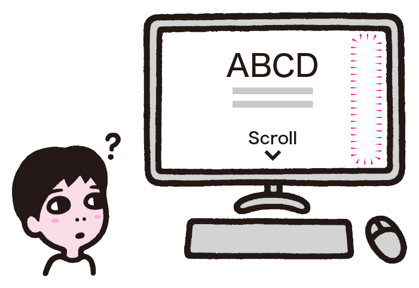
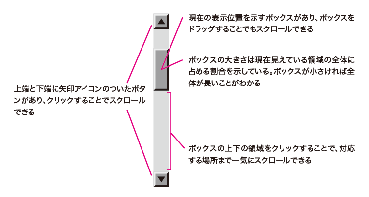
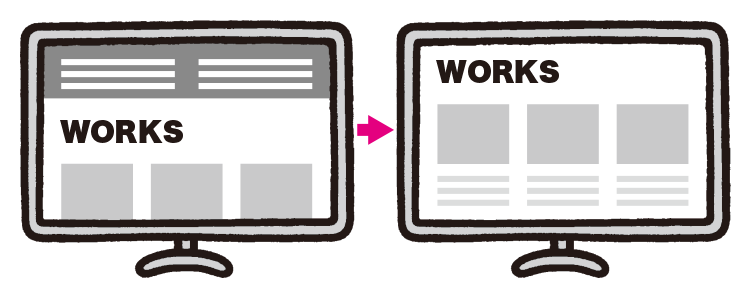
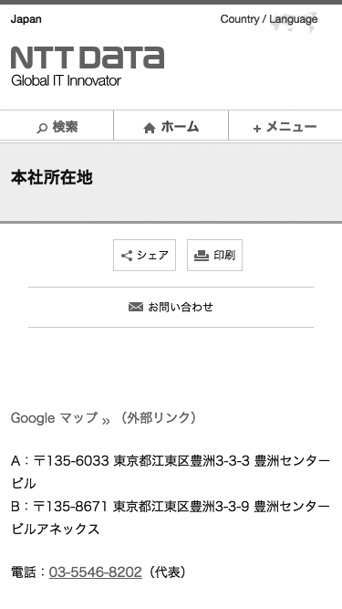
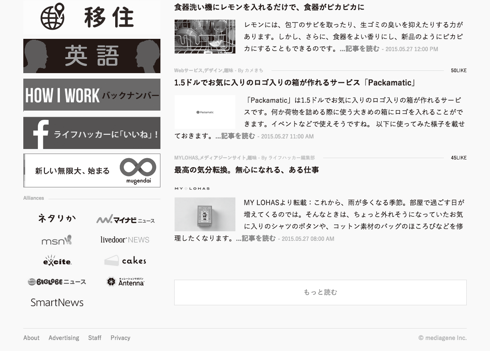

# 思ったようにスクロールできない
スクロールに細工をしたり、スクロール操作に依存したUIを導入すると、ユーザーが期待通りに操作できなくなるおそれがあります。スクロールをコンテンツ側で制御することは控え、またスクロール依存のUIは別の形に置き換えます。

## よく見られる問題

### スクロールバーが消され、スクロールできることがわからない

スクロールバーを意図的に消している例。ふだんスクロールバーを利用しているユーザーは操作方法がわからず混乱する。

### 標準と異なるスクロールバーで混乱する

OS標準とは異なるスクロールバーが使われている例。スクロールバーだと認識できなかったり、標準のスクロールバーと比べて機能が不足していることがある。

### ページ内のスクロール領域に操作が奪われる

ページ内にスクロール領域やドラッグできる領域がある例。この領域を上にスワイプすると領域内だけがスクロールし、ページ側をスクロールすることができない。

### スクロール操作に干渉され、自由に操作できない

一定のところまでスクロールすると、スクロール操作を横取りしてアニメーションの演出が始まる例。演出と引き換えに、ユーザーの操作の自由を奪っている。

### 無限スクロールで後続のコンテンツにアクセスできない

一覧の終わりまで来ると、次のコンテンツを自動で読み込む例。使いどころに注意したうえで適切に実装しないと、さまざまな問題を引き起こす。

## ここが問題！ スクロールに細工をすると操作できなくなる
スクロールバーを隠したり、独自に実装したりすると、環境によってはスクロールできなくなることがあります。また、ページ内スクロール領域や自動スクロールがあると、ページをスクロールするつもりで誤操作することがあります。

### スクロールバーが消され、スクロールできることがわからない
スクロールが必要なページでは、自動的にスクロールバーが表示されますが、コンテンツ側でスクロールバーが出ないようにすることもできます。スクロールバーには、スクロールが可能なのかどうか、全体の中のどのあたりを見ているのか、といった情報を伝える役割もあり、消してしまうと、そもそもスクロールできるということがわからなくなります。コンテンツ内に「下にスクロール」というラベルを配置するケースも見られますが（図1）、ユーザーがそのラベルを発見できるとは限りません。

図1：スクロールバーを消し、スクロールすることをコンテンツ内のラベルで示している例
このラベルに気づかないと、ユーザーにはスクロールできることがわからない。

また、マウスホイールが使えず、スクロールバーに依存しているユーザーもいます。スクロールバーを消すと、バーをドラッグして全体を眺めたり、空白部分をクリックして特定の位置に一気に移動する、といった操作もできなくなってしまいます。

### 標準と異なるスクロールバーで混乱する
OS標準のスクロールバーを使用せずに、独自のスクロールバーを設けているケースもあります。OS標準のスクロールバーと見た目が異なると、ユーザーはそれをスクロールバーと認識できないことがあります。
また、OS標準のスクロールバーには多彩な機能があります（図2）。独自スクロールバーは機能を十分に備えていないことがあり、ユーザーの環境によっては、うまくスクロール操作ができなくなることがあります。

図2：OS標準スクロールバーの多彩な機能
* 上端と下端に矢印アイコンのついたボタンがあり、クリックすることでスクロールできる
* 現在の表示位置を示すボックスがあり、ボックスをドラッグすることでもスクロールできる
* ボックスの大きさは現在見えている領域の全体に占める割合を示している。ボックスが小さければ全体が長いことがわかる
* ボックスの上下の領域をクリックすることで、対応する場所まで一気にスクロールできる

特定の環境での挙動を再現しても、他の環境では混乱のもとになることがあります。たとえば、OS XやiOSの標準スクロールバーでは、スクロール操作をしたときだけバーが出現し、少し経つと非表示になります。しかし、この挙動をそのままWebに組み込むと、他のOSのユーザーには「スクロールバーが見つからない」と認識されてしまうおそれがあります。

### ページ内のスクロール領域に操作が奪われる
ページそのもののスクロールとは別に、ページ内の一部分だけがスクロールすることがあります。小さな枠に長大な利用規約を表示してスクロールさせるケースのほか、Googleマップ、Twitter、Facebookなどの外部サービスのコンテンツを読み込んでいる部分がスクロールするケースもあります。

マウスホイールやタッチデバイスでページ全体をスクロールしようとした際、マウスポインタの位置やタッチした位置がたまたまスクロール領域内だった場合、その領域だけがスクロールしてしまいます。末尾までスクロールすればページのスクロールが行われますが、領域が長かったり、後述の無限スクロール問題がある場合、いつまでもページのスクロールが始まらないことがあります。特に、ユーザーが画面を拡大していたり、ページ内スクロール領域が非常に大きかったりすると、これが画面全体を覆ってしまい、ページ自体のスクロールが全く行えなくなることがあります。

### スクロール操作に干渉され、自由に操作できない
ユーザーがスクロール操作を行ったとき、それに伴って画面を変化させる演出もあります。単なる演出であれば問題ありませんが、ユーザーのスクロール操作の自由を奪うような演出では問題が起きます。

たとえば、ある程度までスクロールすると、スクロールを伴うアニメーションが始まり、以降は自動でスクロールが行われるような演出があります。このとき、ユーザーのスクロール操作によって演出が途中で止まるようにしないと、元の位置にスクロールして戻ることができなくなってしまいます。

スクロールのスナップにも問題があります。特定の位置までスクロールしたとき、要素の位置などがぴったりになるようにスクロール位置が調整されるケースがありますが（図3）、狭いモニターの場合、画面からはみ出した部分が全く読めなくなってしまいます。また、縦に長いモニターでも読みにくくなることがあります。

図3：スクロールのスナップが働き、要素が必ずウィンドウの上端に来る例
狭いモニターでははみ出した部分が読めなくなり、広いモニターでは肝心の要素が端に行ってしまう。

その他、スクロールの加速、減速なども問題を起こします。スクロールの微調整が利かなくなるため、画面を拡大して閲覧しているユーザーは、目的の場所にスクロールすることができなくなります。また、ウィンドウの高さを基準にスクロールを加速すると、縦に長いモニタを使っている場合に制御不能なほどスクロール量が変化してしまいます。

### 無限スクロールで後続のコンテンツにアクセスできない
ユーザーがページを下端までスクロールすると、続きの内容をその下に読み込んで、ページが伸びる仕組みがあります。その後、さらに下端までスクロールすると、また続きの内容が読み込まれます。これが無限に続き、どこまでもスクロールできるため、この仕組みは「無限スクロール」と呼ばれます。

一般に、ページの長さは有限です。ユーザーはページが伸びるとは思っておらず、いつのまにかページが伸びても気づかないことがあります。特に、スクリーンリーダーのユーザーには、ページが伸びても全くわからなかったり、追加された内容にアクセスする方法がわからないことがあります。

また、ページが伸びると、スクロールバーの中のボックスの位置が変わります。ボックスをドラッグしてスクロールしているユーザーは、ページが伸びるたびにバーを再度つかみにいかなければなりません。

さらに問題なのは、コンテンツの後ろに存在する要素にアクセスできなくなってしまうことです。たとえば、無限スクロールで読み込まれる要素の下にフッタがある場合、コンテンツが読み込まれるたびにフッタが下に移動するため、いくらスクロールしてもフッタに到達できないことがあります。キーボード操作の場合、フォーカス移動順が後ろにあるサイドバーなどにもアクセスできなくなります。

無限スクロールが続くと、ページが非常に長くなるという問題もあります。無限スクロールの後でページ冒頭の要素にアクセスしたくなった場合、ユーザーは非常に長い距離をスクロールしなければなりません。また、他のページに移動して「戻る」ボタンで戻ってきたときなどは、長いスクロールと読み込みを最初からやり直すことになってしまいます。

## 解決アプローチの例

### 標準のスクロールバーを使う

標準のスクロールバーをそのまま使っている例。スクロールは閲覧行動の基本であり、独自色を持たせるべきではない。

### ページ内スクロール領域を避ける

ページ内スクロール領域を別のページに切り分けた例。別の形に置き換えたり、操作不能にならないよう配慮する。

### スクロール操作に干渉しない

ユーザーのスクロール操作に応じて演出が行われる例。スクロールを行うと、それに伴って商品が回転するという演出が入る。演出を行う場合、ユーザーの操作を妨げず、ユーザーの操作で開始、停止ができるようにする。

### 無限スクロールを避ける

「もっと読む」ボタンを設け、続きを手動で読み込むようにした例。URLを変化させ、戻るボタンが正しく機能するよう対処することが望ましい。

## 解決アプローチ 標準のスクロール機能をそのまま提供する
スクロールバーやスクロール操作をコンテンツ側で制御することはできる限り避け、ブラウザやOSの標準機能をそのまま提供します。ページ内スクロール領域や無限スクロールは可能な限り避けるようにします。

### 標準のスクロールバーを使う
コンテンツ側でスクロール機能を実装することは避け、ユーザーが使い慣れたOSやブラウザの機能をそのまま提供します。ビジュアルデザインのためや、その他の理由でどうしても独自に実装しなければならない場合、標準のスクロールバーと同じ機能を持たせた上で、さまざまなデバイスで操作できるようにするべきです。しかし、そのような実装は容易ではありません。

### ページ内スクロール領域を避ける
ページ内スクロール領域は可能な限り避け、別の形で表現できないか検討しましょう。もっとも単純な方法は、ページ内スクロールをやめて、全てをその場に展開してしまうことです。ページが多少長くなっても、ユーザーはそれほど苦にしません。狭い領域をスクロールしながら読むよりも、展開してしまったほうが読みやすくなることが多いでしょう。

どうしても狭いスペースに押し込める必要がある場合、アコーディオンやモーダルダイアログを使う、別ページに切り分けるといった選択肢もあります。特に、タッチデバイスではアコーディオンが一般的なため、タッチデバイスの時だけアコーディオンにするという手法もよく見られます。

やむを得ずページ内にスクロール領域を設ける場合は、できるだけページ内スクロール領域の面積を小さくして、画面全体を覆いつくす可能性を下げるようにしましょう。また、中身が無限スクロールしないように配慮します。たとえば、Googleマップの場合、ページに埋め込むのは静的画像のバージョンとし、無限にスクロールする地図はリンク先で利用できるようにすると良いでしょう。

### スクロール操作に干渉しない
スクロールを乗っ取ってアニメーションが始まるような演出は、そもそも必然性があるのかを考えるべきです。一定の時間を使ってユーザーに注視してもらい、直線的に内容を伝えるという要件であれば、ほとんどの場合、動画を使ってコミュニケーションしたほうが良いでしょう。

スクロールによる演出が必須である場合でも、スクロールの途中でアニメーションを始めるのは避け、ボタンやリンクを押したときに開始するようにします。また、ユーザー側がスクロール操作を行った際にアニメーションがキャンセルされるようにします。アニメーションに限らず、スクロール位置や量をトリガーにして慣性的な動きを発生させたり、スクロール位置を調整したりすることは避けましょう。スクロールのスナップも避け、ユーザーが好みの位置まで自由にスクロールできるようにしましょう。

### 無限スクロールを避ける
スクロール位置をトリガーとしてコンテンツを読み込むことは避けましょう。続きのコンテンツを読み込むときは、「続きを読む」などのボタンを用意して、ユーザーが明示的に操作したときに内容を追加するようにします。こうすることで、知らない間にページ構成が変化したり、後続の要素にアクセスできなくなるといった問題は避けられます。

なお、このUIを採用する場合は、キーボードでも正しく操作できるかをチェックしましょう。「続きを読む」ボタンを消してコンテンツを追加すると、フォーカスが消滅してしまったり、順番がおかしくなってしまったりといった問題が起きることがあります。

どうしてもスクロール位置をトリガーとする必要がある場合は、明確なローディング表示をつけるなど、コンテンツが読み込まれてページが伸びたということをユーザーに明確に伝えるようにします。スクリーンリーダーに伝える方法については、「9-7 スクリーンリーダー対応が不適切」を参照してください。
