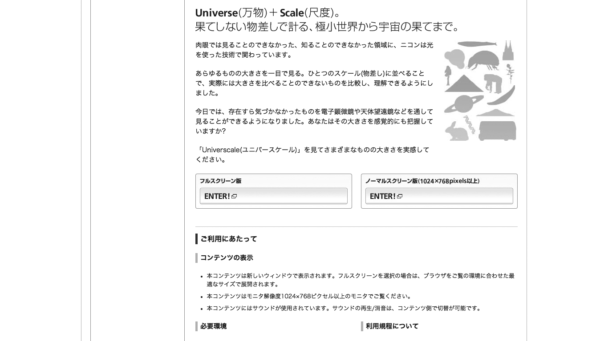

# 勝手に新規タブやポップアップが開く
新規タブやポップアップは、混乱を招いたり、操作の手間を増やす原因になるため、使わなくて済むように設計します。やむを得えず使う場合はリンクテキストで説明します。

## よく見られる問題

### 新規タブで開いたことに気づかず混乱する

外部リンクを新規タブで開いている例。サイトの範囲を明示したり、離脱を防止するために新規タブにすることがあるが、ユーザーは気づかずに混乱する。

### ポップアップで情報が覆い隠される

入力手順の途中で、ポップアップのヘルプを出している例。ヘルプメッセージのウィンドウが入力フォームを覆い隠してしまっている。

### ポップアップや新規タブを閉じることが困難

検索結果からのリンクが新規タブで開くようになっている例。結果を見ていくとどんどんタブが増えて行ってしまい、最後には大量のタブを閉じる必要がある。

スマートフォンでタブを切り替える際の画面の例。この画面に切り替えた上で、一覧から該当のタブを探し出して閉じる必要がある。

## ここが問題！ 新規タブやポップアップは混乱を招く
リンクをたどった場合、リンク先は同一のタブ内で開くのが普通です。リンク先が新規タブやポップアップで開くと、通常とは異なる動作となり、混乱を招きます。また、ウィンドウを閉じたり、タブを切り替える操作が容易にはできないユーザーもいます。

### 新規タブで開いたことに気づかず混乱する
タブやウィンドウが増えても気づかないことがあります。リンクをたどるユーザーはコンテンツに注目していて、コンテンツの外側で新しいタブが増えても視界に入らないことがあります。スクリーンリーダーでも、ポップアップや新規タブは特に通知されず、通常のリンクと全く同じように読み上げられます。そもそも、新規タブや新規ウィンドウという概念がないデバイスもあります。たとえば、初期のiPhoneでは複数のアプリを同時に使えず、Safariでも複数タブを扱えませんでした。新規タブという考え方自体、デバイスに強く依存したものなのです。

新規タブに気づかなかったユーザーは、ブラウザの「戻る」機能が使えないという問題に直面します。戻ろうとしても「戻る」ボタンが押せなくなっており、その理由がわからずに混乱します。

### ポップアップで情報が覆い隠される
ポップアップは、画面の内容の一部を隠します。そこに注目している情報があったり、入力欄があったりする場合、ポップアップウィンドウを移動させる必要があります。しかし、画面が小さい場合や、画面を拡大している場合、ポップアップが画面のほとんどを覆ってしまい、移動できないことがあります。

そもそもウィンドウの概念を理解しておらず、ポップアップウィンドウを移動できること自体がわからないユーザーもいます。また、細かいマウス操作ができない場合、ポップアップウィンドウを操作するつもりで、背面のブラウザウィンドウを操作してしまうこともあります。

### ポップアップや新規タブを閉じることが困難
新規タブやポップアップが大量に開かれると、閉じる操作の負担が大きくなります。ポインタの移動や操作に時間がかかるユーザーの場合、タブひとつ閉じるだけでもかなりの労力ですし、操作する場所がずれ、目的と違うタブを閉じてしまうこともあります。また、スマートフォンの場合、新規タブを閉じるためにタブ一覧を表示しなければならず、片手で操作を行っている場合などに負担となることがあります。

障害やデバイスの制限がないユーザーにとっても、ポップアップや新規タブを閉じる操作は煩雑なものです。このため、新規タブを避けたいと考えるユーザーも多くいます。

ブラウザには、通常のリンクを新規タブや新規ウィンドウで開く機能があります。しかし、新規タブやポップアップが開くような設定を無視する手段はありません。通常のリンクであれば、ユーザーはそのまま開くか、新規タブで開くのかを自分の都合によって選択することができます。しかし、新規タブに設定されたリンクは常に新規タブになってしまい、ユーザーの選択肢が奪われてしまいます。

## 解決アプローチの例

### 外部サイトであることを新規タブで示すのではなく、説明を加える

リンク先が外部サイトであることを示すために、テキストとアイコンを追加した例。リンクテキストで説明すれば、サイトの範囲を示唆するための新規タブやポップアップは不要になる。

### 行き来する必要のあるリンクを新規タブにせず、動線を強化する

商品詳細のページを新規タブで開くのをやめ、関連商品を見る動線を強化した例。一覧に戻らずに関連商品を次々見ていくことができる。

### ポップアップではなく、画面内でヘルプを出す

ページ内で補足情報を開くようにした例。新規タブやポップアップを使用せずに、その場で情報を提示することができる。

### どうしても必要な場合、新規タブやポップアップが予測できるようにする

新規タブやポップアップが開くことをリンクテキストで説明している例。どうしても新規タブやポップアップを開く必要があるときは、事前にわかるようにする。

## 解決アプローチ 新規タブやポップアップを避け、別の方法を使う
新規タブやポップアップが使われる状況の多くは、他の手段で解決することができます。新規タブやポップアップを安易に導入せず、何のために導入しようとしているのかを考え、他の方法で目的を実現できないか検討しましょう。

### 外部サイトであることを新規タブで示すのではなく、説明を加える
リンク先が外部サイトであることを示すために新規タブにすることがあります。しかし、ユーザーは新規タブに気づかないことがある上、気づいても意図が伝わるとは限りません。外部サイトであることを明示したければテキストなどで説明するべきですし、説明があれば新規タブにする必要はないはずです。

自分のサイトを残しておいて離脱を防ぎたい、という理由で新規タブが使われることもあります。この場合、ユーザーがリンク先のサイトから戻ってくるのかどうかを考えましょう。戻る必要がなければ、リンク元を新規タブで残しても、結局離脱されるでしょう。戻る必要がある場合は、次項を参照してください。

### 行き来する必要のあるリンクを新規タブにせず、動線を強化する
リンク元とリンク先を何度も行き来する必要がある場合があります。たとえば、ECサイトの検索結果ページに商品詳細へのリンクが並んでいる場合、ユーザーは商品詳細に行って戻る行動を繰り返すでしょう。このような場合、ユーザーの利便性を高めるために、リンクを新規タブにすることがあります。しかし同時に、新規タブが大量に開くことが避けられず、アクセシビリティの問題も生じます。

本当に新規タブが利便性を高めるのか、十分に検討しましょう。設計時にユーザビリティテストを行い、実際にユーザーを観察します。頻繁に戻る行動が観測された場合、ナビゲーション機能が弱いことも考えられます。リンク先ページにナビゲーションを追加して、一覧に戻らずに関連商品を見ていく動線を強化するのも良いでしょう。「4-5再調整したり、やり直す手がかりがない」も参照してください。

### ポップアップではなく、画面内でヘルプを出す
ユーザーが作業を行っているときに、別ページにあるヘルプメッセージを表示させたい場合があります。この際、作業の流れが中断されることを防ぐ目的で、新規タブやポップアップを使うことがあります。ページ遷移をさせずにヘルプメッセージを出す方法はいくつもあります。情報量が少ない場合は、囲みなどをつけて操作している箇所の近くに提示すれば十分です。量が多い場合でも、アコーディオンやモーダルダイアログなどのUIで、ページ遷移せずに本文エリアに載せることができる場合が多いでしょう。

### どうしても必要な場合、新規タブやポップアップが予測できるようにする
どうしても新規タブやポップアップを避けられない場合、ユーザーが挙動を事前に予測できるようにします。たとえば、リンクテキストの中に「新規タブが開きます」と書き添える方法があります。ただし、これで混乱を避けられるのは、新規タブの概念を理解しているユーザーだけです。新規タブやポップアップが無秩序に開かれると、たとえ説明があってもユーザーは混乱します。新規タブやポップアップを開くときのルールを設け、徹底することも重要になります。

## コラム別メディアを開くときは?
PDF、Excel、Wordなどのドキュメントや、画像・動画・音声などのメディアへのリンクを新規タブにするケースがあります。ユーザーにはこれらのメディアがWebとは別のものに見え、閲覧を終えたときにウィンドウを閉じてしまい、元のページに戻れなくなるケースが見られるためです。

解決策のひとつは、ファイルをダウンロードさせることです。ユーザーはファイルをダウンロードして使い慣れたアプリケーションで開けるため、ブラウザで開くよりも快適になることが多いでしょう。ただし、スマートフォンなどではダウンロードができない場合もあり、この解決策は万能ではありません。

可能であれば、HTMLにしてしまうのが良いでしょう。PDFはHTMLに変換し、画像などはWebページに埋め込むことで、誤操作を避けつつアクセシビリティを向上させることができます。
