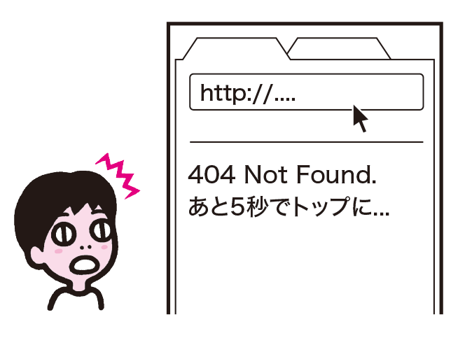
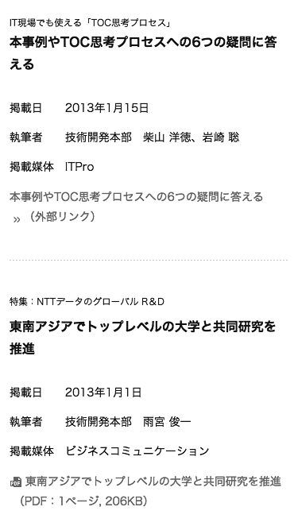

# 一定時間で勝手にページ移動する
ページが表示されてから数秒後に、自動で別のページ移動するようなケースがあります。ユーザーが意図しないタイミングで移動が発生すると、ユーザーは混乱し、作業も中断されてしまいます。

## よく見られる問題

### 読み終わる前にページ移動してしまう

外部サイトリンクの説明ページから、5秒でリンク先に移動する例。説明があるが、読み終わる前に移動してしまう。

### 操作が完了する前にページ移動してしまう

404 Not Foundのページから、5秒後にトップページに移動する例。URLを修正したい場合は、5秒以内に行わなければならない。

## ここが問題！ 意図せずページ移動すると混乱し、作業も中断される
操作していないのに急に画面が切り替わると、ユーザーは何が起きたかわからず、あるいは自分が誤操作したのではないかと思って混乱します。また、作業も中断されてしまいます。

### 読み終わる前にページ移動してしまう
文章を読む速度はユーザーによってさまざまです。短時間で自動的にページ移動してしまうと、読んでいる途中で画面が切り替わり、最後まで読むことができません。特に、スクリーンリーダーでは読み上げに一定の時間がかかるため、問題が起こりやすくなります。なお、スクリーンリーダーの場合、別のページに行くのではなく、現在のページを自動的に再読み込みする場合にも同じ問題が生じます。

### 操作が完了する前にページ移動してしまう
短時間で画面が切り替わると、ユーザーの操作が中断されます。たとえば、404 Not FoundページでアドレスバーのURLを修正しようとした時、ページ移動が発生するとアドレスバーが書き換えられ、修正ができません。操作に時間がかかるユーザーの場合、移動前に作業が完了できない可能性が高まります。

## 解決アプローチの例

### 中間ページは挟まずに、直接移動する

外部サイトへのリンクであることをテキストで説明している例。前置きのページを挟むまでもなく、ユーザーには外部サイトであることが伝えられる。

### 自動で移動せず、ユーザーの操作にまかせる

自動では移動しない404 Not Foundのページにトップページへのリンクがある例。ユーザーは自分の好きなタイミングでURLを修正したり、トップページに移動したりできる。

## 解決アプローチ 直接移動するか、ユーザーの操作にまかせる
ページを短時間で切り替えることは避けましょう。短い前置きページは可能な限り省略します。必要な場合は、自動での移動をやめ、ユーザーが好きなタイミングで操作できるようにします。

### 中間ページは挟まずに、直接移動する
まず、目的のページに行く前に説明ページを挟む必要があるのか検討しましょう。リンク先が外部サイトであることを知らせる場合、リンクテキストにその旨を書けば、外部サイトに行くことが明白になります。リンクを拾い読みするユーザーもいるため、説明はリンクテキストの中に書くと良いでしょう。実装の都合でどうしても中間ページが必要な場合、サーバー側でリダイレクトするか、0秒でリダイレクトするmeta refreshを使えば、次のページに瞬時に移動するため、ユーザーの体験としては、直接移動したのと同じことになります。

### 自動で移動せず、ユーザーの操作にまかせる
セキュリティの都合で中間ページが必要になるケースもあります。たとえば、社内のWikiから外部へリンクしている場合、直接リンクではRefererからページ名が漏れてしまうことがあり、これを防ぐために中間ページを設けることがあります。このような場合、自動で移動するのはやめ、単純に次のページへのリンクを設置しましょう。こうすれば、ユーザーは好きなタイミングで次のページに行くことができます。
