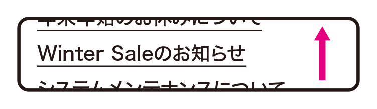

# 動きをコントロールできない
自動で切り替わったり動き続けるものがあると、読めない、操作できない、注意をそらされるといった問題が起きます。動かすのをやめるか、ユーザーが動きをコントロールできるようにします。

## よく見られる問題

### 動いたり切り替わったりするものが読めない

ニュースのテキストが数秒で自動的に切り替わる例。読むスピードが遅い場合、読み終える前に切り替わってしまい、読むことができない。

### 動いたり切り替わったりするものを誤操作する

リンクつき画像が数秒ごとに自動で切り替わる例。ちょうどクリックしようとしたタイミングで切り替わると、目的とは別のリンク先に移動してしまうことがある。

### 不意に動いた要素に注意を引かれてしまう

ある程度スクロールすると、不意にナビゲーションが出現する例。ユーザーの目はナビゲーションにひきつけられ、コンテンツをどこまで読んでいたのかわからなくなってしまう。

### 動き続ける要素を止められず、注意を引かれてしまう

動き続けるインフォグラフィックスの例。コンテンツ内の一部が動き続けていると、その部分に注目してしまい、中身を読み進められなくなる。

## ここが問題！ 動くものは読めない、誤操作する
要素が自動で切り替わったり動いたりすると、読み終わる前に動いてしまったり、操作の瞬間に動いて誤操作することがあります。また、ユーザーは動くものに目を引きつけられるため、動きがあると重要なものから目をそらされてしまいます。

### 動いたり切り替わったりするものが読めない
狭いエリアに複数の情報を入れたいとき、コンテンツを切り替えて表示する「カルーセル」というUIが使われることがあります。また、ニュースなどのテキストを切り換えたりスクロールさせて流す「ティッカー」という表現もあります。これらに共通するのは、要素が動き、一定時間で切り替わることです。ユーザーがテキストを読んだり、何かを見て内容を理解するスピードには個人差があります。読む速度が遅い場合、一定時間で要素が切り替わると、最後まで読むことができなくなります。特に、音声で読み上げていたり、画面を拡大している場合は読むのに時間がかかり、問題が起きやすくなります。

また、スクリーンリーダーのユーザーには、そこにティッカーやカルーセルが存在していること、中身が切り替わっていることが全く伝わらないことがあります。切り替わってもそのことに気づかなかったり、切り替わった後の内容にアクセスすることが難しい場合もあります。

### 動いたり切り替わったりするものを誤操作する
リンクになっている要素がカルーセルで自動的に切り替わると、ユーザーがクリックしようとした瞬間に切り替わってしまうことがあります。この結果、ユーザーは押したつもりのものとは違うリンク先に行ってしまい、混乱します。特に、ユーザーの操作に時間がかかる場合、問題が起こりやすくなります。

### 不意に動いた要素に注意を引かれてしまう
コンテンツに集中しているとき、不意に何かが動くと、そこに目をひきつけられ、どこを読んでいたのかわからなくなることがあります。特に、画面を拡大している場合などは、読んでいた位置に戻るのが困難になります。たとえば、「ページの先頭に戻る」リンクがアニメーションして不意に現れるケースが問題を起こすことがあります。また、スクロールに応じて画面上の複数の要素がばらばらに動く表現も、あちこちに視点がさまようことになり、視差効果で酔ってしまって不快に感じるユーザーもいます。

### 動き続ける要素に注意を引かれてしまう
注意力欠如障害を持つユーザーは、何かが動き続けていると、それに目を引きつけられ、他の部分が読めなくなることがあります。特に、映像やアニメーションをページの背景に使ったり、インフォグラフィックスなどにアニメーションを取り入れるケースでは注意が必要です。

なお、アクションに対するフィードバックのモーションのように、短時間で停止する場合は問題ありません。WCAG 2.0では、5秒以内という目安が示されています（参考1）。また、ローディングのアニメーションが動き続ける場合、もとより他の操作ができませんので、目を引いたとしても問題ありません。

## 解決アプローチの例

### 動かすのではなく、固定の表示にする

カルーセルをやめ、画像を並べて表示するようにした例。訪問のたびにランダムに切り換える方法もある。

### 自動で動かすのではなく、手動で動くようにする

カルーセルを手動での切り替えにした例。ユーザーは自分の好きなタイミングで内容を切り替えられる。

### 自動で始まった動きを止められるようにする

カルーセルに「一時停止」ボタンをつけて停止できるようにした例。一時停止ボタンが目立たないとユーザーは気づかないことがあるため、注意が必要。

### 動く表現をコンテンツの一点に絞る

コンテンツの中の一点だけが一定時間動くような演出の例。バラバラに色々な箇所が動いたり、動き続けたりすると読みづらくなるため、そのような表現は回避し、注目を集めるべきポイントを集中する。

## 解決アプローチ ユーザーが動きを制御できるようにする
切り替えたり動きを伴ったりする表現が必要不可欠なのか検討しましょう。動きを使う場合は、ユーザーの操作で動きを制御できるようにして、予想外の動きをすることがないようにします。

### 動かすのではなく、固定の表示にする
まずは、切り替えや動きが本当に必要なのかどうかを検討しましょう。ほとんどのユーザーはカルーセルの1枚目しか目にしないという調査結果があります（参考2、参考3）。動きを速くして無理に2枚目以降を見せようとすれば、ユーザーはその全てを無視するでしょう。本当にユーザーに見てもらいたいのであれば、切り換えずに見せることを検討したほうが良いでしょう。

複数のものをユーザーに見せたい場合、以下のような方法もあります。状況に応じて選択しましょう。

* コンテンツ全てを並べて表示し、必要に応じて強弱をつける
* 最重要な1枚だけを表示し、ボタンを押すとスペースが広がって残りが表示されるようにする
* トップページでは最重要な1枚だけを表示し、残りは別のページに置いてリンクする
* 1枚だけを表示し、アクセスするたびに内容をランダムに切り替える

### 自動で動かすのではなく、手動で動くようにする
切り替え表示が必要になる場合は、自動で動かすのではなく、手動で切り替えられるようにします。切り替えの操作のUIを設計する際は、以下のような点に注意しましょう。

* 全体の数と、その中の位置を示す
* 操作しやすくなるよう、十分な大きさを確保する
* 独自UIは理解の妨げになるため、一般的なものを用いる
* 他のものに埋もれないよう、区別できるデザインにする
* キーボードでも操作できるようにする

### 自動で始まった動きを止められるようにする
どうしても自動での切り替えが必要になる場合は、一時停止ボタンをつけるという対応もあります。ただし、一時停止ボタンをつける対応には問題があります。目的の状態で停止させるには、次の切り替えが行われるまでの間に停止の操作をしなければなりません。しかし、動きを止めなければ読めないユーザーは、素早く操作を行うこともできない可能性が高いでしょう。素早く読めないから止める必要があるのに、止めるためには素早い操作が要求されるのです。

残念ながら、ユーザーが実際に停止ボタンを活用することは難しいでしょう。それでも一時停止ボタンをつける場合は、ボタンがはっきり目立つようにした上で、操作しやすい大きさにして、少しでも使いやすくなるようにしましょう。

### 動く表現をコンテンツの一点に絞る
背景やナビゲーションなど、コンテンツ以外の部分を動かすことは極力避けます。背景に映像やアニメーションを使う必要がある場合、ループさせず、短時間で停止するようにします。長い映像を見せる場合は背景ではなくコンテンツとして見せ、ユーザーの手で再生や停止できるようにするべきです。

ユーザーの操作に連動してアニメーションなどの演出を行う場合、複数の箇所をばらばらに動かしたり、コンテンツと離れた場所を動かすのは避け、動きをコンテンツ内の一点に集中させます。そもそも、要素の移動や視差効果などが効果的な演出となるケースは限定的です。多くの場合、そのような効果はコンテンツを読みづらくし、印象を薄めてしまいます。表現手法から考えるのではなく、コンテンツに対して適切な表現が何なのかを検討しましょう。

参考1 [WCAG 2.0 2.2.2一時停止、停止、非表示](http://waic.jp/docs/UNDERSTANDING-WCAG20/time-limits-pause.html)

参考2 [Carousel Interaction Stats](http://weedygarden.net/2013/07/carousel-interaction-stats/)

参考3 [自動送りカルーセルとアコーディオンは、ユーザーをいらつかせ、可視性を下げる](http://www.usability.gr.jp/alertbox/auto-forwarding.html)
