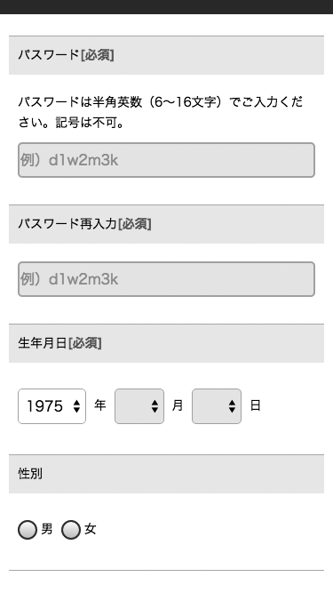

# ラベルや説明が不足しているフォーム

入力を行うためには、何を入れればよいのかを理解する必要があります。入力欄にラベルがなかったり、必要な説明がなかったりすると、理解ができず、入力できないことがあります。明確なラベルと説明を提供しましょう。

## よく見かける問題

### ラベルがなく、入力欄が何なのかわからない

ラベルをつけず、入力欄の中にプレースホルダとしてラベルテキストを入れた例。一見問題なさそうだが、入力を開始すると見えなくなってしまう。

### 必要な説明がなく、入力の条件がわからない

パスワードを設定するフォームの例。特に説明がないため、使用できる文字種や長さに制限があるかどうかがわからない。入力してみてエラーが出てはじめてユーザーはその制限に気づく。

### ラベルや説明が見つからない

入力についての説明が入力欄の後に置かれている例。入力を終えてから説明に気づくと、入力内容を後から修正するはめになる。

### ラベルや説明とコントロールとの対応がわからない

チェックボックスが横並びになっており、マージンが狭く設定されている例。ラベルはついているが、見た目にはどちらのチェックボックスのラベルなのかわかりにくい。

### ラベルや説明があいまいで混乱する

「メールマガジンを受け取らない」というラベルのチェックボックス。否定文のチェックボックスは意味がわかりにくく、ユーザーは一瞬立ち止まって考えなければならない。

### 必須か任意かがわからない

フォームの冒頭や各項目において、どれが必須または任意なのかが示されていない例。任意項目を空欄にして進めたユーザーは、それで問題なかったのか、入力が反映されていないのかが判別できず、不安になる。

## ここが問題! ラベルや説明がなければ何を入れるのかわからない

ラベルがなければ、入力欄が何なのかわかりません。入力内容によっては、説明が必要なこともあります。これらがなかったり、見つからなかったり、不適切だったりすると、何を入力すればよいのかわからなくなります。

### ラベルがなく、入力欄が何なのかわからない

入力欄にラベルがないと、ユーザーにはその入力欄が何なのかわかりません。特に、配置や見た目で入力欄を説明しようとしている場合、環境によっては全くわからないことがあります。画面の右上にラベルのない入力欄がある場合、それはサイト内検索のフォームであろうと推測するユーザーもいるでしょうが、まるでわからないこともあります（図1）。

また、入力欄が空欄のとき、入力欄そのものの中にテキストを表示するテクニックがあります。このテキストはプレースホルダと呼ばれ、 HTML5では入力欄にplaceholder属性を指定するだけで簡単に実現することができます。しかし、プレースホルダはラベルではありません。プレースホルダのテキストは、ユーザーが入力を始めると読めなくなってしまいますし、内容を後から修正する場合など、あらかじめ何かが入力されている状況では全く表示されません。また、ブラウザ標準のプレースホルダは非常に色が薄く、色がわかりづらい状況では読めないことがあります。

このように、プレースホルダは読めないことがあるため、ラベルの代わりに使っていると、ラベルがわからないことになります。特に、入力欄を取り違えて入力した場合、入力した時点でプレースホルダは読めなくなっているため、どの項目を入力したのかわからず、間違いに気づくことが難しくなります。

図1：ラベルがなく、アイコンだけで検索フォームの性質を示している例
ユーザーはこの入力欄が何なのかわからない可能性がある。

### 必要な説明がなく、入力の条件がわからない

入力の際に必要な条件が事前に提示されていないケースがあります。たとえば、郵便番号、電話番号、クレジットカード番号などの入力にハイフンが必要なのかどうかは、説明がなければわかりません。

また、パスワードを設定する場合、使用できる文字種や長さに制限があることが普通ですが、その条件が事前に提示されていないことがあります。パスワードを考えて設定した後で「半角英数8文字以内で設定してください」のようなエラーを目にすると、かなり厳しいユーザー体験となります。

### ラベルや説明が見つからない

ラベルや説明を提供していても、ユーザーが気づかなければ無意味です。ユーザーはフォームのラベルと入力欄に集中しているため、離れた位置にラベルや説明があっても気づかないことがあります。特に、入力欄より後ろに説明が配置してあると、入力を終えた後で初めて気づくことがあります。

### ラベルや説明とコントロールとの対応がわからない

複数の入力欄と複数のラベルが並んでいる場合、レイアウトを工夫しないと、どのテキストがどの入力欄に対応しているのかがわからなくなることがあります。典型的な例は、ラジオボタンやチェックボックスを横に並べているケースで、ラベルが右と左のどちらに対応しているのかがわかりにくくなります。

### ラベルや説明があいまいで混乱する

ラベルがあいまいだったりわかりづらかったりすると、ユーザーはそこで立ち止まって考えねばなりません。考えてわかる場合はまだしも、不明な場合は入力作業自体が完遂できなくなってしまいます。

チェックボックスに不明瞭なラベルがつけられている場合があります。たとえば、「メールマガジン」という名前のチェックボックスでは、それをどうするものなのかわかりません。また、チェックボックスにチェックを入れることは「OK」「受け入れる」といった肯定的な意思表示になるため、「メールマガジンを受け取らない」のような否定文のラベルになっていると、チェックの結果がどちらになるのか混乱することがあります。

ボタンのラベルがあいまいで、押した時にどのような動作になるのかわからないこともあります。問い合わせフォームの「送信」ボタンの結果が確認画面なのか、送信完了なのかは、押してみないとわかりません。

スクリーンリーダーのユーザーに伝わりにくいラベルもあります。典型的な例は、「ふりがな」「フリガナ」というラベルで、ひらがなでの入力かカタカナでの入力かを示しているケースです。スクリーンリーダーで単純に読み上げると、ラベルがひらがなで書かれているのかカタカナで書かれているのかはわからないため、いちいちラベルの文字種を確認する操作をしなければなりません。

### 必須か任意かがわからない

必須項目が少なければ、ユーザーは任意項目の入力をスキップして、入力の手間を減らすことができます。しかし、どの項目が必須でどの項目が任意なのかがわからなければ、入力をスキップできません。

そもそも、各入力項目が必須か任意か表示していないケースがあります。全ての項目が必須の場合や、全ての項目が任意の場合であっても、そのことが書かれていなければユーザーにはわかりません。また、「赤字は必須項目です」「太字は必須項目です」のように、色やスタイルに依存した必須表示も問題です。色が判別できなかったり、スクリーンリーダーを使っている状況では、これらの表現は伝わりません。「※（米印）がついているものは必須項目です」のようなものも、印が小さくてわかりづらかったり、スクリーンリーダーで記号を読み上げないことがあるなど、伝わらないケースがあります。

## 解決アプローチの例

### チェックボックスやラジオボタンにラベルをつける

「メールマガジンを受け取る」というラベルのチェックボックスの例。チェックボックスのラベルは常に肯定文にしておくとわかりやすい。

### ボタンには具体的な動作がわかるラベルをつける

「お手続きを進める」と書かれたボタンの例。ボタンのラベルは、押した後に何が起きるのかが明確にわかるものにする。多少長くなっても、明確さを優先するほうが良い。

### 必要に応じて説明をつける

パスワードの設定に必要な条件を記載した例。入力条件の見落としや認識もれを避けるため、入力欄の前に配置している。

### 入力欄は縦に並べ、十分なマージンを設ける

ラジオボタンを縦に並べた例。ラベルがどのラジオボタンに対応するのか明確になっている。

### 必須項目を明確にする

ラベルの横に「必須」と記載されている例。色や記号やスタイルだけでなく、必須項目がどれかを文字で明示する。自明な場合以外は省略しない。

### プレースホルダをラベル代わりにしない

プレースホルダは使わず、ラベルと注釈を使用した入力欄の例。プレースホルダに重要な情報を入れることは避け、読めなくても問題ないようにする。

## 解決アプローチ 明確なラベルと説明を提供する

全ての入力欄に明確なラベルをつけ、必要に応じて説明を提供しましょう。この際、入力欄が必須であるのか任意であるのかがわかるようにします。また、誤解を招くようなラベルの内容や配置は避けるようにします。

### 入力欄に明確なラベルをつける
全ての入力欄には明確なラベルをつけます。この際、他の入力欄と区別でき、この入力欄が何であるのかがわかるような名前をつけましょう。ラベルは入力欄の直前に配置することが望ましいでしょう。

ラベルは色やスタイルに依存せず、テキストだけでわかるものにする必要があります。ラベルの色を変えて「赤くなっている項目」などと指示すると、色がわからない環境では指示が伝わらなくなってしまいます。「8-1見た目に頼っている」も参照してください。

同様に、「フリガナ」と「ふりがな」のように、読み上げたときに音だけでは理解できないラベルも避けるべきです。フォーム側でひらがなとカタカナのいずれかしか受け付けられない場合は、「ふりがな（全角カタカナ）」のようにするか、あるいは「全角カタカナで入力してください」のような説明をつけて、テキストだけで明確になるようにしましょう。

### チェックボックスやラジオボタンにラベルをつける

チェックボックスやラジオボタンの場合、個々の選択肢のラベルと、項目全体を示すラベルの両方が必要になります。

チェック項目そのもののラベルは、チェックボックスやラジオボタンの直後に置かれるのが一般的です。ラベルと次の選択肢との間隔を空け、ラベルとの対応関係がはっきりわかるようにしましょう。また、チェックボックスのラベルは肯定文で統一します。「受け取らない」チェックボックスにチェックを入れさせる代わりに、「受け取る」チェックボックスのチェックを外させるようにしましょう。

項目全体を示すラベルも必要です。全体のラベルは、選択肢よりも前に提示します。また、選択肢をグループ化して、それらがひとくくりになっていることがわかるようにすると良いでしょう（図2）。

図2：ラジオボタンの例
個々の選択肢となるラジオボタンの後ろに「男性」「女性」「設定しない」というラベルがついている。また、ラジオボタンはグループ化され、全体には「性別の設定」というラベルがついている。

### ボタンには具体的な動作がわかるラベルをつける

ボタンのラベルは、たとえば、「入力内容を確認する」のように、押すと何が起きるのかわかるものにします。多少長くなっても、明確さを優先しましょう。

### 必要に応じて説明をつける

入力できる値に条件がある場合、説明を記載します。入力の条件には、以下のようなものがあります。

- 長さに制限がある
- 文字種に制限がある（ひらがな、カタカナ、英数など）
- フォーマットが複数ある（電話番号のハイフン有無など）

典型的な例はパスワードの設定で、使用可能な文字種と長さに制限がある場合がほとんどです。このように、一般的に制限があるような場合は、たとえ制限がなくても説明でそのことを明記しましょう。

何を入力すればよいのかわかりにくい場合も、説明を記載しましょう。たとえば、製品のシリアルナンバーを入力させる場合、どこに記載されているのか、どのような書式なのかを示すことで、何をどう入力すればいいのかがわかりやすくなります。

いずれの場合も、説明は入力欄よりも前に記載するようにしましょう。入力を終えてから説明に気づいても意味がありません。

### 入力欄はできるだけ縦に並べ、十分なマージンを設ける

複数の入力欄がある場合、それらを縦に並べると、区切りやラベルとの対応関係が明確になります。また、左右の視線の動きも抑えられるため、見やすさも向上します。やむを得ず横並びにするときは、矩形で囲む、背景色を敷く、マージンを設けるといった工夫をして、どのラベルがどのコントロールに対応するのかわかるようにしましょう。

### 必須項目を明確にする
フォームのそれぞれの入力欄について、必須なのか任意なのかを明確にします。記号や色で表現するのではなく、ラベルの後ろに「必須」「任意」というテキストをつけるのが最も良いでしょう。フォームが必須項目だけで構成されている場合であっても、何も記載がなければ必須か任意かわかりません。全ての項目に「必須」と表示するか、あるいは冒頭で「全て必須です」のようにはっきり記載しましょう。

### プレースホルダをラベル代わりにしない
プレースホルダをラベル代わりに使うことは避けましょう。プレースホルダは何かが入力されると消えてしまいます。ラベル、必須表示、説明、入力例といった、入力中に見る可能性があるものは、プレースホルダを使わず、入力欄の外に見えるように置いたほうが良いでしょう。

プレースホルダを有効に使える場面はさほど多くありません。読めなくてもよいような装飾的な内容をプレースホルダに入れるのは問題ありませんが、スタイルによっては、プレースホルダの内容がデフォルト値に見えたり、入力済みに見えたり、disabled状態に見えるなど、さまざまな誤解のもとになることがあります。
