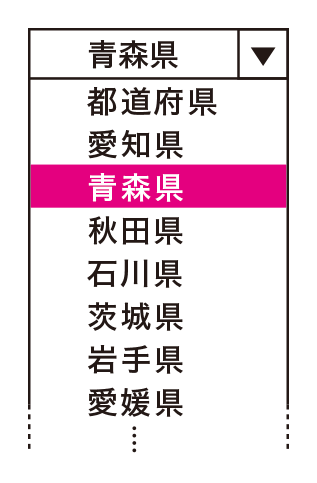

# 入力が困難なフォーム

フォームのインターフェイスにどのようなUIを選択するかは重要です。選択が誤っていたり、不必要な入力制限があると、入力が困難になります。適切なUIを選び、ユーザーの自由な入力を支援するようにしましょう。

## よく見られる問題

### 入力文字種が限定され、入力できない

数字を全角文字で入力するよう求めている例。半角と全角の違いがわからないユーザーは入力を完了できない。デバイスによっては、全角英数の入力が困難な場合もある。

### 入力欄が細かく分かれ、入力しづらい

メールアドレス入力欄が2つに分割されている例。コピー&ペーストやIME辞書による入力ができなくなる。

### 選択肢のUI部品が不適切で、入力しづらい

セレクトボックスで生年月日を選択させる例。生まれた年の選択肢の数は100近くあるため、選びにくい。また、操作ミスで隣の選択肢を選んでしまうこともある。

択一選択の選択肢に、チェックボックスのような見た目のコントロールを使っている例。チェックボックスを並べると複数選択が可能なように見え、混乱を招く。

## ここが問題! 不適切な UI部品は入力を困難にする

フォームにはさまざまなインターフェイスがありますが、適切なUI部品を選択しないと入力が困難になることがあります。また、システムで入力を制限している場合も問題を起こすことがあります。

### 入力文字種が限定され、入力できない
入力欄に入力できる文字の種類が限定されており、想定された入力以外ではエラーになるケースがあります。代表的なケースには以下のようなものがあります。

#### 全角での入力を強制される

「全角で入力」のような指示は、ユーザーが全角と半角の違いを知らなければ理解できません。環境によっては全角と半角の区別が難しかったり、全角での入力が難しい場合もあります。たとえばiPhoneでは、いったん半角で入力して変換するか、読みを入力してから変換する操作が必要です。特に全角記号類の入力は難しく、Q&Aサイトで全角ハイフンやスペースの入力方法が相談されている光景もよく見かけます。

#### 区切り文字の入力を強制される

数字や番号を入力する際、区切り文字の入力を強制されるというパターンもあります。たとえば、電話番号や郵便番号を入力する際にハイフンが必須だったり、日付入力時にスラッシュを入れさせられるケースがあります。逆に、これらの区切り文字を入れるとエラーになるパターンもあります。

#### カタカナでの入力を強制される

名前や住所のふりがなをカタカナで入力させる場合がありますが、多くのスマートフォンには直接カタカナを入力する機能がなく、ひらがなを入力して変換しなければなりません。この変換を学習してしまい、以降の入力がわずらわしくなることもあります。また、スクリーンリーダーの場合、ひらがなとカタカナが同じように読まれ、詳細読みモードにしなければどちらなのかわからないことがあります。

### 入力欄が細かく分かれ、入力しづらい

郵便番号、電話番号、カード番号などの入力欄が分割されている場合があります。分割されているとフォーカス移動と入力とを繰り返す回数が増え、コピー＆ペーストやIMEの変換による入力が難しくなります。また、ユーザーが分割に気づかずに最初の入力欄に全て入力してしまうこともあります。特に、スクリーンリーダーのユーザーや画面を拡大しているユーザーは、入力欄の分割に気づきにくくなります。

### セレクトボックスの使い方が不適切で、入力しづらい

セレクトボックスは省スペースですが、選択を行う際には選択肢が全て表示されます。選択肢が多いと、環境によっては一画面に収まらず、選択が困難になります。また、並び順が想定と違っていたり、デフォルトの選択肢が不適切だと、選択肢を探し回ることになります（図1）。

図1：都道府県の選択肢が50音順になっている例

一般的な並び方とは異なるため、探しにくい。

### 選択肢のUI部品が不適切で、入力しづらい

UI部品には目的に応じた種類があります。特に選択肢を提示するUIは種類が多く、不適切な使い方をするとユーザーは混乱します。たとえば、択一選択にチェックボックスを使うと、ユーザーは複数選択できるものと思ってしまいます。また、ラジオボタンには、一度選択すると、未選択の状態には戻せない性質があり、任意項目にラジオボタンを使うと、誤って選択した際に戻すことができなくなります。

## 解決アプローチの例

### 入力を柔軟に受けつけ、システム側で変換する

半角と全角といった制約のない住所入力欄の例。自由な入力を受けつけ、必要に応じてシステム側で全角と半角を変換する。ユーザーは全角半角を意識せずに済む。

### 入力欄を分割せず、ひとつに統合する

電話番号の入力欄をひとつに統合した例。入力欄がひとつになれば、操作の手順が減る。必要であればシステム側で区切りを見分けるようにする。

### 選択肢のUIを適切に選択する

ラジオボタンを使い、デフォルト値を設定している例。択一選択で、選択肢が少ない場合にはラジオボタンを採用するとよい。

### 選択肢の並び順に配慮する

都道府県の並び順を一般的なものに合わせた例。他のサイトで入力した際の経験と一致する可能性が高く、いつもの場所にあるという安心感がある。

## 解決アプローチ ユーザーの自由な入力を支援する

ユーザーのさまざまな入力をできるだけ受け入れましょう。システムで制約をかけるのではなく、ユーザーの幅広い入力を許容し、システム側で支援するようにします。また、ユーザーが混乱しないよう、適切なUIを選択します。

### 入力を柔軟に受け入れ、システム側で変換する

ユーザーの入力をできるだけエラーにせず、システム側で変換しましょう。半角と全角、ひらがなとカタカナ、大文字と小文字、ハイフンなどの区切りの有無などは、システム側で変換して処理できることが多いでしょう。システム側で変換できない場合、JavaScriptで入力時に変換する方法もあります。

### 分割された入力欄をひとつに統合する

郵便番号や電話番号やクレジットカード番号などの入力欄はひとつに統合しましょう。入力パターンが見えずに不安になるユーザーも出てきますので、入力例を示すことを忘れないようにします。

### 選択肢のUIを適切に選択する

選択肢のUI部品は、素直に意味通りに使いましょう。おおまかな指針は以下の通りです。

#### 択一選択にはラジオボタンを使う

ラジオボタンは、複数の選択肢からひとつを選ぶコントロールです。選択肢が最初から全て見えており、一覧できるメリットがあります。選択肢が少ない時にはラジオボタンを使用すると良いでしょう。なお、ラジオボタンは原則として、常に何かひとつが選択されている状態になります。初期状態で何も選択されていない場合、一度選択すると戻せなくなりますので、未選択状態に意味を持たせることは避けるべきです。できれば、初期状態で何かが選択されている状態にしておきましょう。

#### シンプルな択一選択にはセレクトボックスを使う

シンプルな択一選択にはセレクトボックスを使うこともできます。選択する際にプルダウン、ドラム表示などで選択肢を展開し、普段は現在選択中の選択肢だけを表示するため、省スペースです。ただし、押してみないと選択肢が見えないため、選択肢をじっくり読む場合には向きません。いくつかの数字から選ぶ場合や、都道府県を選ぶ場合など、選択肢がシンプルで予想できるときに使いましょう。

#### 複数選択にはチェックボックスを使う

チェックボックスは、オン・オフを切り替えるコントロールです。選択肢から複数選択できるときは、ラジオボタンではなくチェックボックスを使用します。複数選択セレクトボックスは滅多に使用されず、使い方もわかりにくいため、使用しない方が良いでしょう。

#### はい・いいえの二択にチェックボックスを使う

選択肢が二択の場合、「男性・女性」のような並列の場合はラジオボタンを使いますが、「はい・いいえ」「受け取る・受け取らない」といったオン・オフの場合はチェックボックスが使えます。この際、ラベルは肯定形にしましょう。「6-3 ラベルや説明が不足しているフォーム」も参照してください。

#### 直接入力のほうが早い場合

西暦や年齢といった項目は、何を入力すべきか、どう入力すべきかが明確です。このようなケースでは、大量の選択肢から選ぶより、直接入力させた方が早い場合もあります。また、コピー&ペーストされることが予想される場合には、直接入力の方が良いでしょう。

#### 選択肢を分割する

選択肢があまりにも多い場合、段階的に入力させる方法もあります。たとえば、都道府県を選ばせる前に東北、関東といった地域を選ばせ、その地域に応じた都道府県だけを選択肢として提示します。ただし、この方法をとると選択を行う回数は増えるため、必要以上の分割は避けた方が良いでしょう。

### 選択肢の並び順に配慮する

選択肢が多い場合、探しやすい並び順になっていることも重要です。たとえば、都道府県を選ばせる場合、JIS X 0401で規定されている都道府県コードの並び順にすることが一般的です。特に決まりがない場合、ユーザーが予測できるような規則的な並び順にしておきましょう。
