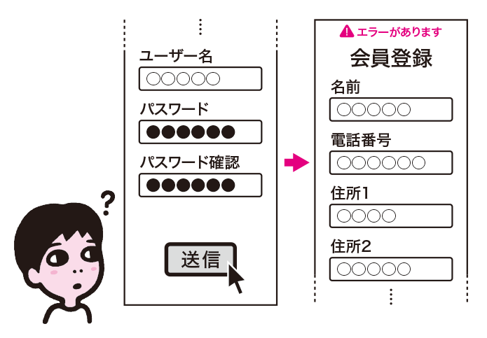
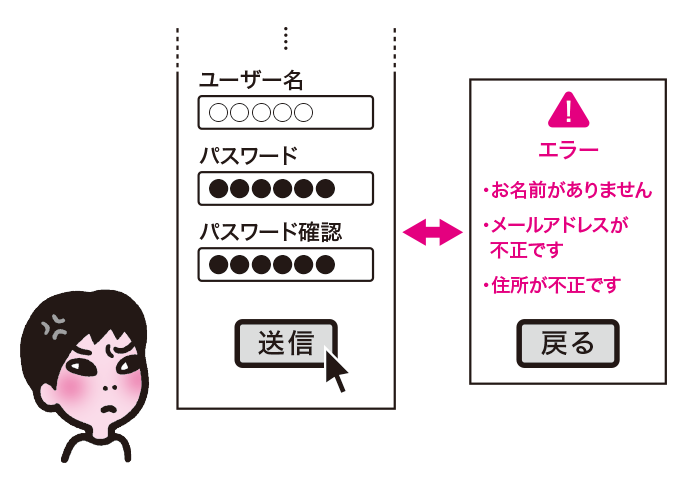
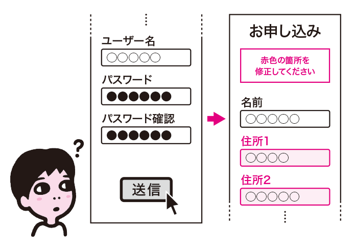
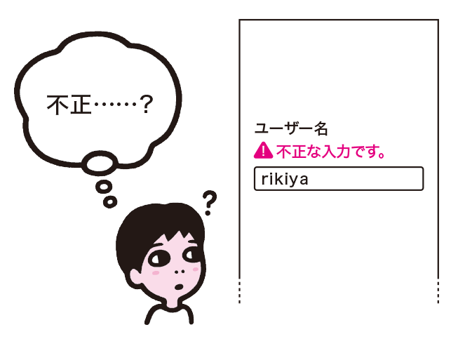
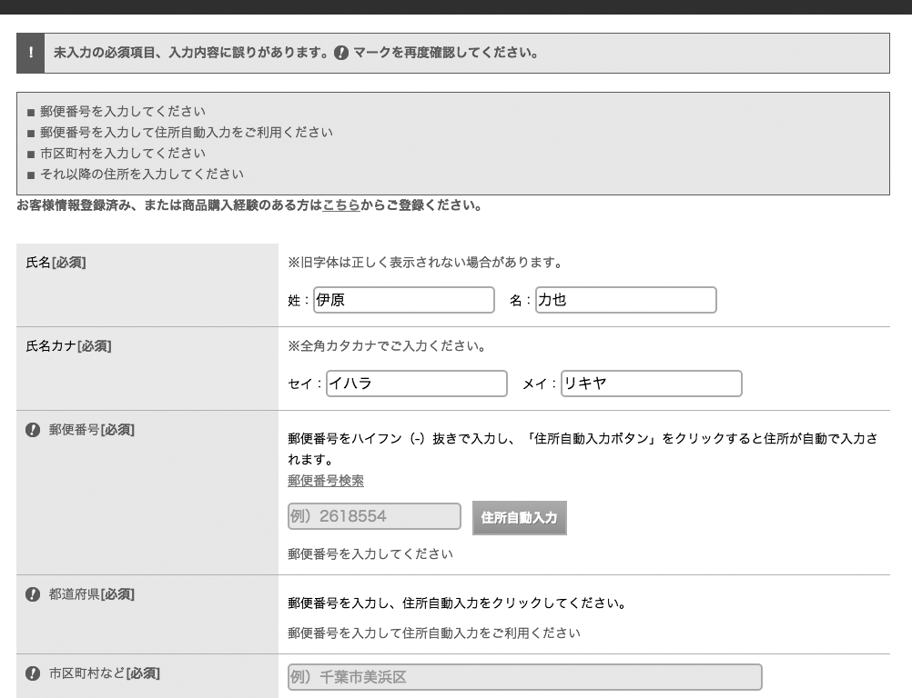
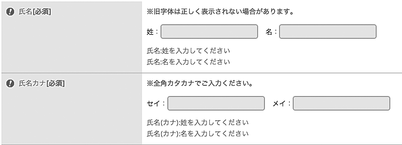
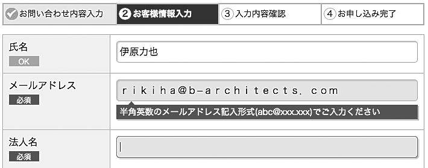
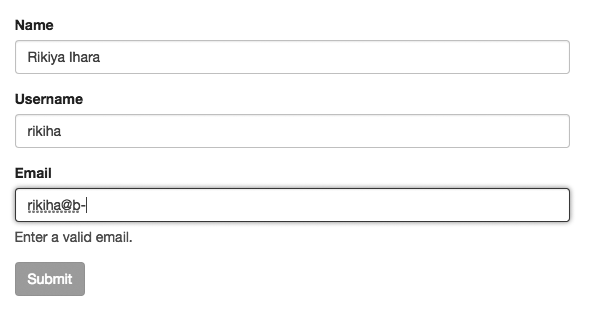
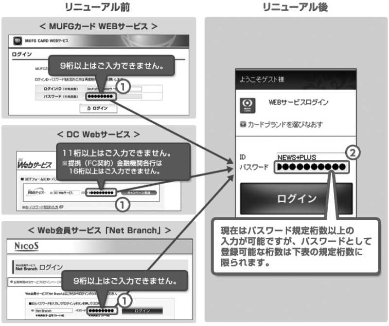

# エラーの解決ができないフォーム

時には、受け付けられない値が入力され、エラーとなることもあります。エラーが出たことがユーザーに伝わらなかったり、修正方法がわからなかったりすると、エラーを解決することができません。スムーズに解決できるように設計しましょう。

## よく見られる問題

### エラーメッセージが見つからず、何が起きたかわからない

フォームを送信したが、何も起こらないように見える例。実は目立たないようにエラーメッセージが出ているが、メッセージに気づかないユーザーには何が起きたかわからない。

### エラー表示と入力欄が分かれており、行き来する必要がある

フォーム送信後、エラーメッセージだけが表示される例。修正するにはフォームに戻る必要があり、このメッセージの内容を覚えておかなければならない。

### エラー箇所がわからず、どこを直せばよいかわからない

「赤色の箇所を修正してください」というメッセージの例。色を識別できない状況だったり、スクリーンリーダーを利用していたりすると、どこがエラーになっているのかわからない。

### エラーメッセージが理解できず、どう直せばよいのかわからない

「不正な入力です」というエラーメッセージが出ている例。エラーの原因や対処法がわからないと、ユーザーはエラーを解決することができない。

## ここが問題! エラーがわかりにくいと解決できない

エラーが起きた場合、ユーザーは入力内容を修正してエラーを解決する必要があります。修正箇所やその理由がユーザーにフィードバックされないと、どこをどう修正すればよいのかわからず、ユーザーは先に進めなくなってしまいます。

### エラーメッセージが見つからず、何が起きたかわからない

フォームを送信した際、エラーメッセージが表示されないと、ユーザーは送信が受けつけられたと思い、そのまま作業を完了してしまいます。エラーメッセージが表示されていても、ユーザーがそのメッセージに気づかなければ同じことです。特に、スクリーンリーダーを利用している場合、画面内のどこかにエラーメッセージが出ていても、その存在に気がつかないことがあります。

### エラー表示と入力欄がわかれており、行き来する必要がある

フォームの送信後、画面にエラーメッセージだけが表示され、修正するためにフォームに戻ると、エラーメッセージが見えなくなってしまう場合があります。この場合、ユーザーはエラーメッセージを記憶しなければならず、忘れた場合はエラーメッセージと入力欄とを行ったり来たりすることになります。

また、エラーメッセージがフォーム画面の冒頭に表示される場合もあります。エラーメッセージと入力欄が同一画面にあっても、それが離れていると、やはり何度も行き来しなければなりません。画面を拡大していたり、スクリーンリーダーを使用している場合には、行き来することも大きな労力になります。

### エラー箇所がわからず、どこを直せばよいかわからない

エラーメッセージが出ても、どの項目が問題になっているのかはっきりわからないことがあります。どの項目がエラーになっているのか認識できなければ、修正の検討もできません。「全ての入力欄を埋めてください」のように言われても、どの欄が記入漏れと判定されているのかわからないと対応できません。

また、エラー箇所を視覚だけで示すようなケースも問題を起こします。たとえば、「エラー箇所（赤色）を修正してください」というメッセージでは、色が判別できないユーザーにはエラー箇所がわかりません。ラベルが太字になっていたり、記号がついていたり、入力欄の枠線が太くなっているようなケースも同様です。特にスクリーンリーダーでは、エラー箇所が全くわからなくなってしまうことがあります。

### エラーメッセージが理解できず、どう直せばよいのかわからない

エラーであることがわかっても、対応方法がわからなければユーザーは立ち往生してしまいます。たとえば、「正しくありません」「正しく入力してください」のようなメッセージはありがちですが、もともとユーザーは正しく入力しているつもりのはずで、どこが間違っているのかわからないこともあります。

さらにひどい場合、プログラムの出力するエラーコードをそのまま載せているケースもあります。それだけ見せられても、ユーザーはどうすればよいのかわかりません。

## 解決アプローチの例

### 送信前にエラーチェックを行う

クライアント側で送信前にエラーチェックを行う例。フォーカスを外したときにチェックを行い、エラーであればエラーメッセージを表示する。全てOKになるまで送信ボタンが押せないようにしている。

### エラーメッセージと同時に修正フォームを提示する

エラー時にエラーメッセージを出しつつ修正フォームを表示する例。冒頭でエラーであることを示しつつ、入力欄の近くにもエラーメッセージを出しているため、メッセージと入力欄とを行き来する必要がない。

### エラー箇所を明示する

エラーになっている入力欄を強調表示し、ラベルにもアイコンを添えた例。エラーメッセージも入力欄の近くに表示しているため、どの項目がなぜエラーになっているのかがわかりやすい。

### エラーメッセージで理由と修正方法を明示する

エラーの理由と修正方法を明示したエラーメッセージの例。なぜエラーになっているのか、どう修正すればよいのかがわかれば、ユーザーは対応することができる。

## 解決アプローチ エラーの表示場所、タイミング、内容を適切にする

サーバー側でのエラーはわかりやすい位置に表示します。そのうえで、クライアント側でのチェックを入力欄ごとに行い、ひとつずつ問題を潰せるようにしましょう。メッセージの内容は問題解決に役立つ形にします。

### 送信前にエラーチェックを行う

エラーが起きると、ユーザーはそれを確認し、解決しなければなりません。そもそもエラーが起こらないようにすることが一番です。「全角文字で入力してください」というメッセージを出す代わりに、自動で半角文字に変換しましょう。「6-4入力が困難なフォーム」も参照してください。

どうしてもエラーが発生してしまう場合、フォームを送信する前にクライアント側でチェックを行うと良いでしょう。入力が終わった都度、入力欄からフォーカスを外したときにエラーを出すようにすれば、入力したものをすぐに修正することができ、最後にまとめてエラーを出されるよりも修正がしやすくなります。

入力中にリアルタイムでチェックを行うこともあります。よくあるのは、入力文字数に制限があるケースで、現在入力可能な文字数を常に表示するパターンです（図1）。こうすることで、エラーが出る前に文字数超過に近いことがわかるようになり、ユーザーはエラーを回避することができます。ただし、クライアント側でのメッセージ表示を行う際は、スクリーンリーダーにも伝わるように実装する必要があります。「9-7 スクリーンリーダー対応が不適切」も参照してください。

なお、リアルタイムチェックが常に有効なわけではありません。まだ入力を終えていない入力欄がエラーと判定されてエラーメッセージが出るようなことになれば、かえってわかりにくくなります（図2）。

図1：リアルタイムに入力可能文字数を表示する例

入力欄に入れられている文字数に応じて、欄外にあと何文字入力可能なのか表示している。

図2：リアルタイムにメールアドレスのチェックをしている例

最初の1文字を入力した瞬間にエラーが出てしまい、ドメイン名を入力するまでエラーメッセージが出続けることになる。ユーザーはエラーメッセージに気を取られてしまう。

### エラーメッセージと同時に修正フォームを提示する

フォーム送信後でなければ判定できないエラーもあります。クライアント側でエラーチェックできる場合でも、スクリプトが無効になっている場合や、入力補完を行うアドオンなど、サイト運営側が想定していない方法で入力される場合があるため、いずれにしてもサーバー側でエラーを出す必要はあります。

フォーム送信後にエラーを出す場合は、エラーメッセージの表示と同時に修正のためのフォームも表示し、その場で修正できるようにします。この際、フォームには入力した値が入った状態にしておきます。

エラーメッセージは、まずページ冒頭の目立つ場所に表示し、どの項目でどのようなエラーが起きているのかという概要を伝えます。これにより、まずエラーが起きていること、送信が完了できていないことをユーザーに伝え、修正作業に移りやすくします。

なお、冒頭にエラーメッセージが出ていても、スクリーンリーダーのユーザーには気づかれないことがあります。見出しにジャンプしたり、フォームにジャンプする機能を使えば、エラーメッセージが出ている部分を読み飛ばしてしまうからです。エラーであることが見出しやタイトルからもわかるように、ページタイトルやページの見出しに「（エラー）」などと追加すると良いでしょう。

さらに、エラーが起きている個々の入力欄付近にもエラーメッセージを表示するようにしましょう。修正すべきポイントにエラーメッセージが表示されていれば、冒頭のエラー表示と入力欄の行き来をせずに修正を行うことができます。

### エラー箇所を明示する

冒頭でエラーメッセージを表示する際は、エラー項目のラベルを明確に示しましょう。同時に、エラーが起きている箇所を強調して、エラー箇所がひと目でわかるようにしましょう。

この際、色や見た目に依存した表現は避けます。エラーを赤で表現することは一般的に行われており、伝わりやすい表現です。しかし、色だけで表現すると、色がわからないユーザーには伝わりません。色を使うことは積極的に行うべきですが、テキストや、代替テキストを指定した画像などのシンボルを明確に置いて、どんな環境でも識別できるようにしましょう。「8-1 見た目に頼っている」も参照してください。

### エラーメッセージで理由と修正方法を明示する

エラーメッセージには、エラーの原因や対応方法の情報を含めるようにします。「郵便番号を正しく入力してください」というメッセージの代わりに、「郵便番号は7桁で入力してください」「郵便番号に全角文字が含まれています。半角で入力してください」のようなメッセージを出すと良いでしょう（もっとも、後者についてはシステム側で半角に変換することが望ましいでしょう）。

単に間違っていると言われても、ユーザーは間違いに気づけないこともあります。間違いやすいポイントがある場合、エラーメッセージに加え、そのポイントを示すと良いでしょう。「ピリオドとカンマの打ち間違いに気をつけてください」「保険者番号と事業者番号の取り違えに注意してください」のようにヒントを示すことで、ユーザーがミスに気づく可能性が高まります。

最悪の場合、ユーザー自身では解決できないシステムエラーが出ることもあるかもしれません。その場合は、メールアドレスや電話番号などの連絡先を提示して、問い合わせできるようにすると良いでしょう。

## コラム maxlengthの落とし穴

入力欄に一定以上の文字数を入れられないように制限したいとき、input要素にmaxlength属性を設定するというアプローチがあります。HTML5ではtextarea要素にもmaxlength属性が指定できるようになり、一見すると便利に使えそうに思えます。

maxlength属性が指定されていると、指定文字数に達した後は、キーを入力しても何も入力されなくなります。また、指定より長い文字列をペーストした場合、指定の長さで切られ、後ろは捨てられます。このため、ユーザーが入力しているつもりの文字が、実は途中で切れてしまっており、そのことにユーザーが気づかないということが起こり得ます。特に、入力欄が小さかったり入力文字列が長かったりして入力欄からはみ出すようなケースでは、入力中の文字列の全体が見えず、長さも把握できないため、入力できていないことに気づきにくくなります。

パスワード入力欄では入力した文字がマスクされるため、切り落とされていることに気づかない可能性が高くなります（図3）。パスワード設定の際にこの問題が起きると、ユーザーは想定よりも短いパスワードを設定してしまうことになります。

図3：三菱UFJニコスで起きた事例

ユーザーが想定よりも短いパスワードを使っており、それに気づいていなかった事例。システム統合でログイン画面のパスワード入力欄が長くなったことで問題が表面化した。

maxlengthがあると、ペーストした文字列から一部を削除して使うことが難しくなる場合もあります。たとえば、ハイフンの入力が必要ない郵便番号入力欄があったとき、ユーザーは「123-1234」という文字列をペーストしてから「-」を削除して「1231234」という入力を完成させようとするかもしれません。しかし、郵便番号入力欄に maxlength="7"が指定されていると、123-123までしかペーストされず、4を手入力しなおさなければならなくなります。

文字数を制限したい場合、文字数制限があることを説明した上で、あえて自由に入力させ、超過したところで警告を出すようにするのが良いでしょう。

[三菱UFJニコス、カード会員向けサービスのパスワード文字数制限でトラブル - INTERNET Watch](http://internet.watch.impress.co.jp/docs/news/20121121_574494.html)
