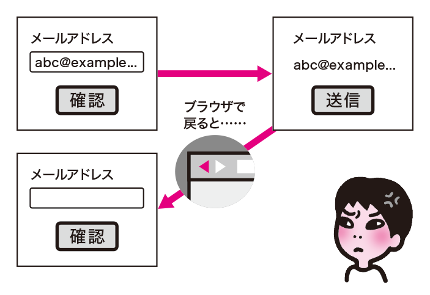
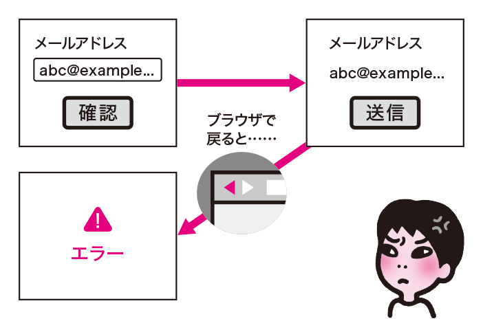
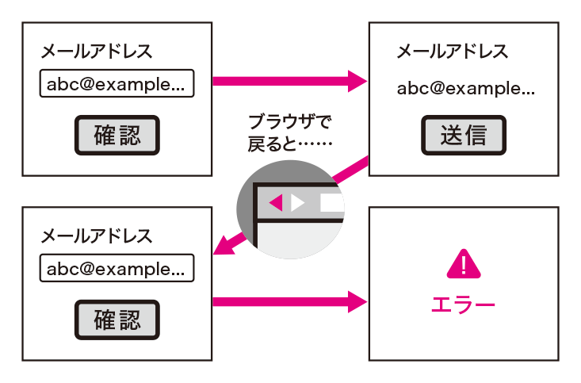
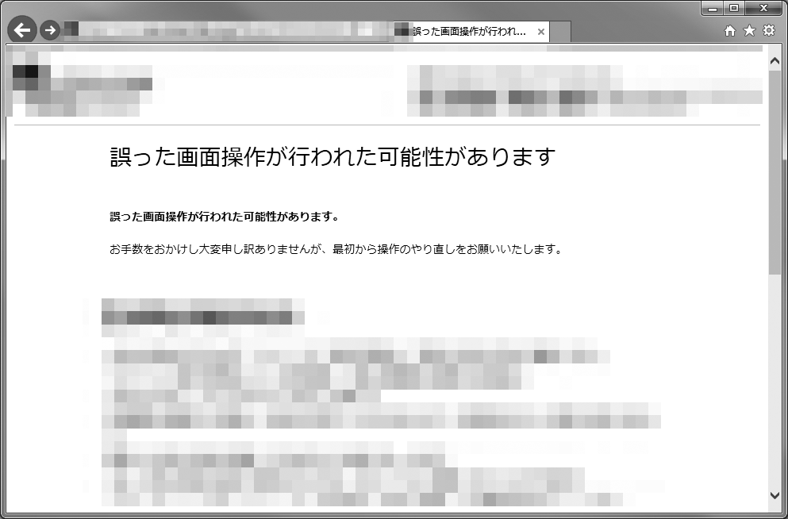

# 戻る機能が使えないフォーム
ブラウザには、ひとつ前のページに戻る機能があります。この機能で戻ったときに不都合が生じたり、戻る機能そのものが制限されていると、ユーザーは不便を強いられます。ユーザーが安心して戻ることができるようにしましょう。

## よく見られる問題

### 戻ると入力内容が消えてしまう

ブラウザの「戻る」ボタンで戻ると、フォームに入力していた内容が消えてしまう例。入力のやりなおしになってしまう。

### 戻るとエラーになってしまう

ブラウザの「戻る」ボタンで戻るとエラーになる例。リロードして続けようとしても最初からになってしまう。

### 戻って再送信するとエラーになってしまう

ブラウザの「戻る」ボタンで戻って入力しなおすと、エラーになってしまう例。最初からやりなおしになってしまう。

### そもそも戻れない

ブラウザの「戻る」ボタンで戻ろうとすると警告されて戻れない例。ユーザーは戻る操作の自由を奪われてしまう。

## ここが問題! 戻れないとユーザーは不便を強いられる

ブラウザの提供する「戻る」機能は重要です。ユーザーは「戻る」によって前のステップに戻ったり、入力内容を訂正したりしようとします。この機能がうまく使えないと、ユーザーは入力内容を訂正できなくなってしまいます。

### 戻ると入力内容が消えてしまう

ほとんどの場合、フォーム送信後にブラウザの「戻る」機能で戻っても、入力した内容は残ったままになっています。しかし状況によっては、入力内容が消えてしまうことがあります。入力しなおしになると、入力に時間がかかるユーザーには大きな負担となります。

### 戻るとエラーになってしまう

ブラウザの「戻る」機能で戻ると、エラーになってしまうケースもあります。「戻る」機能でフォームに戻ってくると、ブラウザは有効期限切れのエラーを表示することがあります（図1）。

図1：ページの有効期限切れのメッセージ

ユーザーが指示に従ってページをリロードすると、「データを再送信しないと表示できない」と言われます（図2）。

図2：情報の再送信が必要になるというメッセージ

ここでユーザーが「再試行」を押すと、今度はサーバー側で「誤った操作が行われた」といったエラーが表示されます（図3）。

図3：「誤った操作が行われた」というエラーメッセージの例

この場合、一連の操作を最初からやりなおす必要があります。これは特に、一連のステップの途中の画面で「戻る」操作をした場合に多く見られるケースです。大量の情報を少しずつ入力してきていたときに、最初からやりなおしになってしまうのは、最悪のユーザー体験と言えます。

### 戻って再送信するとエラーになってしまう

ブラウザの「戻る」機能で問題なく戻れたように見えても、再送信すると「誤った操作が行われた」とされてエラーになってしまうケースがあります。ユーザーは情報を入力し、訂正までしているのに、最初からやりなおしになってしまいます。これもかなり厳しいユーザー体験です。

### そもそも戻れない

ブラウザの「戻る」機能を使えないようにしているケースがあります。ブラウザの「戻る」ボタンを押しても何も起きなかったり、ひどい場合はアラートが出て「戻る操作は禁止」と告げられることもあります。

コンテンツ内に「戻る」ボタンが配置されていても、ボタンの操作が容易でない場合もあります。ボタン操作が困難なユーザーでも、「戻る」操作にはショートカットが割り当てられて容易になっていることが多く、その操作が禁止されれば、ユーザーの負担は大きくなります。

## 解決アプローチの例

### 入力内容が消えないようにする

ブラウザの「戻る」ボタンで戻っても、フォームに入力していた内容が残っている例。凝ったことをしなければ、戻っただけで内容が消えることは少ない。

### システム都合の制限を極力避ける

操作手順を限定するような実装をせず、「戻る」ボタンで自由に戻れる設計の例。必要最低限の部分だけシステム側で制限している。

## 解決アプローチ 可能な限り自由に戻れるようにする

原則として、戻れないような仕様は避け、ユーザーが自由に前の画面に戻れるようにします。サイト運営者の意図に反して戻れなくなっているケースもあるため、検証時に戻る操作ができるかどうかを確認しましょう。

### 入力内容が消えないようにする

フォーム送信後、「戻る」機能を使ってフォームに戻ると、入力内容が消えてしまうケースがあります。これは、主に以下のような実装になっている場合です。

#### 入力欄がパスワード入力（inputtype=password）になっている場合

パスワード入力欄の場合、安全性のため、あえて内容が復元されないようになっています。この場合、消えることを前提に、消えても問題が大きくならない構成を考慮しましょう。大量の入力欄の中にパスワード入力欄が混ざっていると、戻った際、パスワードだけが消えます。ユーザーはパスワードが消えたことに気づかなかったり、パスワード入力欄を探し出して再入力しなければならず、操作も大変です（図1）。可能であれば画面を分け、パスワード入力欄だけを単独のページにすると、他の項目を修正する場合にパスワードを入力しなおす必要がなくなります（図2）。

図1：大量の入力欄にパスワード入力を混ぜた構成

図2：パスワードだけ別の画面に切り出した構成

#### 入力欄にautocomplete="off"が指定されている場合

input要素に対してautocomplete="off"という属性を指定すると、ブラウザ側での入力補完が行われなくなります。戻ってきた場合も、入力していた内容が反映されません（ただし、 Internet Explorerなどは指定を無視して復元します）。この場合、そもそも補完を禁止する必要があるのかどうか検討しましょう。autocomplete="off"の指定は、ワンタイムトークンの入力など、ユーザーが本当にその値を1回限りしか入力しないようなケースに限るべきです。

#### JavaScriptによるDOM操作で入力欄を挿入したり、書き換えたりしている場合

JavaScriptでDOM操作を行って入力欄そのものを挿入している場合、あるいはJavaScriptで入力欄の中身を書き換えているような場合には、戻ってくると入力内容が消えてしまいます（Firefoxなど、消えないブラウザもあります）。消えないようにするためには、このような実装を避けるしかありません。document.writeで生成すれば問題ありませんが、そうはできない場合もあるでしょう。フォーム画面では、JavaScriptに依存しすぎないように注意し、戻ったときの挙動も検証しておきましょう。

### システム都合の制限を極力避ける

システム側で厳密な画面遷移の制御を行うと、「戻る」機能を使ったときに不正な遷移とみなし、エラーになることがあります。これはシステム側の都合ですので、システムの設計時に考慮しておかなければ対応できません。本当にこのような厳密な制御が必要なのかどうか検討しましょう。

厳密な画面遷移のチェックをしない場合、戻って再送信すると多重送信できてしまうことがあります。しかし、多重送信は常に起こり得る問題ですし、システム側で多重送信を検出して適切な処理ができていれば、「戻る」機能を禁止する必要はないはずです。また、処理を確定する前であれば問題ありませんので、確認画面などではそのまま戻らせてしまって問題ないはずです。システム側で必要最低限の多重送信チェックを行う必要はありますが、それ以上の処理は必要ないことが多いでしょう。どうしても必要であれば、ユーザーが戸惑わないようなメッセージの出し方をするなど、できる限りの配慮をしましょう。
