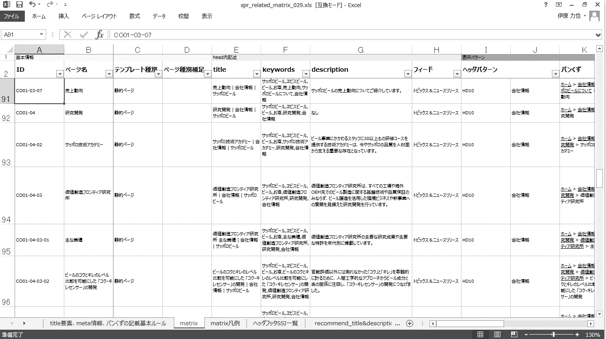

# 概要と流れ
ここまで、サイトの構成やナビゲーション、インタラクションの仕組みなどを設計してきましたが、これらはコンテンツを入れるための器にすぎません。「コンテンツ設計」のプロセスでは、いよいよユーザーに提供するコンテンツそのものを用意します。構成要素を決め、テキスト原稿や素材を調達します。

これは単純なようでいて、難しい問題をはらんでいます。たとえば、コンテンツを画像だけで構成すれば、画像を見られないユーザーはアクセスできなくなってしまいます。代替テキストを指定すればアクセスできるようになりますが、代替テキストはコンテンツですので、実装時に考えるべきではありません。コンテンツを検討する時点で、さまざまなユーザーを想定して構成しておくことが重要になります。

## STEP1素材・原稿ルールの確認
コンテンツを設計する前に、素材のルールを確認します。ここで言う素材とは、記事コンテンツの原稿となるテキストや、画像、映像、PDFなど、コンテンツを構成する要素の元データのことを指します。素材を用意したり、原稿を起こしたりする際のルールが明確になっていないと、ページごとに言い回しがちぐはぐになったり、画像の使い方やスタイルが異なるといったことが起こります。これはユーザーにちぐはぐな印象を与えたり、戸惑わせてしまったりすることになります。確認しておきたいルールには、以下のようなものがあります。

### テキスト原稿のルール
サイト内で使用するテキストのルールを決め、統一しましょう。よくある決めごとには、文体（です・ます or だ・である）、ワーディング（よくある表記ゆれや、送り仮名の統一）、専門用語の使い方、運営者のポリシーとして使用を避ける表現（人種差別と受け止められる表現をしない、台湾が国なのかどうかあいまいにするなど）、といったものがあります（図1）。

なお、Webにおいては検索性という観点も重要になります。ユーザーがよく検索する言葉を使うことで、検索によってたどり着くことが容易になります。検索される単語がひとつに絞れない場合は、複数の語を併記することもあります。本文にキーワードを盛り込む施策は、SEOの考え方とも共通します。ただし、これはコンテンツの評価を吊り上げることが目的なのではありません。あくまで、このコンテンツを探しているユーザーがきちんとたどり着けるように、という観点でルール設計を行いましょう。

図1：ワーディングルールの例

### リンクのルール
Webに特有の、リンクのルールも確認しておきましょう。リンクのルールがサイト内で統一されていないと、ユーザーは混乱してしまいます。よくある決めごとには、たとえば以下のようなものがあります。

* リンクテキストは原則としてリンク先のページタイトルとし、「こちら」リンクは使用しない
* 文中リンクはせず、必要に応じて本文の下に箇条書きでリンクを並べる
* 新規ウィンドウ、新規タブとなるリンクは使用しない
* PDFへのリンクには専用のアイコンをつける

### 画像、映像、PDFなどの使用法
コンテンツで画像やPDF、映像などを使用することがありますが、その使い方のルールも決めておく必要があります。よくある決めごとには、たとえば以下のようなものがあります。映像などの使用が例外的である場合、事前にルールを決めておかず、運用の中でルールを確立していくこともあります。対象となるコンテンツがある程度増えたところで、確実に明文化しましょう。動画については「3-4動画コンテンツにアクセスできない」、PDFについては「3-5紙媒体のコンテンツがそのまま使われる」も参照してください。

* 記事コンテンツには打ち出し用画像、サムネイル画像、アイコン画像を用意する必要がある
* PDFのあるニュースリリースも必ずHTMLコンテンツを用意する。コンテンツのHTML化ができない場合は概要のみ記述して「詳細はPDFを参照」という形にする
* 映像はYouTubeに置き、埋め込んで参照する形にする。この際、映像が見られないユーザーも考慮して、本文中に必ず概要を書くようにする

## STEP2コンテンツ構成要素の設計
コンテンツは、見出し、本文、リスト、図版、表など、さまざまな要素で構成されます。このような、コンテンツを構成するパーツを「コンポーネント」と呼びます。「モジュール」「エレメント」「ブロック」などと呼ばれることもあります。

コンポーネントのルールがないと、各ページのルールが統一されず、見出しが使われないページがある、スタイルがページごとに異なるなど、さまざまな問題が出てきます。コンポーネントを定義することで表現を一貫したものにできます。また、あらかじめアクセシビリティに配慮して設計しておけば、そのコンポーネントを組み合わせて構成したページも、自然とアクセシブルなものになります。

原稿や現状のサイトを確認して、どのようなコンポーネントが必要になるのかを検討します。一般的には、見出し、本文、リスト、図版、表などが必要になります。サイトによっては、サブタイトル、キャプション、段組、囲み記事、区切り線、動画の埋め込み、といったものが必要になることもあります。

必要に応じて、コンポーネントにスタイルのバリエーションを持たせることもあります。たとえば、見出しのスタイルを何種類か用意したり、図版を配置する際に画像を右に置く、左に置く、中央に置く、といった配置のバリエーションを持たせることがあります（図2）。

図2：さまざまなコンポーネントの例

なお、コンポーネントの使用が適さない場合もあります。トップページやランディングページなど、他のページとの共通点が少なく、ルールを統一する必要性が薄いページについては、コンポーネントを使わずに単独で設計してもかまいません。また、サイト内での使用頻度が低い要素については、コンポーネントとして切り出さず、都度設計することがあります。

## STEP3コンテンツの構成
コンポーネントが洗い出せたところで、実際の素材にコンポーネントを当てはめていきます。テキスト原稿のどこが見出しでどこが本文なのかを判断したり、画像素材をどこに配置するのかを検討したりしながら、適切なコンポーネントを適用していきます。適切なコンポーネントが見当たらない場合は、一品ものとして対応するのか、コンポーネントを追加する必要があるのかを検討します。

かつては、この検討作業の結果をコンテンツ仕様書としてドキュメントにすることがよく行われていました。コンテンツ仕様書には、各ページにどのような原稿が入り、どこにどのコンポーネントを適用するのか、どこにどの画像を配置するのか、といった指示が書かれます（図3）。

図3：コンテンツ仕様書の例

最近では、このようなドキュメントを作らず、いきなりプロトタイピングを行ってしまうケースもあります。プロトタイプを作る過程の中で、コンポーネントの適用を検討します（図4）。

図4：プロトタイピングツールの例

コンポーネントを扱うことのできるCMS製品を導入している場合、CMSの機能を使っていきなりコンテンツデータを入れてしまうこともできます（図5）。後からCMSのテンプレートやスタイルを変更することで、ここで投入したデータをそのまま本番化することができます。

図5：コンポーネントを扱うCMSの例

原稿に見出しが不足しているなど、原稿の不備がこのタイミングでわかる場合もあります。そのような場合は適宜補ったり、原稿を再検討したりします。

その他、コンテンツを構成する際には、以下のような点に注意しましょう。

* 画像に依存せず、テキストで伝わるように構成する。必要に応じて代替テキストも検討する
* 見出しを使う、見出しが不足していれば補う
* わかりやすい言葉を使う

## STEP4メタ情報の検討
画面上に現れない、コンテンツのメタ情報についても、忘れずに検討しておく必要があります。

アクセシビリティの観点から重要なのは、ページタイトルです。ページタイトルは要件の段階ですでに大まかに検討されていることが多いと思いますが、コンテンツを構成した段階で内容が変化していることもありますので、ここで改めて検討すると良いでしょう。サイト全体を見渡して、内容がわかりやすく、かつ他のコンテンツと明確に区別できるようなタイトルをつけます。

他にも、必要なメタデータはいくつかあります。外部サイトに提供するためのコンテンツの説明文やタイトルは、コンテンツの内容やタイトルそのものではなく、編集して短くしたものを使うことも多いでしょう。そのようなメタデータについては、表にしてまとめておくと、全体の見通しがよくなるでしょう（図6）。

図6：メタ情報も取りまとめたサイトストラクチャの例
