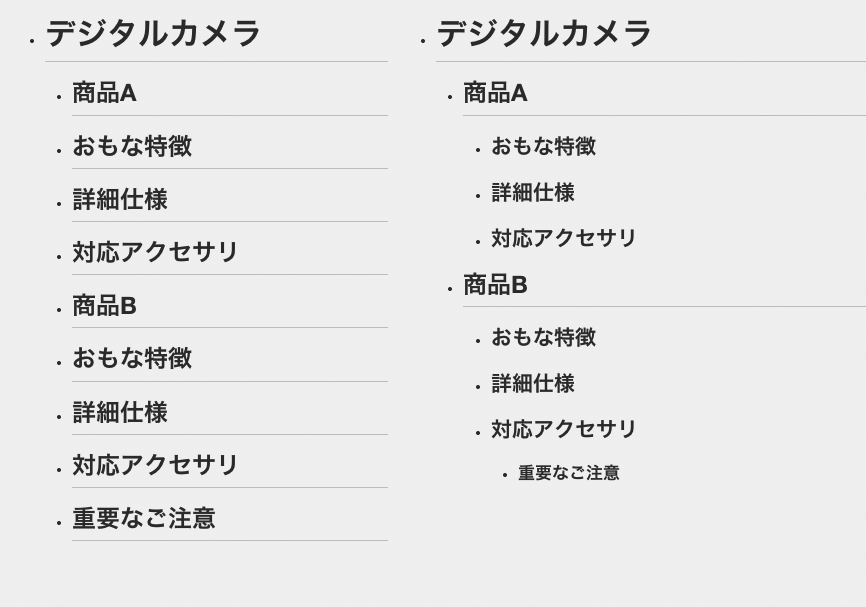

# 適切な見出しが立っていない
適切な見出しがつけられていないと、ページの内容をざっと把握したり、不要な内容を読み飛ばすことが難しくなります。情報のまとまりごとに見出しをつけ、内容の把握や読み飛ばしができるようにしましょう。

## よく見られる問題

### コンテンツの見出しがない

コンテンツに見出しが全くなく、いきなり本文テキストが始まる例。このコンテンツがそもそも何なのかがわかりにくく、見出しジャンプ機能でコンテンツの先頭に飛ぶこともできない。

### セクションの見出しがない

コンテンツがかなりの長文になっているが、途中に見出しが現れない例。読み飛ばしたり、途中から読んだりする際、どこから読めばよいのか判断できない。

### 見出しから内容を推測できない

見出し一覧を表示したところ、「その1」「その2」などが並んでいる例。見出しを見ても内容が推測できず、どこから読めばよいのか判断できない。

### 見出しの階層が不適切

見出しの親子関係がわからない例。カメラBの下にある「ご注意」という見出しが、カメラB固有の注意点なのか、ページ全体の注意点なのかわからない。

## ここが問題！ 見出しがないと斜め読みや読み飛ばしができない
適切な見出しがないと、必要な部分を拾い読みすることが困難になります。特にスクリーンリーダーでは、見出しがないと読み飛ばしができず、時間をかけて本文を読むはめになります。

### コンテンツの見出しがない
コンテンツの冒頭に見出しがないと、このコンテンツが何なのか判断できません。ページタイトルは原則としてコンテンツ内には表示されませんし、ユーザーはコンテンツを見ているため、コンテンツを表す見出しが必要です。また、スクリーンリーダーのユーザーは、見出しジャンプの機能でヘッダ部分を読み飛ばすことがあります。コンテンツの先頭に見出しがないと、うまく飛ぶことができません。

### セクションの見出しがない
長いコンテンツの多くは、意味のまとまりごとに分割することができます。たとえば、本書は全体を9つの章に分割し、その中身を7-1、7-2などの節に分割しています。さらに、節の中も複数に分け、項目の冒頭に見出しを置いています。このように、コンテンツを分割できるそれぞれの単位を「セクション」と呼びます。章も、節も、その下の小見出しのついたかたまりも、大きさは異なりますが全てセクションです。

ユーザーはコンテンツ全てを読むのではなく、必要な部分だけを読もうとします。セクションに見出しがないと、必要な部分をピックアップすることができません。特に、スクリーンリーダーのユーザーはページをざっと見渡すことができないため、長い本文を読んでいかなければならなくなります。

### 見出しから内容を推測できない
見出しから内容が推察できなければ、見出しを活用できません。「その1」「その2」などの見出しでは、ページ内の順番しかわからず、そこに何が書かれているのか推察できません。

### 見出しの階層が不適切
見出しには大見出し、小見出しといった種類があり、階層化されているのが普通です。階層が適切でないと、コンテンツの構造や関係が伝わらないことがあります。たとえば、ひとつのページに2つの製品情報があり、製品名の見出しの後ろに「重要なご注意」という見出しがあるとします。「重要なご注意」という見出しが商品名と同じ表現で並んでいれば、このページ全体の注意点に見えますし、見出しのレベルが落としてあれば、商品Bのアクセサリだけに関連するように見えます（図1）。

図1：見出しがフラットに並ぶ例と、見出しが階層化されている例

見出しの階層が異なっているだけだが、情報の持つ意味には大きな違いが出てくる。

## 解決アプローチの例
### コンテンツとセクションに具体的な見出しをつける

コンテンツの冒頭や各セクションに適切な見出しを設けた例。アウトラインを表示すると、コンテンツの概要をひと目で理解することができる。

## 解決アプローチ コンテンツとセクションに具体的な見出しをつける
コンテンツの先頭と、各セクションに見出しを配置します。流し読みするユーザーにも内容が想像できるような具体的なテキストを見出しにして、コンテンツの階層に合った適切な見出しレベルを設定しましょう。

### コンテンツの冒頭に見出しを置く
このページ全体に対する見出しを用意して、メインコンテンツの先頭に配置します。これにより、このページが何なのかひと目でわかるようになり、スクリーンリーダーでは、見出しジャンプですぐにコンテンツを読み始めることができます。見出しの内容は、このページ全体の内容や主題を簡潔に表したものにします。ページタイトルにコンテンツのタイトルをつけているのであれば、それをそのまま見出しとして使うのが良いでしょう。考え方については「7-1ページタイトルがわかりづらい」を参照してください。

### セクション見出しを設置する
ページ内の各セクションに見出しをつけます。これにより、各セクションの内容が推測できるようになり、スクリーンリーダーでは、見出しジャンプで各セクションに飛ぶことができるようになります。コンテンツが長い場合は複数のセクションに分け、こまめに見出しを入れるようにしましょう。セクションが多い場合は、冒頭に目次をいれて概要を説明すると、さらに見通しが良くなります。

なお、コンテンツを含まないエリアに見出しをつける必要はありません。ヘッダやフッタ、ナビゲーションなどのエリアにスクリーンリーダー専用の隠し見出しを入れるケースもありますが、適切なマークアップをすれば、そのようなエリアをスクリーンリーダーに通知できます。不自然に感じられるような見出しを無理に入れる必要はないでしょう。「9-7スクリーンリーダー対応が不適切」も参照してください。

### 内容を推測できる見出しをつける
ユーザーは、見出しからそのコンテンツやセクションの内容を推測します。見出しをつける際は以下のような点に注意すると良いでしょう。

#### 単独で取り出してもわかるようにする
見出しだけを取り出しても内容が推測できるようにしましょう。全文を読むつもりがないユーザーは見出しだけを見ることがありますし、スクリーンリーダーの見出し一覧機能では、見出しだけが単独で読まれます。前後の文章と重複して冗長になったとしても、見出し単独のわかりやすさを優先しましょう。また、「概要」「使い方」「詳細」といった一般的な見出しを使うと、ページ内で重複することがあります。同じ見出しで異なる内容が含まれていると混乱するため、なるべく避けたほうが良いでしょう。

#### 具体的に内容を推測できるようにする
どのような内容にも適用できるような「その1」「その2」といった見出しを使うと内容が推測できません。「商品Aの概要」「商品Bの使い方」など、できるだけ具体的な表現にしましょう。なお、セクションの内容が複数の話題にまたがっていると、具体的な見出しをつけづらいことがあります。このような場合、できればセクションを分割して、ひとつのセクションがひとつの話題になるようにするべきです。

#### 重要なキーワードを前に持ってくる
ユーザーがコンテンツを流し見する際は、見出しの冒頭がまず目に入ります。また、スクリーンリーダーもテキストを先頭から読み上げます。内容を示す重要なキーワードを見出しの前のほうに置くと、内容をすばやく理解しやすくなります。

### 見出しのレベルを明確にする
セクションが階層化されている場合、見出しに上下関係が生まれます。たとえば、商品情報に「概要」「使い方」のような下位の見出しがあるとき、これが下層の見出しだと明確にわかるようにしましょう。コンテンツ設計時に見出しのレベルを明確に定義し、ビジュアルデザインやマークアップの際にも、レベルを意識することが重要です。なお、上記の「概要」という見出しを「商品Aの概要」のようにすれば、たとえ階層がフラットでも、また見出しを単独で取り出しても意味が通じるようになります（図2）。見出しが少ない場合は、階層化せずにフラットにしたほうがわかりやすくなることもあるでしょう。

図2：フラットに並ぶ見出しを具体的にした例

階層がフラットでも理解できるようになる。
