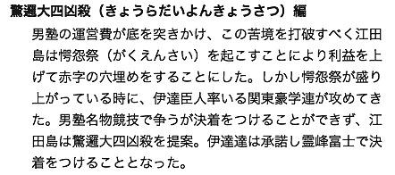

# 言葉がわかりにくい
ユーザーがコンテンツにアクセスできても、言葉がわからなければ内容を理解できません。専門用語や略語、難読語などは伝わらないことがあります。平易な言葉に置き換えたり、補足を追加して理解できるようにしましょう。

## よく見られる問題

### 言葉が読めない

外国語、略語、難読語などが使われている例。ユーザーはこの単語を読めない可能性がある。また、スクリーンリーダーでも適切に読み上げられない可能性が高い。

### 言葉の意味がわからない

外来語、専門用語などが使われている例。単語の発音はわかっても、その言葉が何を指すものか理解できない可能性がある。

### 言葉の意味が誤解される

あまり一般的でないことわざや慣用句、一般的な意味と異なる業界用語などが使われている例。言葉の指す意味を誤解されてしまう可能性がある。

## ここが問題！ 難しい言葉は伝わらない危険性がある
業界用語のように一般的でない言葉を使うと、特定のユーザーにしか理解できなくなります。また、一般的な用語であっても、難しい言葉は伝わらないことがあります。ユーザーによって語彙力、理解力は異なることに注意しましょう。

### 言葉が読めない
ユーザーは、知らない単語が出てきても読めません。また、スクリーンリーダーが認識できないような略語は、うまく読まれなかったり、別の語のように読まれてしまうこともあります。外国語、略語、難読語などのほか、人名や地名、商品名といった固有名詞も問題になります。これらは、同じ表記でも異なる読まれ方をすることがあり、テキストの情報だけでは適切に読めないことがあります。

### 言葉の意味がわからない
単語が読めたとしても意味がわからないことがあります。あまり一般的でない外来語や専門用語などは、多くのユーザーには理解できません。

### 言葉の意味が誤解される
言葉がわかるように思えても、意味を誤解してしまうことがあります。気の利いた言い回しは、一見意味が伝わりやすそうに見えても、ユーザーが誤解してしまう可能性が高くなります。

## 解決アプローチの例

### ルビをつける

Firefox 38のruby対応の説明。ルビを使うと、意味や読み方を簡潔に示すことができる（参考1）。

### かっこ書きで補足する

難読語の後ろにかっこ書きで読みを記述した例。補足によって読み方や意味を明確にできる。

### 脚注で説明する

用語に脚注へのリンクをつけ、脚注で説明を書いている例。脚注に飛んだ後、脚注から元の単語に戻ることもできる。

### 用語集で説明する

用語集に説明を書いた例。サイト内で何度も登場する単語からリンクされている。

## 解決アプローチ 言葉が難しければ補足する
できるだけ難しい言葉は使わず、一般的でわかりやすい言葉を使うのが原則です。難しい言葉を使う必要がある場合は、かっこ書きや用語集などで補足を行い、ユーザーが理解できるようにしましょう。

### ルビをつける
簡単な読みの説明だけであれば、ルビをつけるという方法もあります。ruby要素を使ってテキストにルビを振る方法は、今のところあまり使われていません。その理由のひとつに、Firefoxが長らくrubyに対応していなかったことが挙げられます。しかし、2015年5月にリリースされたFirefox 38がruby要素に対応したため、現在では主要なブラウザすべてでルビが使える状況になっています。

ただし、ルビは本文より小さな文字で表現されるため、ユーザーにとって読みやすいとは言えないことに注意しましょう。詳しい説明を書いたりせず、あくまで簡単な読み方を示す用途で使うべきです。

### かっこ書きで補足する
専門用語や外来語を使わなければならない場合、言葉の読みや意味をかっこ書きで補足する方法があります。固有名詞の読み、難読漢字の読み、略語の正式名称などは、かっこ書きで対応するのが望ましいでしょう。ページ内に同じ単語が繰り返し出てくる場合は、初出のときにかっこ書きをつけます。

かっこ書きの欠点は、読み飛ばしが難しいことです。用語を理解しているユーザーは説明を読み飛ばして本文の続きを読もうとしますが、かっこ書きは本文との区切りがわかりにくく、読み飛ばしが困難です。短い説明であれば問題ありませんが、説明が長くなる場合、かっこ書きは避けたほうが良いでしょう。

### 脚注で説明する
説明が長くなる場合、脚注で説明する方法もあります。対象の言葉の後ろにリンクを置き、コンテンツの末尾などに置いた脚注エリアに飛ぶようにします。リンクテキストを「※」のような記号のみにすると、ページ内で重複したり、読み上げできない可能性があるため、「脚注1」のようなテキストを使うと良いでしょう。また、脚注から元の言葉にリンクを張っておくと、すぐに本文に戻ることができます。

### 用語集で説明する
説明が必要な言葉がサイト内に何度も登場する場合は、説明を用語集として独立させる方法もあります。用語集は単独でもコンテンツとして成立し、説明のほかにさまざまな情報を盛り込むこともできます。

ただし、用語集の説明を参照するためには用語説明のページへ移動しなければならないため、同ページ内に用語が何度も出てくると、画面を行ったり来たりする必要があります。簡潔な説明で済む場合は、かっこ書きや脚注を使ったほうが良いでしょう。用語集へのリンクを新規タブにしたり、ポップアップで表示させることについては、「5-3 勝手に新規タブやポップアップが開く」を参照してください。

参考1 [Ruby support in Firefox Developer Edition 38](https://hacks.mozilla.org/2015/03/ruby-support-in-firefox-developer-edition-38/)
