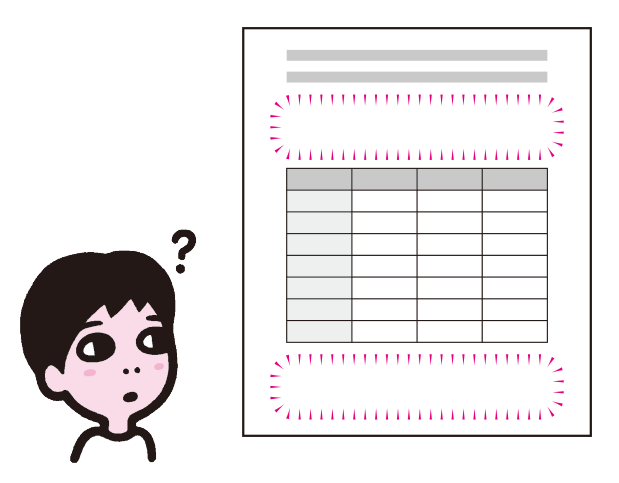
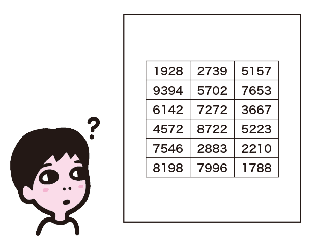
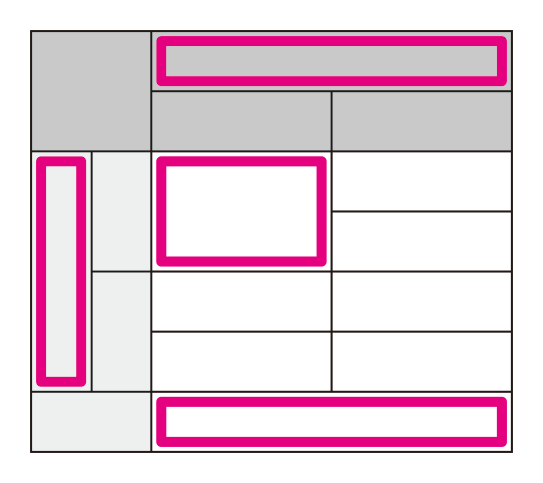
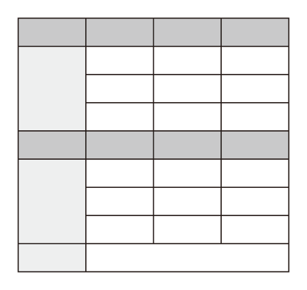
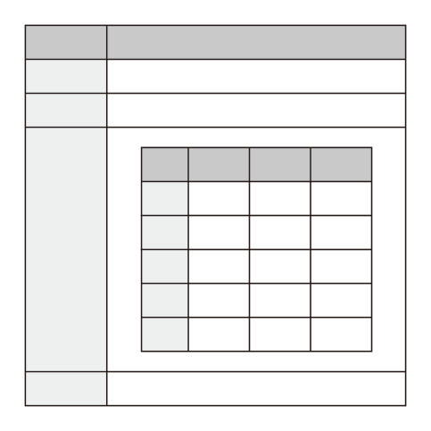
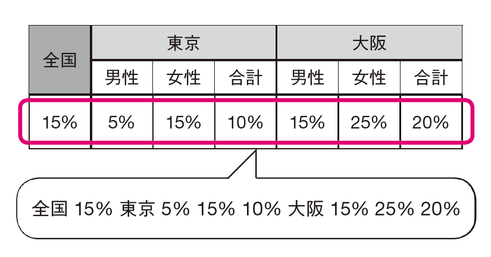
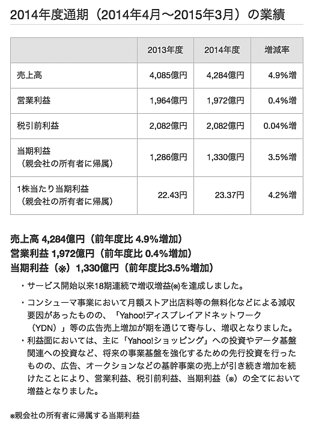
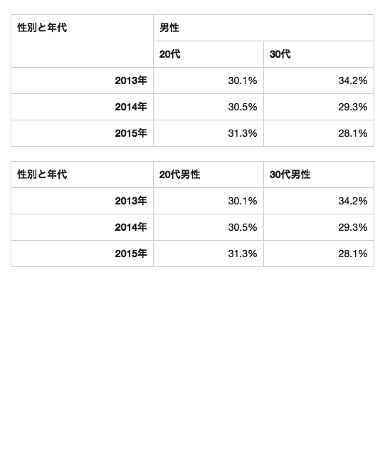
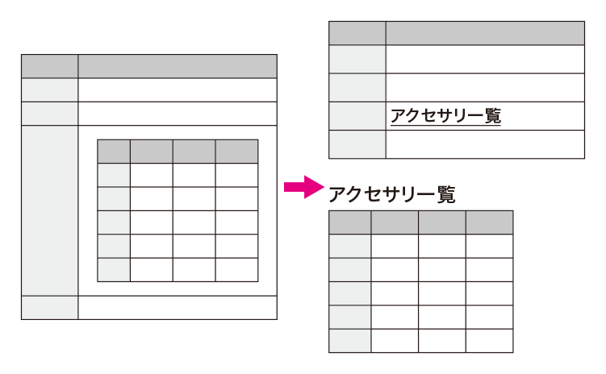

# 複雑な表が理解できない
情報を表の形に整理すると見やすくなることがありますが、複雑な表はスマートフォンなどで見づらかったり、スクリーンリーダーで理解することが難しくなります。表を使うならシンプルな形のものにしましょう。

## よく見られる問題

### 表題やキャプションがない

キャプションがなく、表題も不明な表の例。文脈があればこの表が何なのかわかるが、文脈から離れてしまうとこの表がいったい何なのかわからなくなる。

### 行や列に見出しがない

行や列に見出しがなく、データセルだけで構成された表の例。データがマトリックス状に並べられているものの、それぞれのデータが何なのか、すぐにはわからない。

### セルが結合されている

結合セルを使っている例。セルがどの範囲にかかっているのかわかりにくくなり、スクリーンリーダーでの理解も困難になる。

### 複数の表が合体されている

意味的に異なるデータがひとつの表に合体されて表現されている例。視覚的には別の情報であることがわかっても、支援技術にはひとつの表として扱われる。

### 表が入れ子になっている

表の中に表が入り、入れ子になっている例。複雑であり、特にスクリーンリーダーのユーザーには理解が難しくなる。

## ここが問題！ 複雑な表は理解しづらく、支援技術でアクセス困難
表を使って情報をマトリックス状に並べると、視覚的には理解しやすくなります。スクリーンリーダーも表に対応しており、シンプルな表であれば問題ありません。しかし、表が複雑になると、アクセスが困難になることがあります。

### 表題やキャプションがない
表を理解するには、まずその表が何であるのか理解する必要があります。表題やキャプションがつけられていないと、この表がいったい何の表なのかわかりません。前後の文脈から判断できる場合もありますが、スクリーンリーダーには表にジャンプする機能もあり、文脈から離れて表が読まれることがあります。キャプションがないと、文脈から切り離された場合に理解できなくなってしまいます。

### 行や列に見出しがない
表の中のデータが何なのか理解するためには、そのデータが属する行と列が何なのか知る必要があります。多くの場合、行と列の先頭には見出しセルがあって行と列の意味がわかるようになっていますが、見出しセルがないと、行と列の意味を推測するしかありません。前後のデータを見ていくと意味がわかる場合もありますが、表を視覚的に確認できない環境や画面の狭い環境では、それは容易ではありません。

### セルが結合されている
表は基本的に縦横のマトリックス構造になりますが、複数のセルを結合してひとつにまとめることもできます。複数のセルを結合すると、表が複雑化して見づらくなるだけでなく、支援技術でうまく扱えなかったり、スクリーンリーダーのユーザーが表の構造を理解することが難しくなったりします（図1）。

図1：セル結合している表を読み上げた例（VoiceOver）

セルを結合している場合、見た目は問題ないが、支援技術には結合箇所の先頭部分にしかセルがないものと認識されてしまう場合がある。

### 複数の表が合体されている
見た目を整える目的で、異なる性質のデータをひとつの表にまとめてしまうことがあります。視覚的に全体を見渡せる場合は表の区切りがわかり、複数の表として認識できますが、スマートフォンや画面を拡大している環境では表の全体像が見えにくく、区切りがわかりにくくなります。また、支援技術はあくまでひとつの表であると認識するため、スクリーンリーダーなどでは表の構造が理解できなくなります。

### 表が入れ子になっている
表の中に、さらに別の表が含まれるようなケースがあります。これは見るからに複雑ですが、スクリーンリーダーのユーザーはさらに混乱します。たとえば、内側の表の中で見出しを読み上げさせる操作をしたとき、読まれるのが外側の表の見出しなのか、内側の表の見出しなのかわからなくなります。

## 解決アプローチの例

### 表の概要が伝わるようにする

見出しセルを使用し、キャプションをつけ、概要をテキストで説明している表の例。表の概要は視覚的に見えるユーザーにも有益なため、見えるように置く。

### セル結合をやめ、それぞれのセルに書く

セルを結合を解消した例。「男性」「20代」「30代」という3つのセルを「20代男性」「30代男性」とすることで、結合を解除してシンプルにすることができる。

### ひとつの表が1種類のデータになるように分割する

入れ子になっていた表から子の表を取り出し、外に出した例。ひとつの表は一種類のデータで構成する。

## 解決アプローチ 表はシンプルな構造とし、難しい場合は説明する
表を使う場合はできるだけシンプルな構造にした上で、キャプションや見出しセルを活用し、理解しやすくします。どうしても複雑になってしまう場合は説明を書き、全てのユーザーに読めるようにしましょう。

### 表にキャプションをつける
表にはキャプションをつけて、何の表かわかるようにしましょう。前後の文脈と切り離して、表とキャプションだけで理解できる状態が理想です。キャプションが書けない場合、表でないものを表にしていたり、複数のデータをひとつの表にしている可能性があります。その場合は、表そのものを見直しましょう。

### 行や列に見出しをつける
表の先頭の行と列に見出しセルを配置して、行見出し、列見出しをつけます。行見出し、列見出しの両方がつけられれば望ましいですが、難しい場合は片方だけでも良いでしょう。行にも列にも見出しをつけられない場合、表でないものを表にしていたり、複数のデータをひとつの表にしている可能性があります。その場合は、表そのものを見直しましょう。

### セル結合をやめ、それぞれのセルに書く
結合されたセルがある場合、セルを分割して、内容をそれぞれに書くと良いでしょう。見出しセルが階層化されている場合は、下位の階層に上位の内容も含めるようにします。たとえば、「男性」という結合セルの下に「20代」「30代」というセルが並んでいる場合、「20代男性」「30代男性」とすることで、セル結合を解消することができます。

### ひとつの表が一種類のデータになるように分割する
ひとつの表では一種類のデータだけを扱うようにします。表が複数のデータを扱っている場合は、データの種類ごとに表を分割します。表が入れ子になっている場合、まずは表でなければならないか確認してください。基本的に、表が入れ子になるのは異常な事態で、表でないものを表にしようとしている可能性が高いでしょう。本当にどちらも表である必要があるなら、子テーブルには表題をつけて親テーブルのうしろに置き、親テーブルのセルからページ内リンクで参照すると良いでしょう。

### 表の説明を見えるように書く
表が複雑で説明がないとわからない場合や、データの列挙だけでは伝えたいことが伝わらないような場合は、表のデータの概要や傾向、結論などをテキストで書くと良いでしょう。このとき、説明はスクリーンリーダー専用にはせずに、どのユーザーにも読めるように書きます。視覚的に表を見られるユーザーにとっても表の説明は有益であることが多いため、無理に隠す必要はありません。「9-7 スクリーンリーダー対応が不適切」も参照してください。

## コラム そもそも表を避けるべきなのか?
表を使うのは、データをマトリックス状に並べることで、データ同士を比較したり、傾向を見たりできるようにするためです。わかりやすくするために表にしているのですから、無理に表を避けると、かえってわかりにくくなってしまいます。スクリーンリーダーは表を読むための機能を持っていることが多く、シンプルな表は問題なく読めるため、過剰な配慮は不要です。

ただし、データ同士を比較する必要がなく、単に上から読んでいけばよいものは、表にしないほうが良いでしょう。よくあるのは、見出しと本文の繰り返しを2列の表にしているパターンです。一見、表としてまとまっているように見えますが、適切な列見出しをつけることができないという特徴があります。このようなものは、表にせずに、見出しなどを使って表現した方が良いでしょう。
