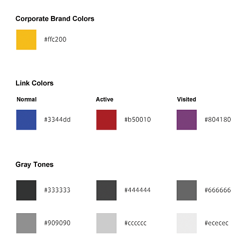
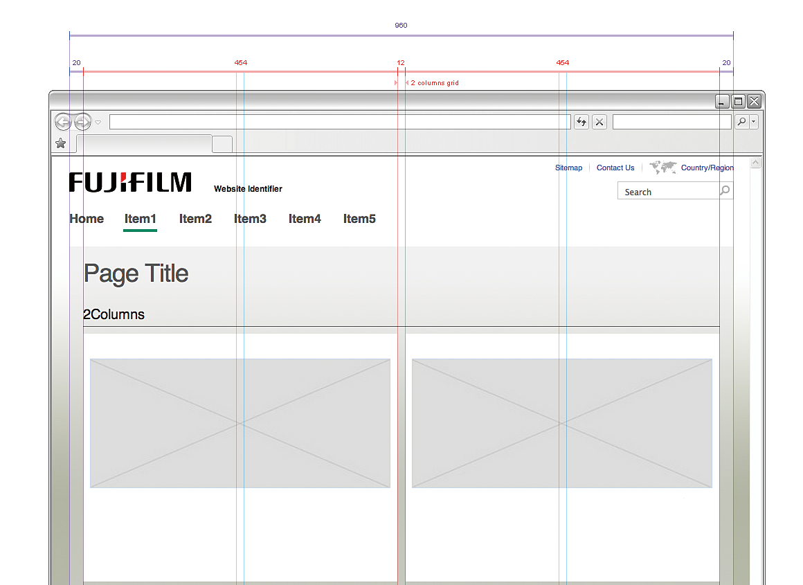

# 概要と流れ

サイトの骨組みとコンテンツの構成要素が決まったところで、「ビジュアルデザイン」のプロセスに入ります。サイトのナビゲーションやインタラクション、コンテンツのそれぞれの要素について、視覚的な見せ方、ビジュアルを検討していきます。

多くのユーザーは視覚から情報を得ています。ビジュアルデザインを工夫すれば、情報が伝わりやすくなり、アクセシビリティを向上することができます。しかし、視覚情報のほとんどはマシンリーダブルではないため、情報を視覚だけで表現すると伝わらないことがあります。また、見せ方に問題があると、読めない、伝わらない、誤解を招くといった問題を起こし、アクセスが困難になってしまいます。

## STEP1 デザイン方針の検討

まずはサイト全体のビジュアルデザインの方向性を検討します。基本的には、要件定義のフェイズでサイトの目的が明確になっているはずですので、それに沿って方針を立てれば良いでしょう。場合によっては、この段階で改めて方向性を確認する必要があるかもしれません。デザインの方針が確認できたら、文書化して共有しておくと良いでしょう（図1）。

図1：デザインの方向性を示したムードボードの例

## STEP2 基本デザインの検討

方向性が決まったところで、サイト全体のビジュアルデザインの基本ルールを決めていきます。たとえば、以下のような点について明確にする必要があります。

### カラースキーム

サイト全体の色使いのルールを設計します。ページごとに色を自由に決めると統一感がなくなり、読みにくくなります。あらかじめ、サイト内で使う色の組み合わせを定義しておくことが一般的です（図2）。この際、リンクのスタイルも検討します。下線をつけるのか、マウスオーバー時や訪問済みリンクをどう表現するか、なども合わせて検討しておきます。この段階でアクセシビリティに配慮した設計をしておけば、コントラストが低くてコンテンツが読めない、といった問題を避けることができます。

図2：カラースキームをカラーパレットとしてまとめた例

### グリッドシステム

サイト内の要素の大きさやコンテンツ幅のルールを設計します（図3）。ルールが決められていないと、ページによって行の長さや写真の大きさがまちまちになり、読みにくくなります。

Webページ全体の幅は、環境によって大きく異なります。コンテンツの幅を広く設定すれば横スクロールが発生することがありますし、狭く設定すれば、左右に大きな余白ができてしまうことがあります。

図3：グリッドシステムの例

さまざまな環境に対応させるためには、コンテンツ幅が柔軟に変化する設計が望ましいと言えます。全体の幅に応じてコンテンツが伸び縮みする設計を「リキッドデザイン」と呼びます（図4）。リキッドデザインにすると、多くのデバイスでコンテンツを読みやすくなりますが、幅が広がりすぎると読みにくくなることがありますし、写真など、あらかじめ幅が決まっているコンテンツが扱いにくくなる問題もあります。

図4：リキッドデザインの例

ウィンドウを広げると、テキストの部分だけが大きく伸びる。狭くするとレイアウトはそのままに、写真とテキストの部分が縮む。

近年では、「レスポンシブWebデザイン」という手法もよく見られます（図5）。

図5：レスポンシブWebデザインの例

ウィンドウを広げると、写真が大きくなり、テキストの文字サイズも大きくなる。狭くするとレイアウトが変わる。

これは、Webページ全体の幅に応じてレイアウトや文字サイズを変更するものです。

この手法は優れているように思えますが、リキッドデザインと比べると、複数のレイアウトを用意して実装する必要があるため、ビジュアルデザインと実装のコストが高くなることがあります。また、運用の際にも複数のレイアウトを考慮する必要がでてきます。

### ヘッダ・フッタ

サイトのヘッダとフッタを含む、コンテンツの外側全体をデザインします。これは俗に「ガワ」とも呼ばれます（「外側」の意味と思われます）。多くの場合、ヘッダにはサイトのロゴが含まれ、サイト全体のトーンに大きく影響します。ヘッダやフッタにはサイト全体に共通する機能を置くことが多く、サイト内検索などのフォームを置く場合、フォームのアクセシビリティに配慮したデザインが必要になります。「6-3 ラベルや説明が不足しているフォーム」も参照してください。

## STEP3 コンポーネントデザイン

基本デザインができたところで、個々のコンテンツの見た目を検討していきます。入ってくるコンテンツにはさまざまなものがありますが、コンテンツ全てに対して個別にビジュアルデザインを検討していたのでは、時間もかかりますし、統一性もなくなります。コンテンツにはいくつかのパターンがあるはずですので、それを洗い出して、パターンごとにデザインしていきます。

コンテンツのパターンは、コンテンツ設計の段階で「コンポーネント」として洗い出されているはずです。ここでは、コンポーネントのそれぞれをどのような見せ方にするのか検討していきます。必要があれば、見出しに色のバリエーションを持たせるなど、コンポーネントの種類を増減することもあります。ここでデザインしたコンポーネントは、サイト全体で使われ、運用の際にも使われ続けます。コンポーネントをアクセシブルにデザインしておくことが、サイト全体のアクセシビリティの確保に直結します。

## STEP4 デザイン展開

時には既存のコンポーネントが使用できないコンテンツもあります。他のページとは異なるルールとなる規格外のページもあり、このような部分については個別にデザインを検討する必要があります。また、数ページにとどまるような小規模なサイトや、キャンペーンページなどでは、ページごとに個々にデザインを起こしたほうが早いため、コンポーネントを用意しないこともあります。

このようなプロセスでデザインされるページでは、見え方にこだわりをもたれることが多く、見た目優先でデザインされることがあります。そのこと自体は問題ありませんが、アクセシビリティへの配慮がおろそかにならないように注意する必要があるでしょう。

## コラム Webと紙との違い

Webのビジュアルデザインには、紙のデザインと共通する部分もありますが、決定的に異なる部分もあります。

### さまざまな環境

Webはさまざまなユーザーエージェント、さまざまなデバイスでアクセスされます。環境によって、画面の大きさや色味などは全く異なるものになります。想定した視覚表現が常にそのまま再現されるわけではありません。特定の環境だけを意識してデザインしてしまうと、他の環境では使いにくかったり、使えなかったりする場合があります。

### さまざまな変化

Webコンテンツはさまざまに変化します。たとえば、ユーザーはブラウザウィンドウの大きさを変えたり、画面を拡大したり、縮小したりすることがあります。これにより、文字の大きさや、コンテンツエリアのサイズが変化することがあります。そのような変化を想定してデザインしなければなりません。

### 運用への配慮

Webコンテンツは追加されたり、修正されたりします。ニュースなど、追加や更新が頻繁に行われるコンテンツもあります。追加や修正のたびにデザインを検討することは現実的ではありません。あらかじめ、さまざまなコンテンツが入ってきても問題ないようにしておく必要があります。

### 動きやインターフェイス

紙と異なり、Webには動く部分があったり、ユーザーが触ったり入力したりするようなインターフェイスの部分があります。近年では、動きが重要になるサイトも増えてきていますが、静止画でデザインを起こしても、動きや変化のイメージがつかみにくく、実装してみると印象が異なっていることもあります。

このような場合、プロトタイプを作りながら進める方法が有効です。実際にHTMLなどで実装して確認していく方法や、専用のプロトタイピングツールを使う方法、Flashなどデザイナーが使い慣れたツールで動きを仮実装する方法など、さまざまな方法があります。いずれの場合も、実際に動くものを見ながらデザインの検討を進めることで、静止画ではわからない問題点が浮かび上がってくることがあります。

### マシンリーダブルな情報構造

1章でも説明したように、Webの特徴はマシンリーダブルであることです。コンテンツは見出し、リストなどの情報構造を持ちます。紙の文書にも同様の構造がありますが、紙では情報構造を見た目で伝えるしかないのに対し、Webコンテンツの情報構造は見た目に依存しません。スクリーンリーダーなどにも伝わりますし、ユーザーの用途に合わせて見た目を変えることもできます。見た目から考えるのではなく、情報の構造を考えてから適切な見た目を与えるという考え方を徹底する必要があります。
