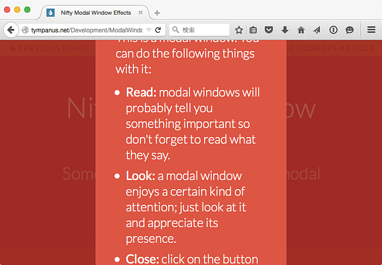
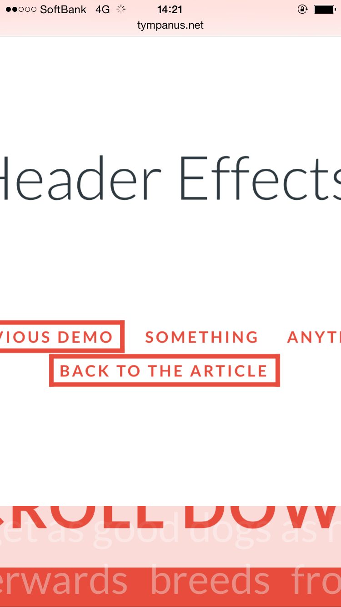

# 拡大すると問題が起きる

ユーザーはページ全体を拡大したり、ブラウザの設定で文字を大きくすることがあります。しかし、ページのデザインに問題があると、拡大できなかったり、拡大時に問題が起きることがあります。拡大されることを想定してデザインしましょう。

## よく見られる問題

### スクロールできない要素がはみ出す

大きなモーダルダイアログが出現する例。拡大すると画面からはみ出すが、スクロールしても動かないため、はみ出した部分にアクセスできない。

### スクロールに追従する要素がコンテンツを覆い隠す

ナビゲーションがスクロールに追従する例。拡大すると画面を覆い尽くしてしまい、スクロールしても残り続けるため、コンテンツにアクセスできなくなる。

### 文字サイズを大きくすると読めなくなる

固定レイアウトを想定したコンテンツで、ブラウザの設定を変えて文字サイズを大きくした例。文字が重なったりはみ出したりして読めなくなってしまう。

### 拡大や文字サイズ変更ができない

拡大や縮小が禁じられているコンテンツの例。HTML側で禁止の設定をしていると、ブラウザの拡大縮小機能が使えなくなる。

## ここが問題! デザインによっては拡大すると問題が起きる

ブラウザには、ページ全体を拡大縮小する機能や、文字サイズを変更する機能があります。しかし、コンテンツのデザインによっては、拡大すると読めなくなったり、うまく拡大できなくなってしまうことがあります。

### スクロールに追従する要素がコンテンツを覆い隠す

ナビゲーションなどをスクロールに追従するようにしているケースがあります。追従する要素は、ページをスクロールしてもついてきて、画面外に消えることがありません。ナビゲーションが追従すると、ユーザーはページ内のどこにいても常にナビゲーションを使えるようになります。

一見問題なさそうですが、狭い画面で使用したり、画面を拡大したりすると問題が起こります。スクロールに追従する要素が大きくなると、より広い面積を覆い隠すようになり、拡大率によってはコンテンツの大部分を覆い隠してしまいます。スクロールしても画面外に消えないため、コンテンツを全く読むことができなくなります。また、スクロール追従要素そのものが拡大されて画面からはみ出した場合、はみ出した部分にアクセスできないという問題もあります。

### スクロールできない要素がはみ出す

画面のスクロールが禁止される状況もあります。典型的な例はモーダルダイアログの表現です。長いページでも、ダイアログが出るとスクロールが禁止され、ダイアログが画面外に流れていかないように固定されることが多いでしょう。その他、全画面表示を行いスクロールを禁止しているケースなどもあります。

スクロールできない状況で画面を拡大すると、内容が画面からはみ出した場合、はみ出した部分にアクセスする手段がありません。特にダイアログの場合、「閉じる」ボタンが隅に置かれていることが多く、永遠に閉じられなくなることがあります。近年では巨大なダイアログを出したり、画面を大きく使ってスクロールしない前提の表現を行うケースが増え、このような問題が起こりやすくなりました。拡大時に限らず、スマートフォンや古いノート PCなどの画面が小さい環境でも問題が起こりやすくなります。

### 文字サイズを大きくすると読めなくなる

PC向けのブラウザには、ページ全体を拡大するのではなく、文字サイズだけを拡大する機能もあります。ズームすると左右がはみ出す場合でも、文字サイズだけを大きくすれば幅に合わせてテキストが折り返され、左右スクロールなしで読むことができます。

しかし、レイアウトが文字の拡大を想定していないと、拡大時に読めなくなってしまうことがあります。テキストが入る枠の高さと幅がともに固定の想定になっている場合、文字を拡大すると枠からあふれます。あふれても問題なく読める場合もありますが、あふれた先に他の要素や別のテキストがあると、重なったり潜り込んだりして読めなくなってしまいます。

### 拡大や文字サイズ変更ができない

iOSやAndroidなどのタッチデバイスでは、ダブルタップやピンチイン・ピンチアウトの操作で、画面を簡単に拡大したり縮小したりすることができます。しかし、コンテンツ側でこれらの機能が使えないように制限していることがあります。この制限があると、視力の弱いユーザーはコンテンツが読めなくなることがありますし、そうでないユーザーも、いつもは使えるはずの機能が使えないため混乱します。

ブラウザの文字サイズ変更機能が使えなくなっているケースもあります。 CSSによるフォントサイズの指定がpx値になっていると、 Internet ExplorerやGoogle Chromeでは文字サイズを変更できなくなります。子要素で%やemやremによる指定をしていても、html要素やbody要素でpx値を指定していると文字サイズを変更できなくなってしまいます。

## 解決アプローチの例

### 画面からはみ出す場合を検討する

画面からはみ出したダイアログがスクロールするようになっている例。はみ出した場合にも何らかの方法でアクセスできるように考慮して設計する。

### スクロール追従は慎重に検討する

上下にナビゲーションが表示され、画面をスクロールしても追従する例。拡大すると追従しなくなるようにして、画面を覆い隠さないようにしている。

### リキッドデザインやレスポンシブWebデザインを検討する

レスポンシブWebデザインの例。スクリーンサイズの多様化に合わせて普及してきているが、拡大縮小にも対応することができる。

### 拡大や文字サイズ変更ができるようにする

スマートフォンで表示を拡大した例。特に拡大を禁止していないため、問題なく拡大できている。

## 解決アプローチ 拡大縮小で破綻しないようにデザインする

ユーザーが自分の環境に合わせて調整できるのがWebの特徴です。ユーザーがページ全体を拡大したり文字サイズだけを変更しても破綻しないようにデザインしましょう。実際に拡大してみて、問題なく使えるかどうか確認すると良いでしょう。

### 画面からはみ出す場合を検討する

可能な限り、スクロール固定の表現は避けるべきです。ほとんどの場合、単にスクロールを許せば問題ありません。スクロールさせないことにこだわりすぎず、スクロールしてもよいのだと考えましょう。

スクロールさせないことに意味がある場合もあります。モーダルダイアログが出ている場合、スクロールでダイアログが画面外に消えてしまうと、ユーザーには状況がわからなくなってしまいます。このような場合、内容がはみ出したときにどうなるべきか検討しましょう。たとえば、ダイアログが出るケースでは、以下のような挙動が考えられます。

- ダイアログは原則として画面中央に表示されるが、内容量が多い場合は上下が伸びて画面からはみ出す。ページ全体をスクロールすると、ダイアログの存在する範囲だけスクロールして中身が読める
- ダイアログは常に画面中央に固定のサイズで表示される。内容量が多い場合はダイアログの中にスクロールバーが出て、内容をスクロールして読める

後者の場合、ユーザーが操作するべきスクロールバーが二重になったり、普段と異なるスクロール操作が必要になることがあるため、できれば前者のような対応が良いでしょう。ダイアログが伸びるのは美しくないかもしれませんが、ユーザーにとっては読めること、操作できることのほうが重要です。

### スクロール追従は慎重に検討する

可能な限り、スクロール追従は避けるべきです。ナビゲーションが追従するパターンは多く見かけますが、本当にユーザーニーズがあるのか検討してください。多くの場合、ナビゲーションを利用するのはコンテンツを読む前か読んだ後であり、途中の任意のタイミングで使うケースは多くないはずです。

Webアプリケーションでは、使用中に特定の情報を何度も見たり、特定のボタンを何度も押したりすることがあります。このように、常に使われるニーズがある場合は、スクロール追従の要素を導入したいこともあるでしょう。この場合の対応策のひとつは、追従要素を小さくすることです。要素が小さければ、画面を覆う範囲が狭くなり、問題を起こしにくくなります。ただし、極端に大きく拡大している場合には問題になるため、完全な対策とはいえません。

画面の大きさを判定して、画面を一定以上拡大している場合は追従しない表示に切り替る方法もあります。ただし、ユーザーは閲覧の途中で拡大縮小の操作をすることもあるため、切り替える時の挙動がユーザーを混乱させないように注意する必要があるでしょう。

### リキッドデザインやレスポンシブWebデザインを検討する

近年では、リキッドデザインやレスポンシブWebデザインが採用されることが多くなってきました。これらは主に画面サイズの変化に対応するための施策ですが、画面の拡大や縮小にも対応することができます。たとえば、PCブラウザでズームを行うと、画面幅の小さいデバイスで表示したときと同じレイアウトになり、問題なく読むことができるようになります。

### 拡大や文字サイズ変更ができるようにする

ブラウザの拡大や文字サイズ変更の機能を阻害せず、自由な拡大縮小ができるようにしましょう。

#### 拡大しても破綻しないようにする

拡大しても破綻しないようになっていれば、拡大を制限する理由はないはずです。機能を制限したくなるケースの多くは、拡大縮小でレイアウトが崩れるようなケースでしょう。特に、文字サイズのみの拡大に対応できておらず、拡大するとはみ出してしまったり、崩れてしまうケースはよく見られます。主に、以下のような場合にレイアウトが破綻することになります。

- テキストブロックの高さが固定されている場合、下にはみ出す
- テキストの折り返しが禁止されていて、ブロックの幅が固定されている場合、横にはみ出す

はみ出しても、その先にある要素が押し出されれば、少なくともテキストは読めます。しかし、実装の仕方によっては、はみ出した部分が消えてしまったり、他の要素に重なってしまうことがあります。

文字が大きくなっても問題ないようにするには、テキストブロックの高さを固定せず、縦に伸びることを想定し、その先にある要素が押し出されるようにする必要があります。無限に伸びる想定では破綻する場合、テキストが通常の2倍まで拡大された状況を想定してみてください。文字を2倍に拡大した状態にしてみて、テキストが読めることを確認しましょう。多少レイアウト崩れが起きたりしても、ユーザーにとっては読めることのほうが重要です。こだわりすぎず、テキストが読めればよいと割り切りましょう。

### 意図せず拡大を禁止していないか確認する

拡大しても破綻しないのに、意図せずに拡大を禁止してしまっているケースもあります。実際にスマートフォンやPCブラウザでアクセスしてみて、ズームや文字の拡大ができることを確認しましょう。

CSSによるフォントサイズ指定にpx値を用いていると、ブラウザによっては文字サイズ変更機能が使えなくなります。px値が用いられている場合、それを%やem、remによる指定に置き換えることで、文字サイズの変更が可能になります。

また、スマートフォン用のコンテンツでは、問題回避のテクニックとして拡大を妨げる指定が入っていることがあります。たとえば、iOS 5までは、端末を縦向きから横向きに切り替えたときにブラウザ内の表示が1.5倍に拡大されるという問題があり、その対応として minimum-scaleとmaximum-scaleを同値にするというテクニックが使われていました。同様に、Android 2.3ではposition:fixedによる要素固定ができないという問題があり、その回避のためにuser-scalable="no"を指定するテクニックがありました。このような経緯から、スマートフォン用コンテンツのテンプレートに望ましくない設定が残っていることがあります。これらは過去のものであるため、消してしまっても問題ない場合が多いでしょう。

## コラム 文字の適正なサイズとは

そもそも最初から適正な文字サイズでデザインしておけば、ユーザーは拡大しなくて済むのではないか、という考え方もあります。しかし、適正なサイズは状況によって大きく異なります。たとえば、ロービジョンのユーザーの場合は、極端に拡大した上で目を近づけてやっと読めるようになることもあります。このときのサイズは、一般のユーザーにとって読みやすいサイズとはかけ離れており、両者にとって読みやすいサイズで提供するのは無理があります。

とはいえ、極端な拡大を必要とするユーザーは支援技術を使うでしょうから、一般のユーザーにとって読みやすいサイズで提供しておくという考え方も理にかなっています。また、文字を拡大しなければ読めないユーザーは、全てのサイトで文字を大きくしたいと考えるはずです。特定のサイトだけで文字を大きくしたいというニーズが生じる場合、そのサイトの文字サイズが小さすぎると言ってよいでしょう。

適正サイズを考える上でのひとつの目安は、ブラウザの標準文字サイズです。ブラウザベンダーは、このブラウザを使う多くのユーザーにとって読みやすいであろうサイズを標準にしていると考えられます。PCブラウザではおおむね16px相当のサイズになりますので、これをひとつの目安として、さらに200%に拡大されても問題ないようにデザインすると良いでしょう。
