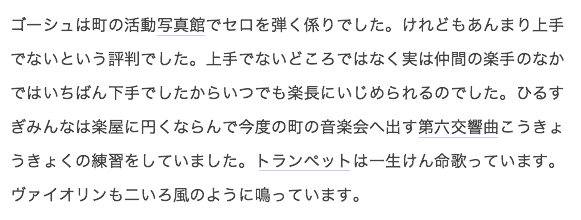

# どこが押せるかわからない

Webには、リンクやボタンのような押せる要素が含まれます。どこが押せるかわからないと、ユーザーはリンクに気づかなかったり、リンクでないものを押したりしてしまいます。何が押せるか明確にわかるようにしましょう。

## よく見られる問題

### リンクがリンクに見えない

通常のテキストと見分けがつかないリンクテキストの例。通常のテキストとリンクテキストの差が小さいと見分けがつかず、リンクを発見できない。

文中のテキストリンクに下線がなく、色相の差だけで表現されている例。色の差があっても、色がわからない状況ではリンクであることがわからなくなる。

### リンクではないテキストがリンクに見える

見出しに青文字と下線のスタイルを適用している例。青文字や下線はリンクの典型的な表現であるため、不用意に使うとリンクと誤認されてしまう。

### 訪問済みリンクが見分けられない

訪問済みリンクが未訪問リンクと同じスタイルになっている例。リンク先を読んだかどうかわからず、何度も同じページを訪問してしまう可能性がある。

### ボタンがボタンに見えない

押せるように見えないボタンの例。ユーザーはこの要素がクリックできるボタンであるということに気づかない。

### ボタンでないものがボタンに見える

押せるわけではない見出しが、ボタンのように見えてしまう例。これをボタンと思ってクリックしたユーザーは、何も起きずに混乱することになる。

## ここが問題! どこが押せるかわからないと混乱する

リンクやボタンが押せるように見えないと、ユーザーはリンクやボタンに気づかないことがあります。逆に、リンクでもボタンでもない要素が押せるように見えると、ユーザーはそれを押して混乱します。

### リンクがリンクに見えない

リンクのスタイルと通常のテキストの差が少なかったり、太字や斜体など、リンクとして一般的でないスタイルを適用していると、リンクに気づかないことがあります。また、リンクテキストに下線などをつけず、色だけで差をつけると、色がわからない状況でリンクが見分けられません。マウスオーバー時にのみ下線がつくパターンもありますが、タッチデバイスでうまく機能しませんし、リンクであることがわからなければマウスポインタを持っていこうと思わないでしょう。「8-1 見た目に頼っている」も参照してください。

### リンクではないテキストがリンクに見える

多くのサイトでは、リンクテキストに青色＋下線というスタイルが使われており、これが事実上の標準となっています。そのため、リンクでないテキストを青にしたり下線を引いたりすると、ユーザーがリンクと間違える可能性があります。また、サイト内で使われているリンクのスタイルをリンクでないものに適用した場合も、やはり同様の混乱が起こります。

### 訪問済みリンクが見分けられない　

多くのブラウザの標準スタイルでは、未訪問のリンクを青、訪問済みのリンクを紫で表現しますが、サイトによっては両者を同じスタイルにしていることがあります。この場合、ユーザーはすでに見たページかわからず、同じページに何度も訪問してしまいます。また、訪問済みリンクの色が薄く、見えないこともあります。再訪することもあるため、訪問済みだからといって見えなくてよいわけではありません。

### ボタンがボタンに見えない

フォームなどのボタンについても注意が必要です。ボタンが押せるように見えないと、ユーザーはそれがボタンであることに気づかない可能性があります。特に、フラットデザインではボタンとそうでないものが区別しづらくなります。背景を透明にした「ゴーストボタン」は、単に矩形で囲まれた要素との見分けがつきにくく、配置や見せ方を工夫しないと、ボタンであることがわかりにくくなります。

### ボタンでないものがボタンに見える

テキストを枠で囲ったような要素は、ボタンのように見えることがあります。単なる見出しやバッジのようなものを矩形で囲んで背景色をつけたりすると、場合によってはボタンのように見え、ユーザーのクリック操作を誘発してしまいます。特に、フラットデザインでゴーストボタンを採用している場合、見出しなどを枠で囲むと、ボタンのようにしか見えなくなることがあります。ボタンを押しても何も起きなければユーザーは混乱しますが、ボタンのように見える要素を押したときも同様に混乱を招きます。

## 解決アプローチの例

### リンクに標準的なスタイルを適用する

リンクに青と下線のスタイルを適用した例。標準的なスタイルを踏襲すると、リンクであることが伝わりやすい。

### リンクに矢印やアイコンをつける

リンクに下線をつけず、矢印で表現した例。下線をつけると読みにくい状況では、アイコンなどの手段でリンクであることを示す方法もある。

### ボタンとして表現する

リンクを、ボタンらしい形状で表現した例。テキストに矩形の枠をつけたり、立体感を持たせたりすると、押せそうな見た目になる。

### 押せない要素の紛らわしいスタイルは避ける

見出しとボタンのスタイルに一貫したルールを適用したCSSのフレームワークの例。フラットデザインでも、一貫性のある明確なルールを適用すれば見分けられるようになる。

## 解決アプローチ 押せるものを明確に、可能なら標準に沿ったスタイルに

押せるものとそうでないものが明確に区別できるようにします。リンクには青文字と下線、ボタンには立体的な矩形、といった標準的なスタイルを適用することが望ましいですが、難しい場合は、ルールを明確にしてはっきり区別できるようにしましょう。

### リンクに標準的なスタイルを適用する

スタイル指定がない場合、ほとんどのブラウザはリンクテキストを青文字と下線で表現します。多くのユーザーは青い下線つきテキストを見ればリンクだろうと考えるでしょう。特に理由がなければ、リンクはこのスタイルにするとわかりやすくなります。

#### 未訪問リンクを青にする

リンクは青か、それに近い色にしましょう。背景色に濃い色が使われている場合は、純粋な青にすると読みにくくなることがありますので、青く見える表現を採用しましょう。具体的な色はサイトのカラースキームに合わせて調整する必要があります。たとえば、Adobe
Color CC（参考1）などのカラースキーム作成ツールを使用し、アクセントカラーとして「青」をプリセットすると、バランスを考えやすくなります（図1）。

図1：Adobe Color CC

コーポレートカラーやブランドカラーなどの要請で、青に近い色が採用できない場合もあるかもしれません。その場合は青以外の色を採用してもかまいませんが、通常のテキストと未訪問リンク、訪問済みリンクが全て区別できるようになっており、かつ、それら全てに背景色とのコントラストが必要です。また、サイト内で色を一貫させること、リンク以外にその色を使わな
いことなどにも注意しましょう。

#### 訪問済みリンクを紫にする

リンク色を設計する際は、忘れずに訪問済みリンクの色も決めておきましょう。未訪問の青に対し、訪問済みは紫が標準的なスタイルです。紫か、それに近く見える色を採用すると良いでしょう。紫が使えない場合は他の色にしても構いませんが、未訪問リンクと区別できるような色にしましょう。なお、訪問済みリンクに適用できるスタイルは限定されており、フォントの大きさを変えたり、異なる背景画像を適用したりすることはできません。色の変更は可能なので、色で区別できるようにしましょう。

#### リンクに下線をつける

リンクには下線がつくのが標準的なスタイルです。可能な限り、リンクには下線をつけましょう。

### リンクに矢印やアイコンをつける

リンクに下線をつけられない場合、矢印やアイコンをつける方法もあります。特に、リンクだけをリストとして並べる場合、前後のテキストとリンクとを区別する必要がないため、下線がなくても大きな問題はありません。ただし、矢印やアイコンのついたものがリンクであるというルールは広く認知されているとは言えないため、可能であれば、下線や青のスタイルも併用したほうが良いでしょう。また、ページによって矢印やアイコンのスタイルが違っていたり、リンクでないものに同じアイコンが適用されていると、ユーザーはリンクを見分けられなくなってしまいます。一貫したルールを設けるようにしてください。

### ボタンとして表現する

リンクをボタンとして表現する方法もあります。ボタンの見た目になっていれば押せることが伝わり、問題なく操作してもらえるでしょう。枠で囲んで立体感をつけることが基本となりますが、近年ではフラットデザインが流行していることもあり、立体感のない要素もボタンに見えることがあります。なお、ボタンの見た目については、サイト内で一貫したルールを持たせるようにしてください。ページによってボタンの見た目が無秩序に変わっていたりすると、ユーザーは混乱してしまいます。

### 押せない要素の紛らわしいスタイルは避ける

リンクやボタンではない要素がそのようなスタイルだと、ユーザーは押せると思ってしまいます。

#### リンクでないテキストの青と下線を避ける

通常のテキストを青色にしたり下線をつけたりすると、ユーザーはそれをリンクと混同します。青色だけ、あるいは下線だけのスタイルでも、ユーザーはリンクと混同してしまうことがあります。特に見出しは、リンクになっている場合もなっていない場合もあり、押せるかどうかよくわからない要素です。これが青字、あるいは下線になっていると、ユーザーは見出しが押せるものだと勘違いしてしまいます。

#### 押せない要素の立体感や縁取りは慎重に適用する

押せない要素を矩形で囲んで立体感をつけると、ユーザーはボタンと混同します。近年ではフラットデザインが流行しているため、立体感がなくても、矩形で囲んだだけでボタンに見えることもあります。形状がいかにもボタンらしいものだったり、文脈からボタンと混同されそうな状況では、見出しなどを線で囲む表現は避けたほうが無難でしょう。

#### 押せる・押せないのルールを一貫させる

似たものが場合によって押せたり押せなかったりすると、何が押せるのかわからなくなります。特にフラットデザインを採用する場合は、スタイルに明確なルールを設けて、押せるものと押せないもののスタイルをサイト内で一貫させましょう。「8-8 スタイルに一貫性がない」も参照してください。

## コラム 下線によるわかりやすさと読みやすさのトレードオフ

本文をスムーズに読むことが重要で、リンクが補足的な存在であるような場合、下線を外すという選択もあります。典型的な例は、Wikipediaの記事ページです（図2）。Wikipediaの記事には他の記事へのリンクが大量に含まれていますが、これは必ずたどる必要があるものではなく、補助的な動線にすぎません。リンクがわからなくても本文の理解に支障がないため、読みやすさを優先するという考えも一理あるでしょう。

また、ヘッダやフッタ、グローバルナビゲーション内のリンクは、青字や下線でなくともリンクと認識されます。多くのサイトでこの場所にリンクが配置されているため、ユーザーはリンクだろうと予想できるからです。このような状況では、読みやすさを優先して下線を取ってしまっても良いでしょう。

一般的に、リンクが他のテキストと独立して単独で存在していると、リンクと思われやすくなります。文中にリンクが入っている場合、外に出して独立させると、本文の読みやすさ、リンクのわかりやすさとともに向上します。

図2：Wikipediaの記事ページ

文中にリンクが含まれ、青い文字で表現されているが、ぱっと見ではどこからどこまでがリンクになっているのか非常にわかりにくい。
