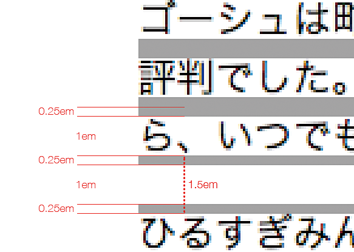

# テキストブロックが読みづらい

行間が詰まりすぎていたり、行が長すぎたりすると、テキストが読みにくくなり、ユーザーによっては読めなくなることもあります。行間や段落間は適度に空けて、長すぎる行は避けるように調整します。また、両端揃えの使用は避けましょう。

## よく見られる問題

### 行間が詰まりすぎている

行間が詰まっている例。単純に読みにくく、次の行の行頭も探しづらい。

### 段落間が行間に比べて狭い

段落と段落の間隔が行間と同じくらいしかない例。行間よりも広い間隔を確保しないと段落の区切りがわからなくなる。

### 1行が長すぎる

1行が長すぎる例。行末と次の行の行頭が離れるため、視線の移動が長くなり、読んでいる場所を見失いやすい。また、拡大すると横スクロールバーが出てしまう。

### 両端揃えされている

右端が不揃いな例と、均等割りつけを適用した例。単語間や文字間に間隔ができ、読みづらい。「白い川」に気を取られて文章を読めなくなってしまう人もいる。

## ここが問題! 行間が詰まっていると読みにくい

複数行のテキストを読み進むときは、行末から次の行の先頭に視線を移す必要があります。行間が詰まりすぎていたり、1行が長すぎたりすると、次の行がどこかわかりにくく、スムーズに読み進むことが難しくなります。

### 行間が詰まりすぎている

コンテンツの本文などでは、複数の文からなるテキストが折り返し、複数行にわたる場合があります。WCAG 2.0では、このようなまとまりを「テキストブロック」（blocks of text）と呼んでいます。

ユーザーは文を行末まで読むと、次の行の行頭を探して続きを読みます。テキストブロックの行間が狭いと、前後の行との境界がはっきりしなくなり、次の行を探すことが難しくなります。特に、認知障害のあるユーザーや、視力が弱く画面を拡大しているユーザーの場合、現在の行を把握したり、次の行を見つけることが容易ではなく、行間が狭いと読むことが困難になってしまいます。

多くのブラウザでは、文字の大きさや色の設定は簡単に変えられますが、行間を変えることは容易ではありません。コンテンツ側で行間が適切に設定されていないと、ユーザー側で解決することは困難です。

### 段落間が行間に比べて狭い

通常、段落と段落の間にはスペースを空けます。行間が広めの設定になっている場合、段落間のスペースが行間より狭かったり、あるいは行間と同じ程度しかなかったりすると、それが段落の区切りなのか、単なる折り返しなのかがわかりにくくなってしまいます。

### 1行が長すぎる

1行が長すぎることも、読みにくさの原因になります。行が長くなると、行頭と行末とが離れます。行末まで読んだときに行頭がユーザーの視界から外れ、次の行の行頭を探し出すことが難しくなります。

また、ほとんどのユーザーは、自分が読んだ位置を行単位で把握します。テキストからいったん離れ、続きから読もうとする際、ユーザーはまず該当の行を探し出します。行が短ければ、すぐに続きを読み始めることが可能ですが、行が長いと、さらに行の中で続きがどこなのか探さなくてはなりません。

行が画面からはみ出すほど長い場合、左右にスクロールしながら読まなければならないという問題もあります。テキストブロックの幅が固定されていると、その幅が適切なように思えても、画面が小さかったり、拡大して使っている場合には画面からはみ出してしまいます。

### 両端揃えされている

テキストブロックに含まれる行の長さが全て一致することは珍しく、テキストブロックの右端は不揃いになるのが一般的です。右端を揃えて美しく見せるため、短い行の単語間や文字間のスペースを空けて、行を右端まで引き伸ばすことがあります。このスタイルは両端揃え、または均等割りつけと呼ばれます。

テキストを両端揃えにすると、文字間や単語間が揃わなくなり、時には不自然なほど間隔が空きます。不規則に字間や単語間が空くと、意味のまとまりを把握しづらくなり、読みにくくなります。また、このスペースが縦につながると、「白い川」（参考1）のように見える現象が起きます。認知障害のあるユーザーには、この白い川が浮かんだり動いたりしているように見え、注意を奪われて文章が読めなくなることがあります。行間が狭いと、スペースが縦につながって見えやすくなり、問題が起きやすくなります。

## 解決アプローチの例

### テキストブロックに適切なスタイルを適用する

適切な行間と段落間を確保し、行の長さを抑え、左揃えにした例。テキストブロックに適切なスタイルを適用することで、読みやすさを確保できる。

### リキッドレイアウトを採用する

リキッドレイアウトのコンテンツを拡大した例。本文テキストがウィンドウ幅にしたがって折り返すため、ユーザーは読みやすい行の長さを確保できる。

## 解決アプローチ 行間や行の長さを適切に設定する

行間、段落間、行の長さを適切に設定することで、読みやすさを確保することができます。ただし、行きすぎた調整は逆に読みにくさの原因になるため、バランスを見ながら調整しましょう。

### 行間と段落間を確保する

行間を適切に確保すると、行の区切りが明確になり、読みやすくなります。 WCAG 2.0では"space.and-a-half"のスタイル、すなわち文字の高さの半分以上の行間を持たせるのが良いとされています。行の高さは文字の1.5倍となり、CSSでの指定に読み替えると、line-height: 1.5に相当する行間になります。

ただし、この値はあくまでテキストブロックについての基準値です。見出しやボタンに含まれるテキストなど、文章を読ませるような状況ではない場合、無理にこの行間を適用する必要はありません。また、空けすぎると、テキストブロックとしてのまとまりがなくなり、箇条書きのように見えてしまうことがあります。line-height: 1.5～2の間で調整すると良いでしょう。

段落間が行間よりも広くなるように、段落間にはマージンを設けます（図 1）。WCAG 2.0では、行送りの1.5倍以上のスペースを確保することが推奨されていますが、これは空行を1行挿入するのに相当するマージンで、CSSではmargin:1emに相当します。段落間マージンを広げすぎると、文章がバラバラに見えてしまい、逆に読みにくくなることがあります。1em〜3em程度で調整すると良いでしょう。

段落間のスペースを空けるかわりに、1行目の行頭を字下げすることで段落を示すスタイルもあります。しかし、このスタイルはWebではあまり使われませんし、拾い読みにはあまり適していません。可能であればマージンを空けるほうが良いでしょう。

図1：line-height:1.5とmargin:1emを指定した際の行間と段落間

行ボックスの高さは1.5emで、文字の上下に0.25emのhalf-leadingが確保される。行間は0.5em相当、段落間のスペースは1.5em相当となる。これは最低限の基準なので、もう少し空けても良い。

### 行の長さを抑える

1行の文字数を抑え、適度に折り返すようにすると読みやすくなります。 WCAG 2.0では、半角80字、全角40字以内という基準が示されています。ただし、短くしすぎると折り返しが大量に発生し、視線の移動が増えて逆に読みにくくなります。サイドバーの中などでは短くせざるを得ませんが、本文となるテキストについては、40字に近いところで折り返すようにするのが良いでしょう。

### リキッドレイアウトを採用する

行の長さをユーザーが選べるようにするという選択肢もあります。いわゆるリキッドレイアウトを採用し、ウィンドウ幅によって自由にテキストが折り返すようにすれば、ユーザーは読みやすい幅にして読むことができます。画面を拡大した場合も、左右スクロールなしで読み進むことができます。

ただし、画面が広すぎる場合、行が長くなりすぎて読みにくくなるおそれがあります。コンテンツの最大幅を決めて、行が長くなりすぎないようにすると良いでしょう。

### 両端揃えをやめて左揃えにする

テキストブロック内での両端揃えは避け、単純な左揃えを採用しましょう。見出しや表のセルの中など、折り返さないテキストについては両端揃えを採用してもかまいませんが、短い単語が引き伸ばされてしまうなど、デメリットもあります。慎重に採用しましょう。

## コラム 欧文向けテンプレートにそのまま和文を入れてはいけない

WordPressのテーマやBootstrapなどのフレームワークを元にサイトを作ることがあります。案件によっては、グローバルで共通のテンプレートを使うように指示されるケースもあるでしょう。しかし、欧文を想定したテンプレートに和文をそのまま入れると、読みにくくなってしまうことがあります。たとえば、以下に挙げるような問題が起きることがあります。

### 太字や斜体が読めなくなる

太字や斜体は欧文を強調するのには向いていますが、和文には太字や斜体専用のフォントが用意されていないことが多く、つぶれて読めなくなることがあります。また、漢字を無理やり斜体にすると、隣の文字に重なって読めなくなることがあります。

### 文字サイズが小さすぎる、メリハリがありすぎる

欧文であれば読める文字サイズでも、和文に適用すると字形が判別しにくく読みづらいことがあります。また、本文と見出しとの文字サイズにメリハリがつきすぎていて、和文にすると違和感のあるサイズになることもあります。欧文を前提に文字間が調整されていると、和文を入れたときに空きすぎたり、文字が重なってしまうこともあります。

### ディセンダ、アセンダの存在を前提にしている

和文では基本的に行いっぱいに文字をおきますが、欧文では文字の上下にアセンダ、キャップ、ディセンダなどの領域があります（図2）。これらの領域が持つ余白を前提に行間が調整されていると、和文を入れたときに行間が狭すぎると感じられることがあります。

また、テキストの横に図版などの要素が配置される場合、ミーンラインやベースラインに揃えられていることが多く、和文を適用すると位置がうまく揃わないことがあります（余談ですが、画像の下に謎の空白ができる現象が起き、img要素にvertical-align:topなどを適用すると消えるのは、画像がベースラインに揃っていて、その下にディセンダの領域が確保されているためです）。

[WordPressのテーマ](https://wordpress.org/themes/)

[Bootstrap](http://getbootstrap.com/)

図2：[Wikipedia「書体」](http://ja.wikipedia.org/wiki/%E6%9B%B8%E4%BD%93)の項より、欧文書体の各種ラインの図

参考1 [白い川（rivers of white）](https://en.wikipedia.org/wiki/River_%28typography%29)
