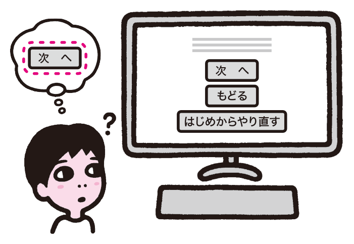
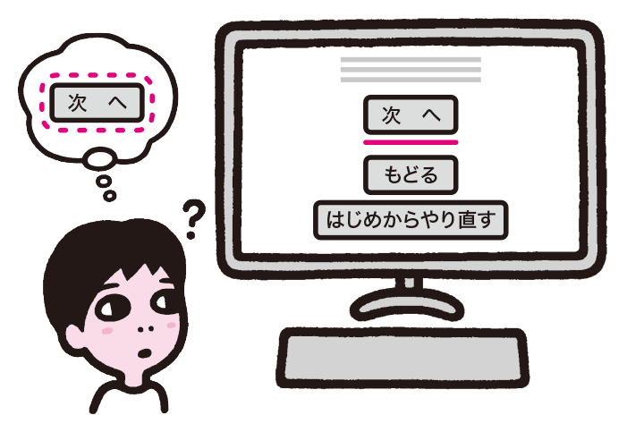

# フォーカスが見えない

キーボード操作時は、フォーカスを移動して要素を選択します。フォーカスが邪魔だからと消してしまったり、わかりにくいスタイルに変更したりすると、操作できなくなってしまいます。フォーカスがはっきりわかるようにしましょう。

## よく見られる問題

### フォーカス表示が見えない

フォーカス表示を消している例。フォーカスが見えていないため、キーボード操作時にどこが選択されているかわからなくなってしまう。

### フォーカスがわからない

フォーカスのスタイルを変更し、ボタンが浮き上がるように見せた例。あまり奇抜なスタイルにすると、かえってわかりづらくなる。

## ここが問題! キーボード操作にはフォーカス表示が必要
キーボード操作を行うのはスクリーンリーダーだけではありません。マウスが使えないユーザーもいますし、マウスがないデバイスもあります。フォーカスが視覚的に見えないと、そのような状況で操作できなくなってしまいます。

### フォーカス表示が見えない
キーボードで操作を行う際は、Tabキーを押して操作対象の要素を切り替え、目的の要素を選んだところでEnterキーを押します。このとき、操作の対象となる要素がフォーカスを受け取っている、と言います。フォーカスを受け取った要素は強調表示され、どの要素が操作の対象になるのかわかるようになっています。多くのブラウザは、フォーカスを受け取った要素を点線や色がついた線で囲みます。

ビジュアルデザイン上、このフォーカスの表示が邪魔に感じられるからという理由で、フォーカス表示を消してしまうこともあります。フォーカス表示が消されていると、現在どの要素にフォーカスが当たっているかがわからなくなり、キーボード操作が事実上不可能になってしまいます。

### フォーカスがわからない

コンテンツ側でフォーカスのスタイルを変える場合もあります。わかりやすいスタイルであれば問題ありませんが、そのスタイルが控えめすぎたり、独創的すぎてフォーカスのように見えなかったりすると、どこにフォーカスが当たっているのかわからなくなってしまいます。

また、フォーカスのスタイルはデバイスによっても異なり、デバイスの特性に合わせて標準のフォーカスを特殊なスタイルにしていることがあります。このようなケースでフォーカス表示のスタイルを変えてしまうと、著しく使いにくくなることがあります。

## 解決アプローチの例

### フォーカス表示をブラウザにまかせる

Chrome標準のフォーカス表示の例。ロゴの部分が青枠で囲まれている。ブラウザ標準のスタイルであるため、ユーザーは迷わない。

### フォーカス箇所を強調する

Twitterでボタンにフォーカスした際の表示の例。ボタンに独自の枠線を表示してフォーカス箇所がわかるようにしている。

## 解決アプローチ 標準のフォーカスを使い、フォーカス箇所を強調する

フォーカスを非表示にすることは避けましょう。基本的にフォーカスのスタイルを変える必要はありませんが、スタイルを変える場合は要素を強調して明確にわかるようにしましょう。実際にキーボードで操作して確認することも重要です。

### フォーカス表示をブラウザ標準にまかせる

フォーカスの見た目が気に入らなかったとしても、消さないようにしてください。キーボード操作をしているユーザーは標準のフォーカス表示に慣れているため、特にスタイルを変更する必要はありません。理由がなければ、ブラウザ標準のまま手を加えないのがもっとも無難です。

時には、意図せずフォーカス表示が消えてしまっていることもあります。outlinenone.com（参考1）では、フォーカス枠が消えてしまう理由として、「リセットCSS」（CSS Reset）の存在を指摘しています。リセットCSSでは、最初にブラウザのデフォルトスタイルを全て消していますが、この際にフォーカスの枠も消しています。CSSにはコメントで「忘れずにフォーカスのスタイルを定義すること」という旨が書かれていますが、多くのサイトはこれを忘れ、消したままにしてしまっているというのです。

このような意図しない理由でフォーカスが消えていないか確認するには、完成したコンテンツを実際にキーボードで操作してみるのが良いでしょう。その他の理由でキーボード操作できないケースも同時に把握することができます。

### フォーカス箇所を強調する

フォーカスのスタイルを変更したい場合もあります。ブラウザ標準のフォーカスは、要素の周囲にぴったりくっついた点線で表現されることがありますが、このスタイルは、ボタンなどの矩形の要素にフォーカスが当たったときに見えにくいことがあります。

この場合、フォーカス枠のスタイルを変えるという方法もありますが、枠のスタイルを変えるとフォーカスのスタイルが一貫しなくなり、ユーザーを混乱させる場合があります。ボタンのような要素については、フォーカスが当たったときにボタンの色やスタイルを変えて強調するのが良いでしょう。

参考1 [CSS outline property - outline: none and outline: 0](http://outlinenone.com/)
