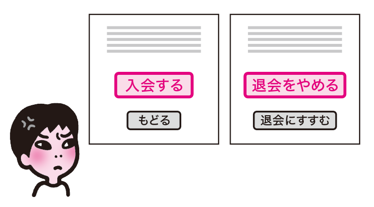
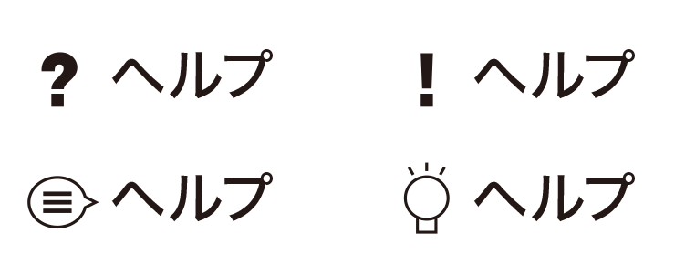
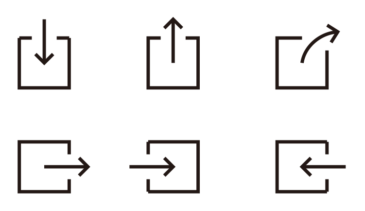
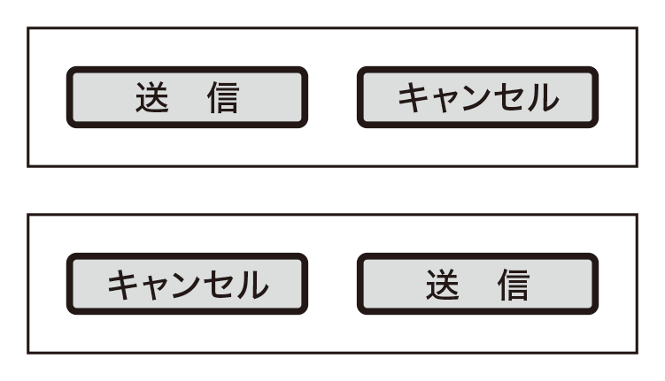
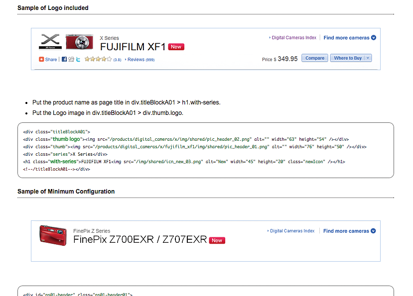
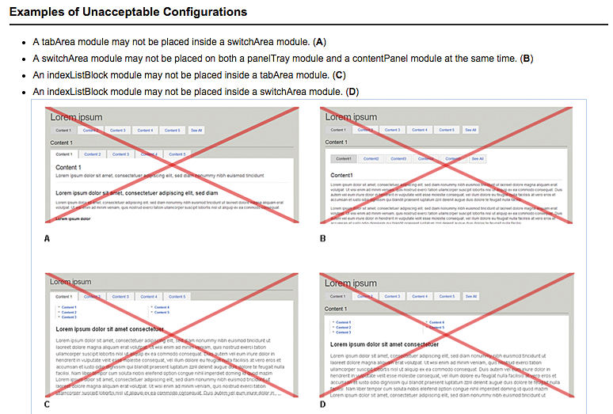

# スタイルに一貫性がない

要素の意味によってスタイルを変えるとわかりやすくなりますが、使われ方が一貫していないと、かえって混乱を招いてしまいます。一貫性を保つように意識すると共に、ガイドラインを整備するなど、制作プロセスも工夫しましょう。

## よく見られる問題

### 同じ見た目が異なる意味で使われている

主動線のボタンを赤くしているが、退会処理の時だけキャンセルボタンが赤くなっている例。ユーザーは混乱する。

### 異なる見た目のものが同じ意味で使われている

ヘルプに対して、さまざまな異なるアイコンが使われている例。アイコンがどのように使い分けられているのかわからなくなり、混乱する。

### 似たような見た目のものが使われている

矩形と矢印で表現されたアイコンの例。それぞれダウンロード、アップロード、シェア、ログアウト、外部リンク、ログインを意味するが、ユーザーは混同してしまう。

### 配置が一貫していない

フォームの送信ボタンが左側にあるが、特定のページでだけ右側に配置されている例。左が送信だと思い込んでいると誤操作してしまう。

## ここが問題! 要素のスタイルに一貫性がないと混乱する

要素の意味や性質によってスタイルを変えると、ひと目で意味がわかるようになり、わかりやすくなります。しかし、使い方に一貫性がないと、どのスタイルがどの意味に対応するのかわからなくなり、かえって混乱を招いてしまいます。

### 同じ見た目のものが異なる意味で使われている

意味や性質によって要素の見た目を変えると、ぱっと見たときにわかりやすくなります。たとえば、サイト内に入力欄が複数あるとき、そのうちのひとつに虫眼鏡アイコンがついていれば、それが検索フォームであり、他の入力欄とは違うことがひと目でわかります。このとき、検索フォームではない箇所に全く同じアイコンを使うと混乱を招きます。たとえば、詳細を見るためのリンクに同じアイコンを適用すると、検索フォームへのリンクと思われてしまうことがあります。

アイコンに限らず、記号や色、形などについても同様です。たとえば送信ボタンに特別な色をつけているとき、送信ボタンでないものにその色をつけると、ユーザーには送信ボタンのように見え、混乱します。

### 異なる見た目のものが同じ意味で使われている

逆に、異なる見た目が同じ意味で使われている場合も混乱を招きます。たとえば、ヘルプのアイコンが場所によって「？」「！」「ｉ」などと揺れていると、ユーザーはそれぞれ違うものだと考え、混乱します。同じ意味なのに色にバリエーションがあるケースも同じ問題を起こします。たとえば、チェックマークが、あるページでは緑、あるページでは赤になっていると、それぞれに違う意味があるように思えます。

### 似たような見た目のものが使われている

見た目が完全に同じでなくとも、ぱっと見た印象が似ていると、ユーザーは混同してしまうことがあります。たとえば、フォームの入力結果がOKの場合に赤い円、NGの場合には赤丸に『！』マーク、というようなスタイルでは、一見した印象が「赤丸」で共通しており、両者を混同することがあります。

### 配置が一貫していない

要素の配置にも意味を持たせることがあります。たとえば、送信ボタンと戻るボタンを並べるとき、必ず送信が右に配置されていると、ユーザーは迷わずに目的のボタンを押すことができます。しかし、特定のフォームでだけ配置が逆になっていると、ユーザーは普段の配置を期待して誤操作してしまいます。特に、キーボード操作のユーザーは、最後の入力欄の次に送信ボタンがあると思ってTabキー、Enterキーの順にすばやく操作することがあり、並び順が異なると誤操作する可能性が高くなります。

## 解決アプローチの例

### スタイルのルールを明確にし、ガイドラインで定義する

要素の見た目やルールを定義したガイドラインの例。スタイルのルールを明確にし、ガイドラインに記載することで、一貫性を保つことができる。

## 解決アプローチ 似て非なるものが生まれにくい仕組みを作る

スタイルの一貫性を保ち、似て非なるものができないようにするためには、プロセスが重要です。まず一貫したルールを設計し、それらをサイト全体に適用します。そして再利用可能な形に定義し、利用ルールを決めましょう。

### スタイルのルールを明確にする

要素のスタイルに意味を持たせる場合は、そのルールを明確にし、どの状況でどのスタイルが使われるのかをはっきり判断できるようにします。また、似て非なるスタイルは作らないようにし、意味の違う要素には明確な差をつけて、ひと目で差がわかるようにします。デザインしたスタイルの一覧を作成し、視覚的に似ているものや、意味が同じで見た目が違うものなどを整理すると良いでしょう。

### アイコンとラベルをセットにする

どうしても似たようなスタイルを使わなければならない場合、ラベルとセットにするとわかりやすくなります。たとえば、検索と拡大に全く同じ虫眼鏡のアイコンを使っても、「検索」「拡大」というラベルとセットになっていれば、それぞれの意味の違いは明確になります。ラベルがあれば画像が利用できない環境でもわかりやすくなるため、アイコンはラベルとセットで使うように心がけると良いでしょう。

なお、ラベルにも一貫性が必要です。「4-3 ナビゲーションに一貫性がない」「6-3 ラベルや説明が不足しているフォーム」「7-6 リンク先がわからない」を参照してください。

### ガイドラインで定義する

スタイルのルールを明確にしても、サイト全体で守られなければ意味がありません。個々のページ側で既存のスタイルと似て非なるものを作ってしまったり、すでにあるスタイルを違うルールで使ってしまったりすると、一貫性が失われることになります。サイト全体に適用されるガイドラインを作成し、ルールを周知しましょう。ガイドラインには、そのスタイルを使うべき局面を書くだけでなく、間違った使い方や、NGとなる独自デザインの例なども記載しておくと良いでしょう。

### コンポーネント化する

主要な要素をコンポーネント化して、各ページでは定義されたコンポーネントだけを利用すれば、自然と一貫したスタイルが適用されることになります。ただし、コンポーネント化していても、本来使うべきではない場所で使ったり、部分的に改変したり、配色や配置を変えてしまうと、一貫性が失われます。コンポーネントのルールについても、ガイドラインを用意して徹底すると良いでしょう。

## コラム 送信ボタンは右か左か

スタイルのルールを作る際には、個々の要素の見た目だけでなく、ボタンの配置などのインターフェイスのポリシーもまとめておくと良いでしょう。この際よく問題となるのは、送信ボタンと戻るボタンのどちらを右に置いてどちらを左に置くかです。この配置には標準と言えるものはなく、サイトによってまちまちなのが現状です。以下のように、これはどちらにも理由があり、一概にどちらが正しいとは言えません。どちらを採用しても構いませんが、サイト内では一貫させるようにしてください。

### 送信を右に置く理由

ユーザーの視線は左から右へと移動します。前後に移動するナビゲーションを置く際は、戻るボタンを左に、進むボタンを右に置くことが合理的です。フォームの送信ボタンは進む動線ですので、右に置くことが合理的と言えます。OS XやiOSの流儀はこの考え方で、ダイアログボックスの右下に主動線のボタンを置きます。どちらかと言えば、マウスやタッチで操作する際のビジュアルを重視した考え方になります。

### 送信を左に置く理由

ユーザーの視線は左から右へと移動します。ボタンが並ぶ際は、メインの動線となるボタンが最初に目に入ったほうが迷いにくくなりますし、キーボード操作時も、よく使うボタンに最初にフォーカスが当たるほうが使いやすいでしょう。フォームの送信ボタンはメインの動線ですので、左に置くことが合理的と言えます。Windowsの流儀はこの考え方で、ダイアログボックスの左に主動線となるボタンを置きます。どちらかと言えば、キーボード操作時のフォーカス順序を重視した考え方になります。
