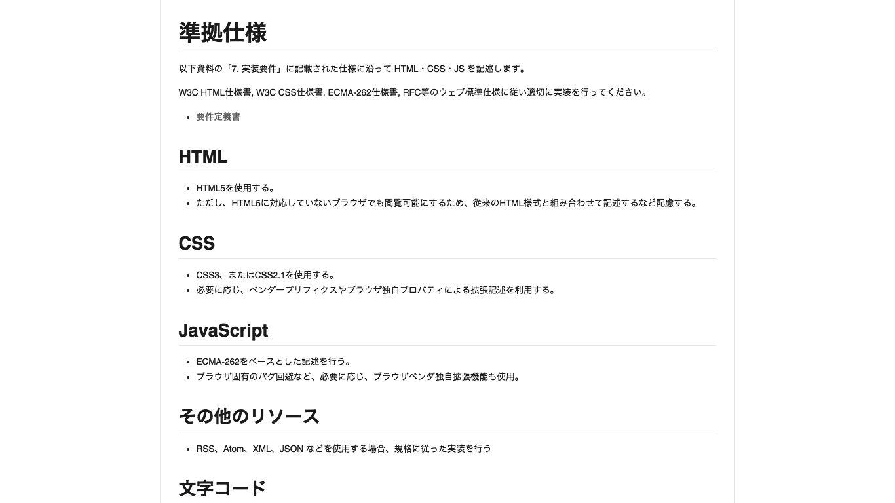
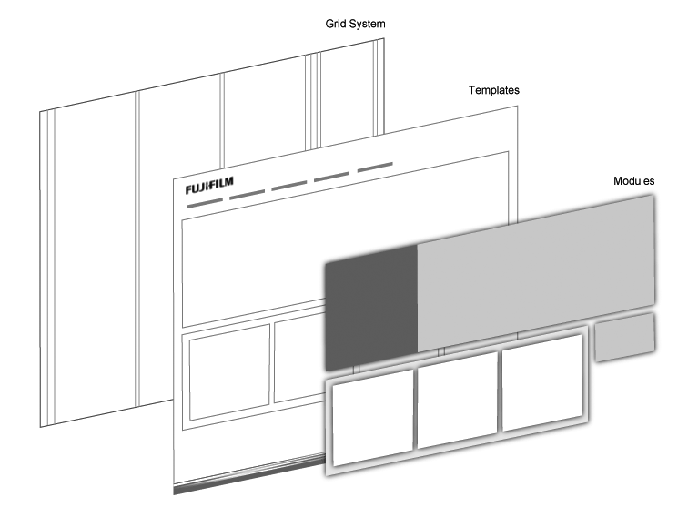
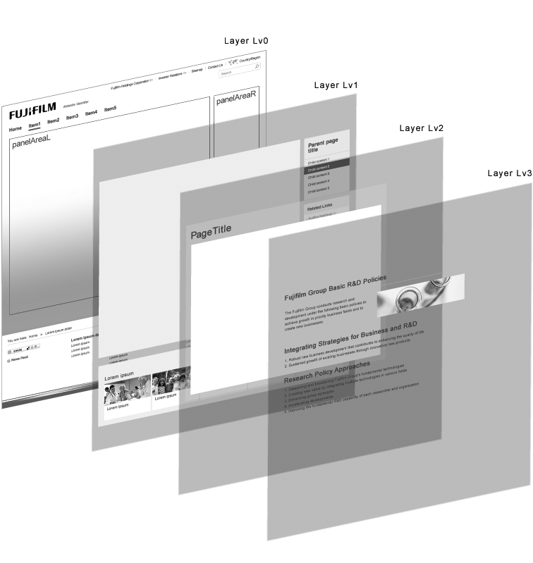
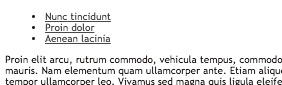
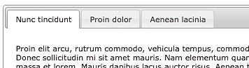

# 概要と流れ
機能やコンテンツなどを、実際に機能する形にすることを「実装」と言います。このプロセスでは、主にHTMLやCSS、JavaScriptを書いたり、画像を切り出したりといった作業を行い、実際にブラウザで閲覧できるWebページの形を作っていきます。

アクセシビリティへの対応は実装時に行うものと考えられていることも多いようですが、この段階で対応できることは、実はそれほど多くありません。この段階で生じる問題の多くは、設計やビジュアルデザインの段階に立ち戻って再考すべきものです。HTMLやCSSの実装にはいくつかの配慮が必要になりますが、特別手間のかかることが必要なわけではなく、基本に忠実に実装することが重要になります。

## STEP1実装方針の検討
大規模な案件では、いきなりHTMLやCSSを書き始めることはできません。準備をしてから手を動かしていくことになります。

### 実装要件の確認
まずは実装の要件を確認します。実装に関わる要件には以下のようなものがあります。

* アクセシビリティ方針
* 使用するHTMLやCSSのバージョン
* ブラウザや端末の要件
* スクリプト無効時の考え方
* 使用するJavaScriptのライブラリ
* 印刷対応

このほとんどは、プロジェクト要件定義の段階で決定しているはずです。もし不足していれば、この段階であらためて決定し、共有する必要があります。要件が決まっていないまま実装が進んでしまうと、後になって要件を満たせないことが判明するなど、問題になることがあります。実装開始前に必ず、要件を確認しておきましょう。

要件が確認できたら、実装者に共有します。情報が共有できればよいので、立派な紙の文書を用意する必要はありません。Wikiなどを利用しても良いでしょう（図1）。

図1：実装要件のドキュメントの例

### 実装手法の検討
要件が確認できたら、実装作業の進め方を検討します。作業を進めるにあたって必要なファイル名やクラス名のルール、その他マークアップのポリシーなどを決定し、統一します。

アクセシビリティ方針でWCAG 2.0の基準を達成することが求められている場合、個々の達成基準をどのような手法で満たすことになるのかをプロジェクト内で確認します。すでにここまでのプロセスでさまざまな解決アプローチが採用されているはずですが、達成基準を満たす方法が不明な場合、ここであらためて検討する必要があるかもしれません。手法を検討する際は、Understanding WCAG 2.0や、その和訳である「WCAG 2.0解説書」（参考1）を参照すると良いでしょう。「達成基準を満たすことのできる実装方法」がいくつか挙げられていますので、その中からひとつ、または複数を選択します。

なお、IDが「G」で始まる実装手法は、特定の技術に依存しない汎用的な項目です。汎用性が高い代わりに効果が薄かったり、コンテンツ側で特殊な実装をしなければならないことがあります。HTMLとCSSで実装している場合は、IDが「H」や「C」で始まる手法を採用できないか検討し、それらが使えない場合に「G」の項目を採用するようにしましょう。ただし、全ての達成基準について特別な対応が必要なわけではありません。中には文字サイズの変更のように、特別な実装が必要ないものもあります。

## STEP2テンプレートの実装
実装の方針を確認できたところで、実際にマークアップの作業をしていきます。まずはヘッダ、フッタ、グローバルナビゲーションなど、サイト全体で共通する部分のマークアップを行います。今後、このHTMLをテンプレートとして、中にページごとのコンテンツを入れていくことになります（図2）。

図2：テンプレートの考え方の例

まずテンプレートを確立し、その上にコンポーネントを積み上げる。

この部分の実装がしっかりしていないと、サイト全体のアクセシビリティに問題が生じることになりかねません。特に、ナビゲーションやメニューの実装によってはアクセシビリティに問題が起きる場合があります。

なお、ここで言うテンプレートは、CMSのテンプレートとは異なります。CMSを採用する場合、CMSのテンプレート実装は別途必要になります。

## STEP3コンポーネント実装
コンテンツ内で使用するコンポーネントの実装を行います（図3）。コンポーネントの設計ついては7章、デザインについては8章を参照してください。コンポーネントを実装する際は、汎用的に使えるように注意する必要があります。また、セマンティクスに注意し、適切な意味を持った要素を選択しましょう。「9-2セマンティクスが不適切」も参照してください。

図3：階層化されたコンポーネントの考え方の例

役割ごとにコンポーネントを階層化し、入れ子構造を定義する。

専門的な知識がなくてもコンポーネントを使用してコンテンツを作れるように、ドキュメントを整備しておく必要があります。コンポーネントの名前、見た目、使い方とHTMLのソースコードがセットになっていれば、作業者は必要なコンポーネントを選び、HTMLをコピーして使うことができます。ドキュメントといっても、作業者が参照するためのものですので、Wikiツールやスタイルガイドジェネレータなどを利用しても良いでしょう。

## STEP4ページ展開
テンプレートとコンポーネントがある程度完成したところで、これらを使用しながら実際のコンテンツを作成していきます。この作業は「量産」とも呼ばれます。基本的には、既存のコンポーネントを使用して、テキストや画像などのコンテンツを入れていく作業になります。テンプレートとコンポーネントがきちんと設計されていれば、この段階でアクセシビリティについて配慮することはほとんどありません。ただし、原稿で画像の代替テキストが指定されていないなどの不備があれば、原稿をあらためて確認する必要があるでしょう。

近年ではCMSの普及が進み、ページの作成時にHTMLを書く必要がないというケースも増えてきました。このような場合、このプロセスはCMSを使用して行うことになります。CMSを使用する場合は、ページ展開の前にCMSのテンプレートを実装するというプロセスが必要になるでしょう。

### 特殊なコンテンツの作成
トップページや特殊な機能を持ったコンテンツなど、既存のコンポーネントでは表現できないようなコンテンツについては、この段階であらためて実装する必要があります。入力フォームなどもここで実装されることが多いでしょう。この場合にはアクセシビリティ上の配慮が必要になってきます。「9-6 ラベルがマークアップされていない」も参照してください。

## コラム マークアップ作業の基本的な進め方
テンプレートやコンポーネントの実装の際には、HTMLを書くマークアップ作業が必要になります。マークアップ作業は、基本的には以下のような順で進めていきます。

### HTMLの実装
まずは、CSSを適用しない状態でHTMLだけを実装します。ページ内の構成要素について、それぞれが見出しであるのか、リストであるのか、段落であるのかといったことを考えながらマークアップしていきます。「9-2セマンティクスが不適切」も参照してください。

コンテンツに画像が使用されている場合は、それが意味のある画像であるかどうかを考え、意味があるものであればimg要素としてHTMLに組み込みます。いったんCSSなしでHTMLを作ったところで、それがCSSなしでも意味が通じるものになっているかどうかを確認すると良いでしょう。「9-3コンテンツがCSSに依存している」も参照してください。

### CSSの実装
HTMLのマークアップがひと通りできてから、CSSを実装して見た目を整えていきます。前景色を指定した場合は背景色も指定する、狭い領域にテキストを入れる場合は領域が伸びるように実装するなど、いくつか細かい配慮が必要になります。

### JavaScriptの実装
スクリプトを使って何かを制御するような場合は、最初にスクリプト無効時の状態でHTMLを作っておき、後からJavaScriptを組み込むようにします。そうすることで、スクリプトが無効でも問題なくアクセスできる状況を作りやすくなります。

たとえば、スクリプト有効時にはタブインターフェイスで項目を切り替え、無効時には全てが縦積みになる想定の場合、まずは縦積みにした状態でHTMLを作ります。その後、JavaScript
を実装して、それらの要素がタブの形になるように整えます（図4）。

図4：スクリプト無効に配慮したタブ実装の例

スクリプト無効時の状態をまず実装し、その後、JavaScriptを追加して整える。

### 検証
実装がひととおり終わったら、検証を行います。検証は納品前にも行いますが、個々のページやパーツの実装中にこまめに検証しておくと、後戻りを最低限にとどめることができます。実装中に行う検証には以下のようなものがあります。

* ツールによる文法チェック
* ビジュアルブラウザでの確認
* 画像表示をオフにした状態での確認
* スクリーンリーダーでの確認
* キーボード操作での確認

参考1 [WCAG 2.0解説書](http://waic.jp/docs/UNDERSTANDING-WCAG20/Overview.html#contents)
