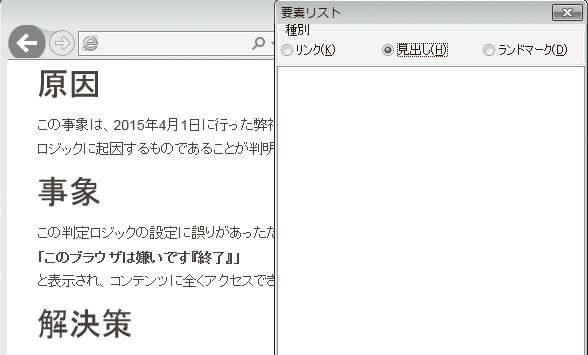

# セマンティクスが不適切
HTMLは、データを要素としてマークアップし、意味を明確にしたものです。要素が表現する意味を「セマンティクス」と呼びます。文法を正しくするだけでなく、適切なセマンティクスを持った要素を使う必要があります。

## よく見られる問題

### 見出しを使っていない



見出しを含むはずのコンテンツを表示し、見出し一覧を表示させた例。見出しがあるように見えるが、見出し一覧には表示されず、スクリーンリーダーでもジャンプできない。

### 見出しでないものを見出しとしてマークアップしている


段落が強調されているコンテンツを表示し、見出し一覧を表示させた例。強調部分が見出しとしてマークアップされているため、見出し一覧にまるごと出現してしまう。

### 別の要素に見せかけている


```
<div class="ui-slider">
  <div class="ui-slider-track">
    <div class="ui-slider-bg"></div>
    <a href="#" class="ui-slider-handle"></a>
  </div>
</div>
```
リッチなスライダーの例。スライダーをa要素で実装してフォーカスが当たるようにしているが、スクリーンリーダーには単なるリンクに見えてしまい、混乱する。


### 不適切なメタ情報
```
<html lang="en">
<head>
<title>無題ドキュメント</title>
<meta name="description" content="ここに説明文を入れてください"/>
```
誤ったメタ情報が指定されている例。ユーザーエージェントは誤った情報を提示してしまう。

## ここが問題！ 要素を適切に使わなければ混乱を招く
HTMLの見出し、リストなどの要素はそれぞれ異なる意味を持ちます。要素を適切に使わないと、見た目は問題なく見えても、環境によっては意味が正しく伝わらなかったり、誤解されたりすることがあります。

### 見出しを使わない
h1などの要素は、見出しをマークアップするためのものです。h1などでマークアップされた箇所は「見出し」というセマンティクスを持ちます。ある箇所を見出しとしてマークアップすると、ブラウザはそれが見出しに見えるように、太字、大きな文字などで強調して表現します。

CSSを使えば、任意の要素に太字、大きな文字などを適用することもできます。たとえば、見出しをh1ではなくdiv要素でマークアップし、CSSで見出しのような見た目にすることも可能です。しかしこの場合、div要素は見出しのように見えるだけで、見出しとしてのセマンティクスを持っていません。

そのため、ユーザーエージェントは、これを見出しではなく単なるdivと判断します。スクリーンリーダーには見出しにジャンプする機能がありますが、見出しのように見えるだけのdivにはジャンプできません。同様に、検索エンジンのクローラーも、これを見出しとは見なさないでしょう。


### 見出しでないものを見出しとしてマークアップ
一部のコンテンツ制作者は、見出しではない、単に強調したい箇所にh1などのマークアップを適用してしまうことがあります。これは強調ではなく見出しとしてのセマンティクスを持つことになります。そのため、たとえばスクリーンリーダーの見出しジャンプ機能の飛び先になります。見出しジャンプを使って見出しでない部分に飛ぶようなことがあれば、ユーザーは意図しない場所に飛んでしまい、混乱します。

### 別の要素に見せかける
CSSやJavaScriptを用いて、ある要素を別の要素に見せかけるような手法にも問題があります。特に、リンクやフォームコントロールなどに似た動作を実装する場合、実装の仕方によっては、キーボードで操作できない、スクリーンリーダーで適切に扱えない、といった問題が起きることがあります。

たとえば、img要素でチェックボックスの画像を置き、JavaScriptを使ってチェックボックスのような動作をさせると、通常のチェックボックスよりもリッチな見た目にすることができます。しかし、単純にこのような実装をすると、スクリーンリーダーのユーザーには、それがチェックボックスであることが伝わりませんし、フォーカスを移して操作することもできなくなります。

要素を見えないようにして隠すことも、同じような問題を起こすことがあります。特に、見えない要素がフォーカスを受け取る場合、キーボード操作時にフォーカスを見失ってしまうことがあります。


### 不適切なメタ情報
HTMLには、見た目に現れないメタ情報を付加することができます。たとえば、meta要素を用いて、このページの説明文やリンク用の画像など、さまざまな関連情報を指定することができます。このような情報は、ページを見ているユーザーに直接届くわけではありませんが、サーチエンジンのクローラーやその他のユーザーエージェントによって利用され、間接的にアクセシビリティを高めます。たとえばFacebookでは、投稿に含まれるURLの参照先からメタ情報を取得して、リンク先の情報を表示します（図1）。

メタ情報が誤っていたり、適切なものが設定されていないと、メタ情報を利用するシステムからアクセスする際に誤った情報やわかりにくい内容が表示され、ユーザーが混乱することになります。

また、html要素にlang属性を指定すると、このページの言語を指定することができます。スクリーンリーダーの中には、言語によって音声合成エンジンを切り替えるものもありますが、言語の指定が誤っていると、日本語の文書なのに流暢な外国語の発音で読み上げてしまう、といったことが起きる可能性があります。このようなものは目に見えないため、チェックから漏れがちです。


図1：Facebookの投稿にURLを含めた例

URLの参照先からメタ情報を取得して表示している。


## 解決アプローチの例

### 要素を適切にマークアップする


見出しを含むコンテンツの例。見出しが見出しとしてマークアップされているため、見出し一覧に表示され、スクリーンリーダーでも適切に扱える。

### UIには本来の要素を素直に利用する


ラジオボタンやチェックボックスをリッチに見せている例。本来のコントロールを置いた上で、見た目だけが変わるようにしている。


## 解決アプローチ 適切な要素を使ってマークアップする
マークアップの際には、文書の構造に沿って適切な要素を使用しましょう。リッチなUIを作る必要がある場合など、どうしても本来の要素が使えないような場合は、WAI-ARIAを使用して補うという方法もあります。

### 要素を適切にマークアップする
HTMLには多数の要素があります。それぞれの用法はHTMLの仕様に書かれていますので、まずはそれを読むことが理解への近道でしょう。中には、既存の要素で表現することが難しいものもあります。そのようなものについては、仕様の中にヒントが書かれている場合があります（参考1）。

それでも、要素の選択に迷う場合は多々あります。ある要素が見出しなのか、定義リストなのか、それとも単なる強調なのか、判断が難しいこともあるでしょう。このような場合は、スクリーンリーダーでの利用シーンを考えてみると判断しやすくなります。たとえば、項目の件数がわかったほうがよければリストに、その場所にジャンプできたほうがよければ見出しに、といった具合です。

特にマークアップが重要になるのは、見出し、リスト、表で、これらはスクリーンリーダーでも特別に扱われます。以下にそれぞれの注意点を挙げます。

#### 見出しのマークアップ
見出しは非常に重要な要素です。スクリーンリーダーでの見出しジャンプに使われるほか、文書のアウトライン構造の解析に使われたり、さまざまなユーザーの理解の助けになることがあります。見出しの重要性については、「7-2適切な見出しが立っていない」も参照してください。

見出しを見出しとしてマークアップすること、見出しでないものを見出しとしてマークアップしないことが重要です。HTMLの見出しにはh1～h6までのレベルがあり、文書の構造を理解するためには見出しのレベルも重要になります。見た目ではなく、文書のアウトライン構造を意識してマークアップしましょう（図2）。


図2：スタイルの異なる見出しが同じレベルになる例

囲みなどの中では見出しは小さめに表現されることもあるが、あくまでアウトライン構造に沿ったレベルの見出しとしてマークアップする。


HTML5では、section要素で文書のアウトライン構造を表現することもできます。この場合、階層はsectionの入れ子で表現されるため、見出し要素自体にレベルを持たせる必要はなく、全てをh1でマークアップすることができます。しかし、section要素によるアウトライン構造を読み取れないスクリーンリーダーも多いため、基本的には見出しのレベルを使い分けた方が良いでしょう。全てをh1でマークアップするのは、見出しのレベルが不明でも誤解を招かないようなシンプルなケースだけに限定するべきです。


#### リストのマークアップ
リストをリストとしてマークアップすると、リストの件数を数えたり、前後のリスト項目に移動したり、リスト全体を読み飛ばしたりすることが容易にできるようになります。

時には、見出しとリストの使い分けが難しいこともあります。dl要素は、名前を表すdt要素と、その値や説明を表すdd要素との組み合わせになるため、dt要素を見出しのように使うこともできなくはありません。dt要素では見出しレベルを意識する必要もなく、扱いやすいと感じる人も多いでしょう。しかし、dt要素は見出しではないため、見出しジャンプの対象になりません。また、dl要素を「リスト」と読み上げる環境もあります。dlはあくまでリストであることを意識しましょう。

#### 表のマークアップ
表を表すtable要素も便利な要素です。はるか昔、CSSがまともに使えなかった時代には、これがレイアウトのために使われることが頻繁にありました。今でも、HTMLメールではレイアウト目的で使われることがあるようです。しかし当然、これらは本来の使い方ではなく、望ましいものではありません。

逆に、表を徹底的に嫌い、あくまでtable要素を避けようとする人もいますが、それはそれで望ましくありません。表は基本的に、情報をマトリックス状に整理して見やすくしたものです。表を使わずに列挙する表現も可能ですが、その場合、見やすさや理解のしやすさで劣る場合があります。特に、列に沿って情報を追っていくことが必要になる場合は、table要素を使うべきです。

table要素には、スクリーンリーダーに向けた説明を書くためのsummary属性が存在しました。しかし残念ながら、この属性が有効活用されることはほとんどありません。summary属性で説明する必要があるほどの複雑な表であれば、その説明はビジュアルブラウザで表を見ているユーザーにも有用なものになるでしょう。summary属性を使いたくなるような状況では、その内容を誰でも見えるように書いた方がよい場合が多いはずです。「7-4複雑な表が理解できない」も参照してください。

表を説明する方法については、HTML5の仕様でも複数の例が挙げられていますので、参考にすると良いでしょう（参考2）。なお、レイアウト用のtable要素にsummary="layout table"のような指定をすることは有害です。これはTechniques for WCAG 2.0で失敗例として明確に挙げられています（参考3）。


### UIには本来の要素を素直に利用する
リンクやフォームコントロールなどを使用する場合、できるかぎり本来の要素をそのまま使用します。別の要素を使って見た目だけ似せることは避けるようにしたほうが良いでしょう。


### WAI-ARIAを使用する
JavaScriptなどを駆使して複雑なインターフェイスを実装する場合、どうしても要素を本来の意味で使用できない場合が出てきます。このような場合、WAI-ARIAを使って要素の意味を変更するという方法もあります。WAI-ARIAの概要については「9-7スクリーンリーダー対応が不適切」を参照してください。


## コラム スマートフォンで表をどうすべきか
表のマークアップに関して、最近よく出る話題は、レスポンシブWebデザインでどう処理するかという問題です。巨大な表をスマートフォンで見るとはみ出したり、縮小されすぎて読みにくくなることがあるため、スマートフォンでアクセスされた場合だけ表の形にせず、縦に積むという対応を行うことがあります。時には、表の内容が縦に積まれるようにするため、表の一列をひとつのtable要素になるようにマークアップを変更する、といった対応が行われることもあるようです。

しかし、セマンティクスの観点からは、このような対応は疑問です。そもそも、なぜ表を使っているのでしょうか。表には表のメリットがあります。複数のデータを縦横に並べることで、情報の相互の関係性を見たり、順に追って変化を見たりすることができます。情報を分解して縦に積むと、見た目上は収まりは良く見えるかもしれませんが、情報同士の関係性は伝わらなくなってしまいます。

もし、表でなくても問題なく情報が伝わるのであれば、表にしないほうがアクセシビリティは向上します。スマートフォンだけと言わず、全ての環境で表の使用をやめ、縦に積んでしまえば良いでしょう。「7-4 複雑な表が理解できない」も参照してください。

もし、表にしたほうが伝わりやすいのであれば、表を使うべきです。そしてこの場合、スマートフォンでも表として表現するべきです。見た目の収まりにこだわりすぎて、表としての情報が失われてしまっては本末転倒です。表が画面からはみ出したり、拡大しなければ読めないほど小さくなったりするかもしれませんが、ユーザーには画面をスクロールしたり、拡大したりする自由があります。無理に加工されて情報が失われた状態よりも、拡大やスクロールで情報が得られるほうが、結局はユーザーにとってプラスになることが多いでしょう。

とはいえ、工夫の余地が全くないというわけではありません。表としての情報の構造を維持しながら、狭い画面でうまく表現する方法はいろいろ考えらます。たとえば「10+ Solutions forResponsive Data Tables」で検討されている方法のいくつかは参考にできるでしょう。

[10+ Solutions for Responsive Data Tables](http://exisweb.net/responsive-table-plugins-and-patterns)

参考1 [HTML5 4.13 Common idioms without dedicated elements](http://www.w3.org/TR/html5/common-idioms.html#common-idioms)

参考2 [HTML5 4.9.1.1 Techniques for describing tables](http://www.w3.org/TR/html5/tabular-data.html#table-descriptions-techniques)

参考3 [F46: Failure of Success Criterion 1.3.1 due to using th elements, caption elements, or non-empty summary attributes in layout tables](http://www.w3.org/TR/WCAG20-TECHS/F46.html)
