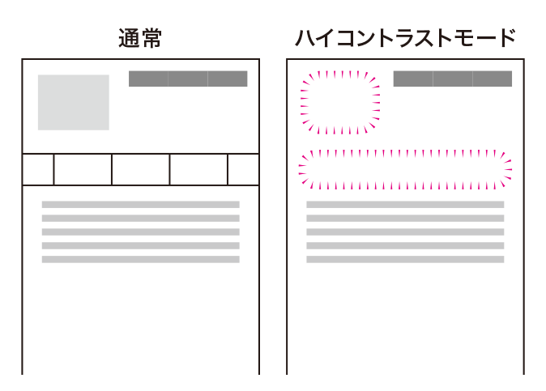
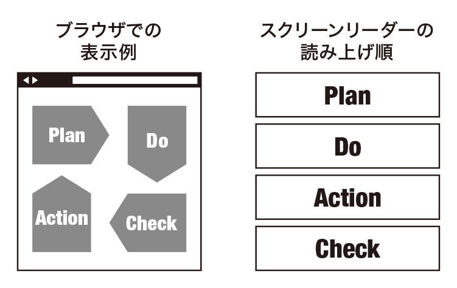
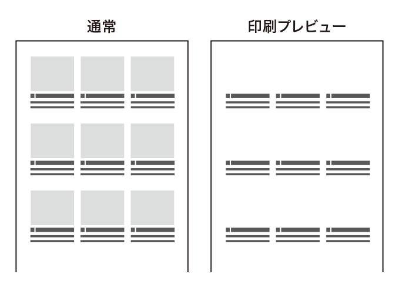
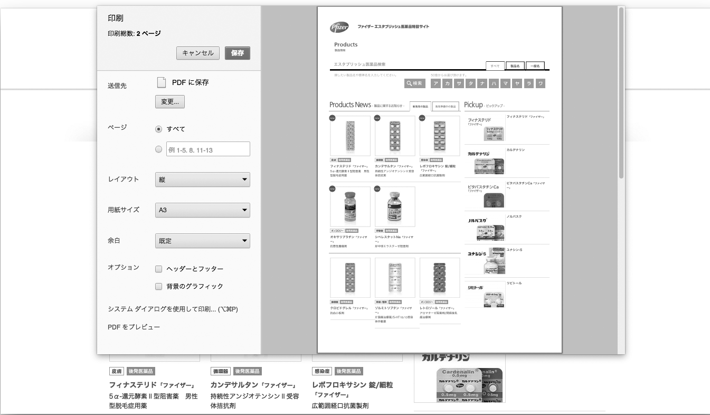
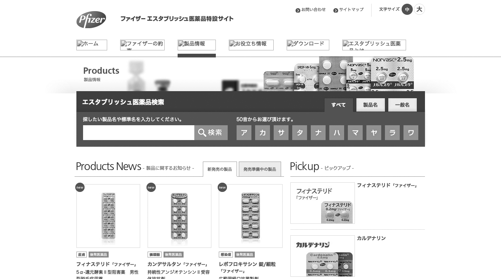

# コンテンツがCSSに依存している
最近はCSSの表現力が増し、さまざまなことがCSSで実装できるようになりました。しかし、重要な情報がCSSに依存していると、情報が伝わらなくなる場合があります。CSSに依存せずに情報が伝わるようにしましょう。

### 背景として実装された画像が表示されない

ロゴやナビゲーションを画像置換で実装している例。一見問題ないが、ハイコントラストモードでは何も表示されなくなり、ナビゲーションが使えなくなる。

### 見た目とHTMLが食い違い、意味が伝わらない

並び順に意味があるコンテンツの例。Plan→Do→Check→Actionの順に意味があるが、スクリーンリーダーではPlan→Do→Action→Checkの順に読まれてしまい、意味が通じなくなる。

## ここが問題！ CSS実装のやりすぎに注意
CSS3への対応も進み、CSSでさまざまな表現ができるようになりました。しかしCSSは、あくまでスタイルを定義するためのものです。重要な情報がCSSに依存した実装になっていると、閲覧環境によっては情報が伝わらなくなります。

### 背景として実装された画像が表示されない
CSSを使うと、任意の要素に背景画像を敷くことができます。何もない領域に画像を敷けば、img要素で画像を置いた場合と同じように見せることができます。

しかし、背景は無視されることもあります。典型例はハイコントラストモードの設定をしている場合で、背景色を強制的に変更するため、背景画像も表示されなくなります。また、印刷時には「背景画像を印刷しない」というオプションがあり、ブラウザの初期設定で印刷しない設定になっていることもあります。本来、これらの状況でもコンテンツの画像は表示されることが期待されますが、背景として実装していると、全く表示されなくなってしまうのです。画像が単なる装飾で、表示されなくてもよいものなら問題ありませんが、意味のある画像を背景として実装すると、アクセスできなくなることがあります。

「画像置換」ではこの問題をクリアできないことに注意してください。HTMLにテキストを書きつつ、CSSでテキストを隠して画像に置き換えるテクニックを、一般に「画像置換」と呼びます。CSSを無効にするとテキストが表示されますし、スクリーンリーダーもテキストを読み上げるため、一見問題ないように思えるかもしれません。しかし、先に挙げたハイコントラストモードや、背景画像を印刷しない設定では、CSSは有効で、テキストを隠す指定は生きています。テキストが隠された上に背景画像も表示されなくなるため、何も表示されなくなってしまうのです。

特に問題が大きくなるのは、ナビゲーションを画像置換で実装しているケースです。ハイコントラストモードではナビゲーションが表示されなくなり、全く使えなくなってしまいます。また、人物の写真や商品写真、地図といったコンテンツとして意味を持つ画像を背景として実装していると、プリントアウトした際に肝心な部分が印刷されず、ユーザーは大いに残念な思いをすることがあります（図1）。

図1：飲食店のメニューのページで画像を背景として実装した例

一見問題ないが、印刷しようとすると肝心の写真が表示されない。

### 見た目とHTMLが食い違い、意味が伝わらない
CSSでは要素を自由に配置することができ、HTMLでの出現順序と全く異なる並び順にすることもできます。しかし、スクリーンリーダーは基本的にHTMLでの出現順に読んでいきます。順番に意味がある場合、CSSで見た目だけを正しい順番にしても、スクリーンリーダーのユーザーには正しく伝わりません。

WYSIWYG型のオーサリングツールで要素の位置を変えた場合や、Word文書などをHTMLに変換した際などは、見た目と実際の順番が食い違うことがよくあります。また、レスポンシブWebデザインを採用し、画面サイズによって大きくレイアウトを変えている場合、実装の都合の良いようにHTMLが書かれており、見た目とはかけ離れた並び順になっていることもあります。

## 解決アプローチの例

### 代替テキストが必要な画像は前景に置く

画像を背景にせずimg要素で置いたコンテンツの印刷プレビュー。印刷しても問題なく表示される。

### 意味のある画像は前景に置く

ナビゲーションの画像が読み込めなかった場合の例。img要素で実装され、代替テキストが指定されているため、問題なくナビゲーションを利用できる。

### HTML上の並び順に配慮する

並び順に意味があるコンテンツの例。Plan→Do→Check→Actionの順に意味があり、スクリーンリーダーでもPlan→Do→Check→Actionの順に読まれるようになっている。

## 解決アプローチHTML単独で意味が通じるようにする
HTML単独で意味が通じるようにします。意味を持つものはHTMLに書き、並び順を適切にします。その上で、見た目や装飾的な部分だけをCSSで制御します。真の意味での背景画像や、意味を持たない装飾などは、積極的にCSSで実装しましょう。

### 意味のある画像は前景に置く
意味を持つ画像を使用する場合は、背景画像として実装するのではなく、img要素などを使って前景に置きます。画像が「意味を持つ」かどうか迷った場合は、以下の点を考慮して判断すると良いでしょう。

* その画像に代替テキストが必要か
* 画像を消すと意味が通じなくなるか
* 画像を選択したり保存したりすることが想定されるか
* 画像が印刷されるべきか

画像置換のテクニックでは、テキストを画像に置き換えています。これは、その画像には代替テキストが必要だということを意味しますから、意味を持つと言えるでしょう。商品写真など、印刷されてほしいと思える画像についても同様です。このほか、画像の更新が想定されるかどうかにも注目すると良いでしょう。コンテンツを更新するたびにCSSの内容を書き直すとなると、運用負荷が大きくなってしまいます。

### HTML上の並び順に配慮する
CSSを書く前にまずHTMLを書き、HTMLを単独で読んで理解できるようになっていることを確認します。

ビジュアルデザインの必要上、要素が線形でない配置になっている場合もあります。このような場合、HTML単独で理解できるようにすることは難しいかもしれません。配置が重要となる部分はあえて画像とし、代替テキストを指定して補う方法もあります。

WYSIWYG型のオーサリングツールの中には、マウスで要素を自由にドラッグして移動できるものもあります。このようなツールでは、順序が見た目と異なるHTMLが生成される場合があるため、注意が必要です。WYSIWYG型のツールを使用する場合は、生成されるHTMLを必ず確認してください。ツールよっては、自由配置のモード（「どこでも配置モード」などと呼ばれている場合があります）をオフにすることができる場合もあります。

Word文書などをHTMLに変換する際には、元の文書の作り方に注意する必要があります。オブジェクトの貼りつけを多用しているケースでは問題が起きやすいため、注意が必要です。元の文書がアウトライン構造を保っていれば、問題ない並び順で生成されることが多いでしょう。

## コラム CSSスプライトは悪なのか?
画像を背景として実装する理由のひとつに、高速化があります。複数の画像をひとまとめにし、background-positionを調整して目的の部分だけ表示させることにより、画像の点数を減らしてHTTPリクエストの回数を減らすことが可能です。このような手法は一般的に「CSSスプライト」と呼ばれています。

意味を持つコンテンツにCSSスプライトを適用すると、環境によってはアクセスできなくなります。CSSスプライトの使用を検討する場合は、その画像が見えなくなっても問題ないか考えましょう。たとえば、アイコンとテキストを併用する場合、そのアイコン画像が見えなくなっても意味は通じるため、CSSスプライトで実装しても問題ないでしょう。
