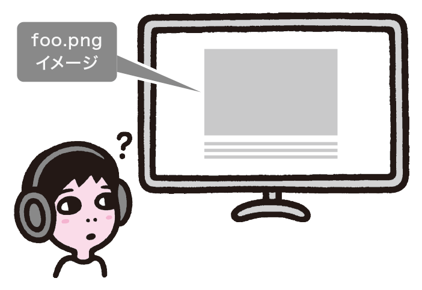
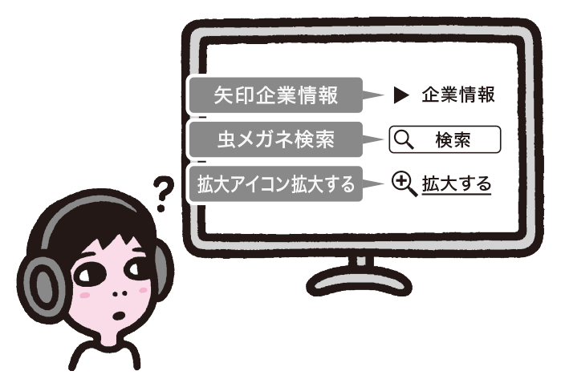
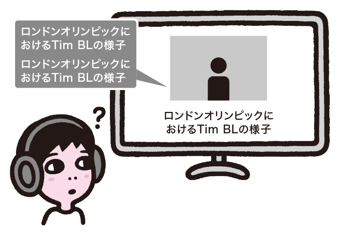
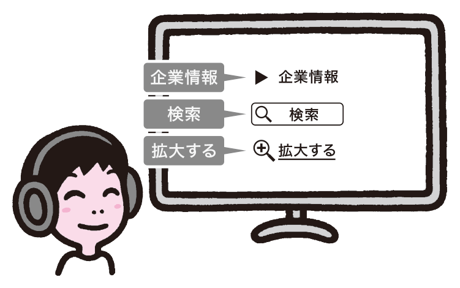
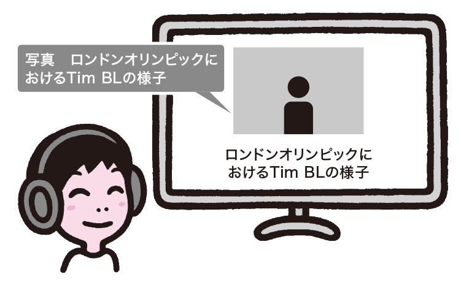

# 代替テキストの実装が不適切
「7.5画像を含むコンテンツが理解できない」では画像コンテンツの問題に触れましたが、実装時にも注意が必要です。代替テキストを不適切に実装するとアクセスできなくなるため、適切な代替テキストを指定しましょう。

## よく見られる問題

### alt属性そのものが指定されていない

画像があるが、alt属性が指定されていない例。スクリーンリーダーは画像のURLなどを読んでしまい、意味がわからなくなる。

### 装飾に不適切な代替テキストが指定されている

装飾画像に不適切な代替テキストが指定された例。スクリーンリーダーのユーザーには冗長だったり、紛らわしかったりして混乱を招く。

### 冗長な代替テキストが指定されている

キャプションつきの写真に、キャプションと同じ代替テキストを指定している例。スクリーンリーダーは同じキャプションを2回読んでしまう。

## ここが問題！ alt属性がない場合や不適切な場合、混乱を招く
img要素にalt属性がない場合、スクリーンリーダーは画像のファイル名などから代替テキストを補って読み上げようとすることがあり、意味が不明になります。alt属性があっても、不適切な内容になっていれば混乱を招きます。

### alt属性そのものが指定されていない
img要素を使用する場合、alt属性で代替テキストを指定する必要があります。alt属性がない場合、本来は代替テキストが必要な画像に、何らかの理由で代替テキストが指定できなかったものと解釈されます。この場合、画像のファイル名や「画像」「dummy」といった文字列などが代替テキストとして使われることがあります（参考1、参考2）。いずれの場合も、ユーザーには意味が適切に伝わりません。

### 装飾に代替テキストが指定されている
画像は、意味を持たない装飾として使われることもあります。そのような画像に代替テキストがついていると、意味ありげなテキストが読み上げられ、意味が通じなくなったり、誤解を招くことがあります。

### 冗長な代替テキストが指定されている
写真にキャプションがついている場合があります。この場合、写真の画像にキャプションと同じ代替テキストを指定すると、スクリーンリーダーでは同じ内容が2度読まれてしまいます。写真の下に人名が表記されている場合なども同様です。

## 解決アプローチの例
### 装飾画像に空のalt属性を指定する

装飾画像に空の代替テキストを指定した例。不適切な代替テキストが読まれなくなり、混乱が生じなくなる。

### 適切な代替テキストを指定する

キャプションつきの写真に、alt="【写真】"を指定した例。そこに写真があることがわかり、冗長にもならない。

##解決アプローチ alt属性は必ず指定し、適切な内容にする
alt属性は必ず指定するようにしましょう。代替テキストが必要ないケースもありますが、その場合はalt属性を省略するのではなく、明示的にalt=""と指定して、代替テキストが空であることをユーザーエージェントに伝えます。

### 装飾画像に空のalt属性を指定する
alt属性は必ず指定する必要があります。装飾など、意味を持たない画像には、alt=""として空の代替テキストを指定し、代替テキストが不要であることを明示します。alt属性そのものがない場合と、alt属性の値として空文字列を指定している場合とでは意味が異なりますので注意してください。

HTML5ではalt属性が省略可能とされていますが、これは、代替テキストがどうしても指定できないケースを想定したものです。たとえば、Webカメラによって生成された画像、任意のユーザーによって投稿された画像などが挙げられます。これらの画像はコンテンツとしての意味を持つため、本来は代替テキストが必要ですが、現実問題として代替テキストを指定することは難しいでしょう。alt属性が省略されるのは、このような例外的なケースに限られます。基本的に、alt属性は常に指定するものと考えてください。

alt属性の有無は、機械的にチェックできる項目でもあります。文法チェックツールを活用するなど、文法ミスへの対策を行うことで、alt属性がないというミスは大幅に減らすことができるでしょう。文法ミスの対策については、「9-1文法ミスがある」を参照してください。

### 適切な代替テキストを指定する
意味を持つ画像には、適切な代替テキストを指定する必要があります。基本的には、ここで実装者が考慮すべきことはありません。代替テキストもコンテンツですから、コンテンツの検討段階で一緒に検討されているのが本来の姿です。原稿に代替テキストの指示があれば、そのまま指定するだけです。

しかし、現実には、コンテンツ検討時に代替テキストの検討が漏れていることもあるでしょう。その場合は、実装者がアドリブで考えるのではなく、いったんコンテンツの検討プロセスに戻るべきです。代替テキストではなく、キャプションをつける、本文で説明するといった解決策のほうが望ましいこともあるからです。詳しくは「7-5画像を含むコンテンツが理解できない」を参照してください。

なお、画像に代替テキストではなくキャプションをつけることにした場合、HTML5のfigure要素とfigcaption要素を使うと、画像とキャプションとを明示的に結びつけることができます。また、WAI-ARIAのaria-describedby属性で画像と説明を結びつける方法もあります。「9-7スクリーンリーダー対応が不適切」も参照してください。

参考1 [F65: Failure of Success Criterion 1.1.1 due to omitting the alt attribute or text alternative on img elements, areaelements, and input elements of type "image"](http://www.w3.org/TR/WCAG20-TECHS/F65.html)

参考2 [装飾およびレイアウト目的の画像の代替テキスト](http://accessibility.mitsue.co.jp/archives/000060.html)
