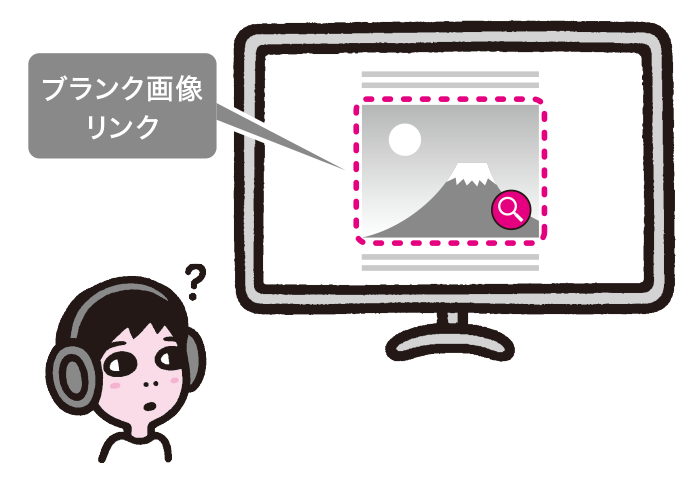
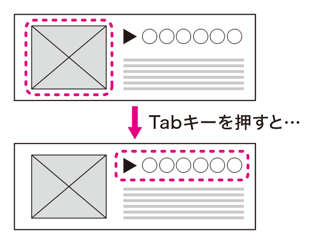
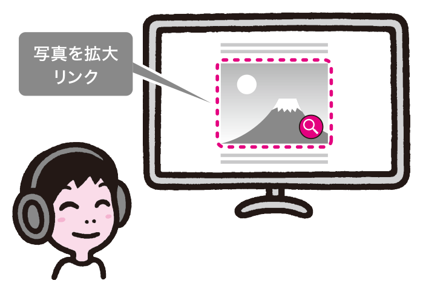
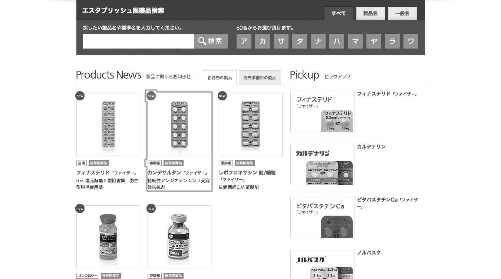

# リンク先がわからなくなる実装
「7-6リンク先がわからない」ではリンクテキストが不適切な例に触れましたが、実装時にも注意が必要です。リンクテキストが適切に伝わらないと理解できないため、アンカーに適切なテキストが入るようにしましょう。


## よく見られる問題
### リンクテキストが空になっている



写真の画像にリンクが張られている例。アンカーの中に何もテキストがないと、スクリーンリーダーなどはうまく扱えない。

### ひとつのリンクが複数のリンクとして実装されている



画像とテキストがあり、リンクになっている例。見た目上はひとつのリンクに見えるが、キーボードで操作してみると、画像とテキストが別々にフォーカスを受け取る。


## ここが問題！ リンクの実装が不適切だとリンク先がわからなくなる
リンクテキストが不適切な例については「7-6リンク先がわからない」で述べましたが、リンクテキストそのものが適切でも、マシンリーダブルでなかったり、リンクと適切に結びつけられていない場合、リンク先がわからなくなってしまいます。

### リンクテキストが空になっている
通常、リンクはa要素を使ってマークアップします。a要素でマークアップした範囲がひとつのアンカーとなり、アンカーの中に含まれるテキストがリンクテキストとなります。

リンクテキストが適切でない場合の問題は「7-6 リンク先がわからない」で述べたとおりですが、画像を使っている場合、リンクテキストが全く存在しなくなることがあります。画像が意味を持たない場合、alt=""として代替テキストを空にしますが、リンクになっている画像の代替テキストを空にすると、リンクテキストがなくなってしまいます。この場合、スクリーンリーダーはリンクを適切に読み上げることができなくなり、画像のファイル名やリンク先のURLなどを読み上げてしまいます。

なお、アンカーの内容が画像だけでなく、テキストも一緒に含まれている場合は、原則として問題ありません。ただし、一部のスクリーンリーダーはこのようなケースをうまく扱えないことがあります（参考1）。

```
<a href="detail.html"></a>
```
リンクの中に画像しかなく、代替テキストが空の例。リンクテキストがなくなってしまい、スクリーンリーダーはこれをうまく扱えない。


### ひとつのリンクが複数のリンクとして実装されている
複数の要素がひとつのリンクとなる場合があります。たとえば、テキストと写真の両方がクリックでき、どちらを押しても同じページに行けるようなケースはよくあります。このとき、商品名と写真とを別々のアンカーとしてマークアップしてしまうと、見かけ上はひとつのリンクに見えますが、実体は2つの別々のリンクとなります。キーボード操作ではそれぞれのリンクにフォーカスが当たり、スクリーンリーダーもリンクを2回読むため、異なる2つのリンクがあるように思われてしまいます。

```
<a href="products.html"></a>
<a href="products.html">商品名</a>
```
画像とテキストをそれぞれアンカーにし、リンクテキストも異なるソースコードの例。ユーザーには別々のリンクのように見える。


## 解決アプローチの例

### リンク画像に代替テキストを指定する



キャプションつきの写真に「写真を拡大」という代替テキストをつけた例。リンクの意味が理解しやすくなっている。

### ひとつのリンクはひとつのアンカーにまとめる



商品画像と商品名がひとつのリンクになっている例。キーボード操作でもひとつのリンクとしてフォーカスを受け取る。


## 解決アプローチ 適切なテキストを入れ、ひとつのアンカーにする
リンクを実装する際は、リンクテキストがどうなるのかに注意して実装しましょう。リンクテキストが空にならないように実装しつつ、ひとつのリンクはひとつのアンカーとして実装します。

### 画像のみのリンクには必ず代替テキストを指定する
画像が単独でリンクになる場合、alt=""として空の代替テキストを指定することは避け、リンクのラベルとなる代替テキストを指定する必要があります。この場合の代替テキストは、画像の内容を説明するものではなく、リンク先の内容を表すリンクテキストにします。

原則として、代替テキストやリンクテキストはコンテンツとして検討されているはずですので、それをそのまま指定すれば良いでしょう。指示が漏れている場合、アドリブで指定したりせず、コンテンツ検討のプロセスに戻りましょう。考え方については、「7-5画像を含むコンテンツが理解できない」「7-6リンク先がわからない」を参照してください。


### ひとつのリンクはひとつのアンカーにまとめる
同一リンク先のリンクは、ひとつのアンカーにまとめるようにします。要素の配置はCSSで調整します。HTML4までは、a要素の中に見出しなどを入れることができなかったため、ひとつのアンカーにすることが難しいこともありました。HTML5ではこのような制約はなくなったため、アンカーをひとつにまとめることも容易になっています。

CMSの制約などの事情で、どうしてもひとつのアンカーで実装できない場合もあるかもしれません。その場合、リンクテキストを同一にすると、比較的理解しやすくなります。2つのリンクに見えることには変わりありませんが、それぞれのリンク先が同一であることが推察しやすくなるでしょう。ただしこの場合、リンクを修正する際に2箇所の修正が必要になるという問題もあります。片方だけ修正して片方の修正を忘れるというミスが起こりやすく、検証でも片方のリンクだけを確認してOKとしてしまうことがあります。運用の観点からも、できるだけリンクはひとつのアンカーで実装したほうが良いでしょう。

```
<a href="products.html">商品のページ</a>
```
リンクをひとつにした例。このようにすることが望ましい。

```
<a href="products.html"></a>
<a href="products.html">商品のページ</a>
```
画像とテキストをそれぞれアンカーにし、リンクテキストは同一にした例。リンクが2つあるように見える問題は残るが、テキストが同一なので、リンク先が同一であることは推測できる。


参考1 [H2-2：隣り合った画像とテキストリンクを同じリンクの中に入れる](http://waic.jp/docs/jis2010-as-understanding/201406/H2-2.html)
