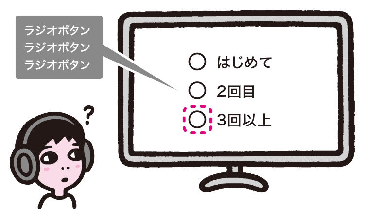
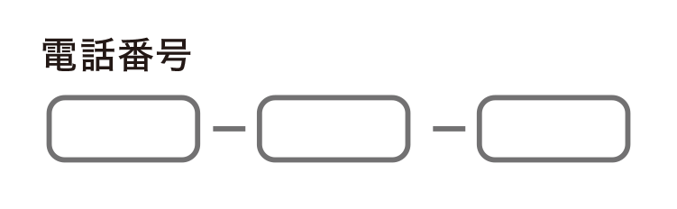
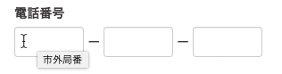

# ラベルがマークアップされていない
「6-3ラベルや説明が不足しているフォーム」ではラベルの問題に触れましたが、実装時にも注意が必要です。ラベルを単に置いても伝わらないことがあるため、適切にマークアップしてラベルだと伝わるようにしましょう。

## よく見られる問題

### ラベルがマークアップされていない

ラジオボタンとラベルが置かれた例。フォーカスを当てると「ラジオボタン」とだけ読み上げられ、どのラジオボタンかわからない。

### 1対1のラベルが用意できない

3つに分かれた電話番号の入力欄の例。ラベルはあるが、入力欄3つに対してラベルはひとつしかない。

## ここが問題！ ラベルがマシンリーダブルでないと理解できない
ラベルのテキストをフォームコントロールの横に置けば、見た目上はラベルがあるように見えます。しかし、ラベルとしてマークアップされていなかったり、フォームコントロールと結びつけられていないと、ブラウザは適切に扱うことができません。

### ラベルがマークアップされていない
入力欄の横にテキストを置けば、それだけでラベルのように見えるかもしれません。しかし、フォームコントロールと関連づけられていないと、入力欄にフォーカスしてもラベルが読まれない、ラベルをクリックしても対応するコントロールにフォーカスが移らない、といった問題が起きます。

### 分割された入力欄に対応するラベルがない
「6-4 入力が困難なフォーム」では、分割された入力欄に入力しづらい問題を扱いましたが、ラベルとの対応が難しいという問題もあります。たとえば、電話番号の入力欄が3つに分かれているとき、入力欄全てに「電話番号」というラベルを関連付けると、分割された入力欄それぞれを区別できなくなります。

## 解決アプローチの例

### label要素としてマークアップする

ラベルのついたラジオボタンの例。ラベルとラジオボタンが関連づけられているため、ラベルが読み上げられ、ラベルを選択してチェックすることもできる。

### さまざまな工夫でラベルをマークアップする

入力欄にtitle属性でラベルをつけ、さらにJavaScriptを使用してキーボードユーザーにもラベルが見えるようにした例。WAI-ARIAを活用して補う方法もある。

## 解決アプローチ ラベルをマークアップによって関連づける
フォームコントロールのラベルは、label要素としてマークアップします。そのうえで、コントロールと関連づけます。どうしてもlabel要素が使えない場合、WAI-ARIAを使って補足することができる場合もあります。

### label要素としてマークアップする
ラベルはlabel要素としてマークアップし、さらに、コントロールと結びつけます。コントロールと結びつけるには、label要素の中にコントロールを入れる方法と、for属性で結びつける方法があります。かつてInternet Explorer 6がfor属性の方法にしか対応していなかったため、for属性を使う方法がよく用いられます。ラベルとコントロールが離れていても結びつけられるというメリットもあります。

### さまざまな工夫でラベルをマークアップする
システムの制約などで、label要素としてマークアップできない場合があるかもしれません。また、入力欄が分割されている場合など、ラベルとなるテキストが提供できないケースもあります。

このような場合、次善の策としてtitle属性で補足する方法もあります。ただし、title属性はスクリーンリーダーでは読まれるものの、ビジュアルブラウザをキーボードで操作している場合に表示させる方法がありません。JavaScriptを使用してラベルが見えるようにするなど、工夫をする必要があるでしょう。このほか、WAI-ARIAを使ってラベルを提供する方法もあります。WAI-ARIAについては「9-7 スクリーンリーダー対応が不適切」を参照してください。
